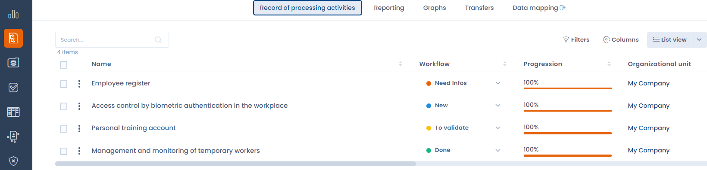
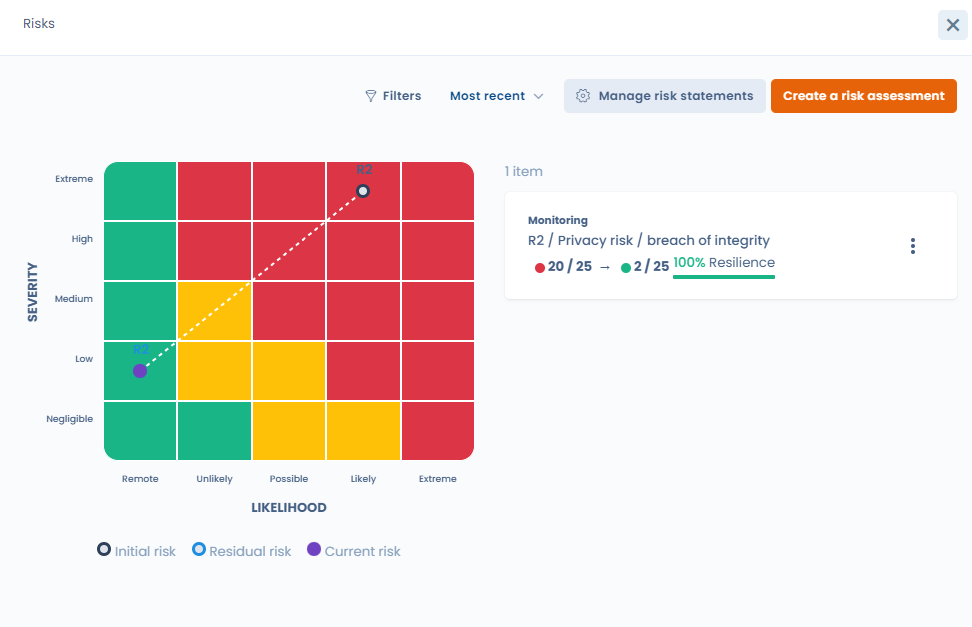
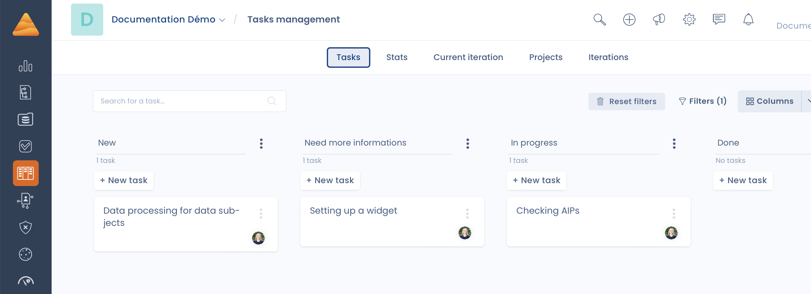
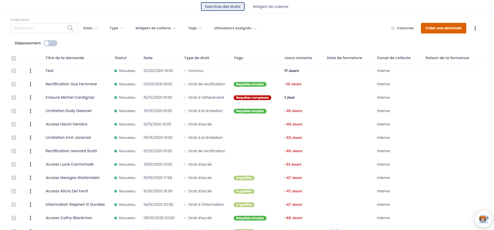
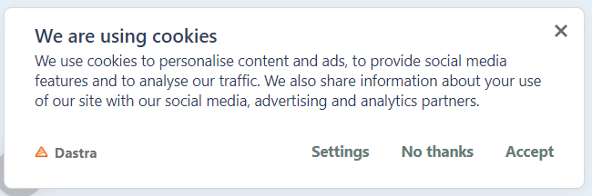
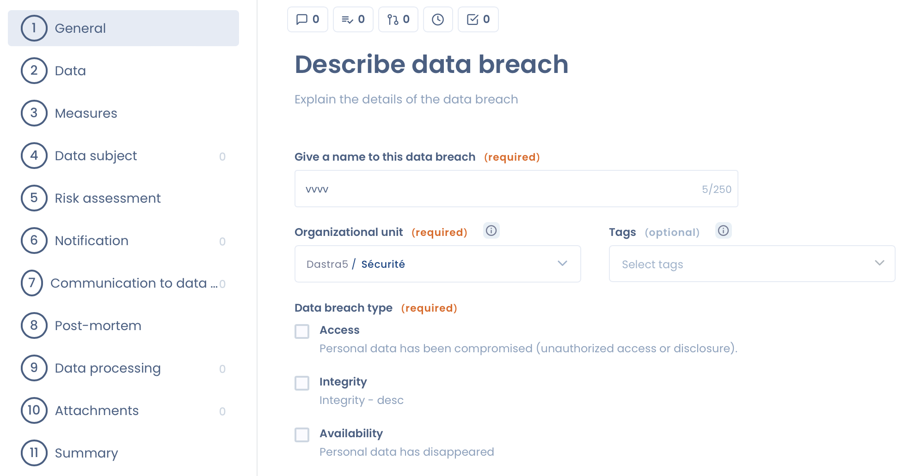
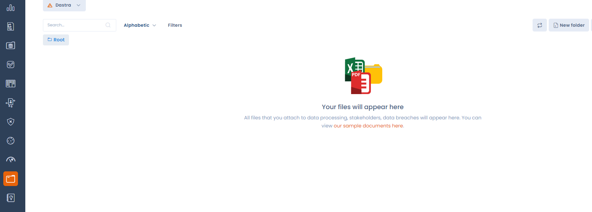

# What is Dastra

**Dastra** is a data privacy solution with which data protection teams can drive and manage all GDPR use cases, from managing the registration of processing activities to implementing a cookie widget on their websites.

We aim to help data protection teams raise **awareness** across their business and **improve the GDPR experience** with a streamlined solution providing a single response to organizations' different GDPR needs, through:

* A fast, intuitive and ergonomic **interface**
* A fruitful **collaboration** between the various players involved in GDPR
* **Time savings** in day-to-day compliance management
* New compliance and management **services** and functionalities
* A **guided** pedagogical approach to empower non-experts step by step

At Dastra, we believe that data protection is not just a legal matter, it's also a **matter of code, expertise, project management and operations**.

For more information, see our [manifesto](https://www.dastra.eu/en/mission).

## With Dastra you can:

* **Map your personal data** by creating and maintaining your record of processing activities (ROPA) thanks to a flexible and intuitive interface, repositories, libraries and a questionnaire, and **build, share and export** your ROPA.

<figure><figcaption>
The record of processing activities (ROPA)
</figcaption></figure>

* **Identify your risks, and carry out audits** to assess priorities.

<figure><figcaption>
Risk module
</figcaption></figure>

* **Generate an action plan, allocate tasks and collaborate with your network**, to better protect your data.

<figure><figcaption></figcaption></figure>

* **Implement internal processes** such as setting up rights exercise management, managing cookie consents or keeping a register of data breaches.

<figure><figcaption>
Register of requests to data subjects rights requests (DSR)
</figcaption></figure>

<figure><figcaption>
Cookie management plateform (CMP)
</figcaption></figure>

<figure><figcaption>
The data breach questionnaire
</figcaption></figure>

* **Centralize documentation** to meet GDPR compliance.

<figure><figcaption>
The repository module
</figcaption></figure>

## How do I get to know Dastra?

Start discovering Dastra right now, first with features and setup, then the tutorial:


[Features](https://app.gitbook.com/s/-LvBxs22wUMicv9uWp6C-1972196547/features)



[Broken link](/broken/pages/-LvaGKB4EL4Jf4xLoJUG)


## For more information


[Broken link](/broken/pages/-M31sj-borK9qQfwBXwH)

