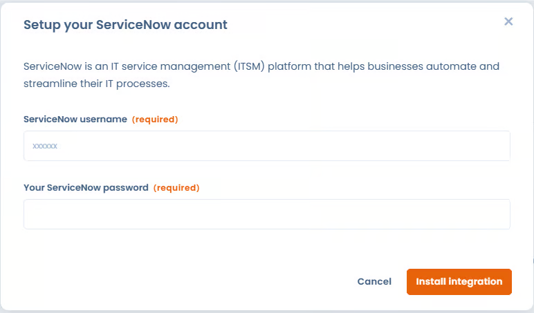

# ServiceNow

**What is ServiceNow?**\
\
The [**ServiceNow**](https://www.servicenow.com/) integration allows you to automatically synchronize business applications from the ServiceNow CMDB directly into Dastra.

It allows you to:

* avoid duplicate data entry;
* centralize technical assets used across the organization;
* use these assets in your processing records, datasets, impact assessments, risk analyses, audits, etc.;
* ensure that information from ServiceNow remains up to date in Dastra.

**Prerequisites**

* Have a paid Dastra license including access to the Integrations / Connectors module.
* Have a ServiceNow account with:
  * An accessible instance (e.g. https://your-instance.service-now.com)
  * An API user with read access to `cmdb_ci_business_app`.
* Ensure that your ServiceNow instance allows REST API calls from external sources.

**Installation**\
\
The setup process is very simple:

1. Go to the ServiceNow integration page in the Dastra integrations marketplace.\
   Example:\
   [https://app.dastra.eu/workspace/0/settings/integrations/servicenow](https://app.dastra.eu/workspace/0/settings/integrations/servicenow)
2. Click on the "Install" button.
3. Enter your ServiceNow account credentials:

* Username
* Password

This information will allow Dastra to generate a secure access token to communicate with your ServiceNow instance.

<figure><figcaption></figcaption></figure>

4. After validation, a configuration window will appear. This step is mandatory to complete the installation.

<figure><figcaption></figcaption></figure>

**Configuration**

* Enter your ServiceNow instance URL
* Choose whether you want to enable asset synchronization (Assets synchronized with ServiceNow will be updated every night at 00:00 UTC)
* Select the people to notify in case of asset modification/creation. They will receive an email notification containing information about the updated assets.
* Checking "Create new assets if not exists" will result in creating an asset if it does not exist in Dastra, based on the external reference.


Warning: if you check this option, a large number of assets may be automatically created in your workspace. Make sure to properly configure external references.


**How is data synchronized between Dastra and ServiceNow?**\
\
During each synchronization, several fields from ServiceNow are automatically mapped into your Dastra asset repository. The following information is retrieved and updated:

* Asset **label**
* **Description** (ServiceNow Short Description)
* **Application type**
* **Installation state / status**
* **Asset type** (systematically imported as _Software_)
* **Associated area / domain** (AreaId)
* Associated **tags**
* ServiceNow **external identifier** (`sys_id`)
* **External source** (`ServiceNow`)
* **Last synchronization date**
* Asset **owner**

All this data ensures a reliable and up-to-date link between your ServiceNow CMDB and your Dastra repository.

**Management of assets deleted in ServiceNow**\
\
When Dastra detects that an asset previously synchronized no longer exists in ServiceNow, it is not automatically deleted in Dastra.

Instead, Dastra adds an automatic tag to the asset indicating that it has been deleted in ServiceNow.

This behavior allows:

* keeping history in Dastra,
* avoiding unintentional deletions,
* facilitating manual review of obsolete assets.
