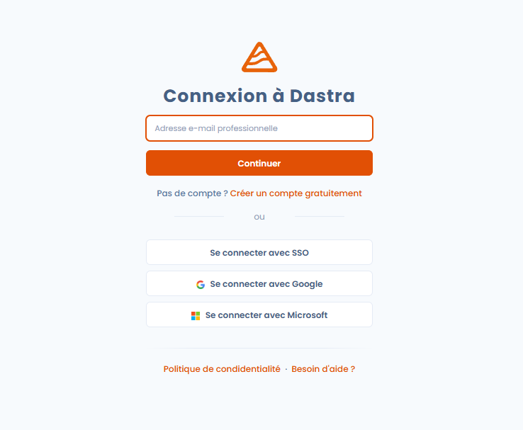
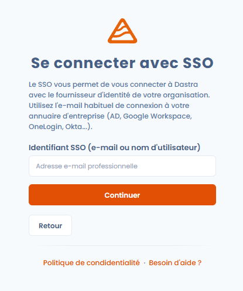
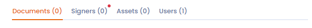
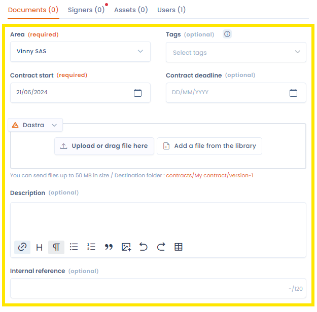

# Logging in and managing authentication

### 🧭 Overview

Access to Dastra is secured by an authentication system that complies with data protection best practices.\
You can log in with your Dastra credentials, a third-party account (SSO), and strengthen your account's security with **two-factor authentication (2FA)**.

***

### 🚪 Logging in to Dastra

#### 🔑 With Dastra credentials

1. Go to [https://app.dastra.eu](https://app.dastra.eu)
2. Enter your **email address** and **password**
3. Click **Log in**

<figure><figcaption></figcaption></figure>


Check the **Remember my password** option if you're using a personal device, to avoid re-entering your credentials on every visit.


***

#### 🌐 With an identity provider (SSO)

If your organization has configured **SSO (Single Sign-On)**, you can log in via your identity provider (e.g. Microsoft, Google, Okta...).

1. On the login page, click **Log in with SSO**
2. Enter your email address
3. Follow your organization's authentication procedure
4. You'll be automatically redirected to your Dastra workspace

<figure><figcaption></figcaption></figure>



SSO simplifies access management and strengthens security: your credentials are never shared with Dastra.


***

### 🔄 Resetting your password

If you've forgotten your password:

1. Click **Forgot your password?** on the login page
2. Enter the email address associated with your account
3. Check your inbox and follow the reset link
4. Choose a new password that meets the security requirements

<figure><figcaption></figcaption></figure>


Reset links expire after a short period for security reasons.\
If the link no longer works, start the procedure again.


***

### 🔒 Enabling two-factor authentication (2FA)

**Two-factor authentication** strengthens the security of your Dastra account.\
It adds an extra step at login: entering a **unique code generated on your phone**.

#### ⚙️ Activation

1. Go to your **user profile → Account security**
2. Click **Enable two-factor authentication**
3. Scan the QR code with an authenticator app (Google Authenticator, Authy, 1Password, etc.)
4. Enter the generated code to confirm activation

<figure><figcaption></figcaption></figure>


Keep the **recovery code** shown during activation.\
It will let you regain access to your account if you lose your device.


Learn more about [strong authentication](../../security/mfa.md).

***

### 📱 Logging in with 2FA enabled

Once 2FA is enabled, logging in happens in two steps:

1. Enter your **username and password**
2. Enter the **6-digit validation code** generated by your authenticator app


Good to know: the 2FA code changes every 30 seconds and can only be used once.


***

### 🧹 Managing active sessions

Dastra lets you view and close the **active sessions** associated with your account.

1. Go to **Profile → Account security → Active sessions**
2. View the list of connected devices and browsers
3. Click **Remove** to log out a specific device


Close any unrecognized session immediately to prevent unauthorized access to your data.


***

### 🧰 Security best practices

* Use a **unique, strong password** (at least 12 characters, with uppercase, lowercase, numbers, and symbols).
* Never share your credentials, even internally.
* Enable **two-factor authentication** on all your professional accounts.
* Log out of your session on shared or public devices.
* Regularly check your active sessions.

***

### 🔗 See also

* [Setting up your user profile](setting-up-your-user-profile.md)
* [Configuring notifications](../../features/settings/notifications.md)
* [Dastra's security and privacy policy](../../security/general.md)
