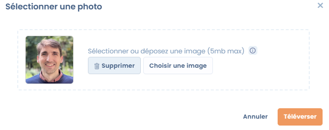
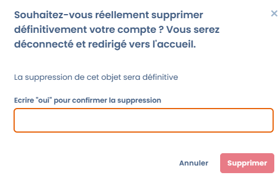

# Setting up your user profile

### 🧭 Overview

Every Dastra user has a **personal profile** containing their identification information, language and display preferences, as well as options related to account privacy.

This page explains how to edit this information from the **User profile** menu, accessible via your avatar at the top right of the screen.

***

### 🖼️ Profile picture

You can add a logo or profile picture that's visible in your workspaces and in your comments.

* **Format:** square image of at least **200 x 200 px**
* **Accepted formats:** PNG, JPG, or WebP
* **Automatic cropping:** Dastra automatically adjusts the image to a square format

<figure><figcaption></figcaption></figure>


Choose a simple, recognizable image (for example, your photo or your organization's logo).


***

### 🧾 Personal information

The following fields can be filled in or updated at any time:

| Field                                         | Description                                                                | Requirement |
| ---------------------------------------------- | --------------------------------------------------------------------------- | ----------- |
| **First name**                                | Your first name as it appears in Dastra                                    | ✅ Required  |
| **Last name**                                 | Your surname                                                                | ✅ Required  |
| **Public nickname**                           | Nickname displayed publicly in comments or external shares                 | Optional    |
| **Phone number**                              | Used for certain notifications or two-factor verifications                 |             |
| **Postal address / Zip code / City / Region / Country** | Business or personal contact details, depending on the context  | Optional    |
| **Blog / Website**                            | Link to your professional website or LinkedIn                              | Optional    |
| **Biography**                                 | Short description of your role or function                                 | Optional    |
| **Profile email**                             | Email address associated with your Dastra account                         | ✅ Required  |

### 🌐 Language and time zone

You can customize how Dastra is displayed based on your language and time zone.

| Setting               | Description                                                                                       |
| ---------------------- | --------------------------------------------------------------------------------------------------- |
| **Interface language** | Language used in the application (French, English, etc.). 9 languages are available by default.   |
| **Time zone**          | Defaults to (UTC+01:00) Central European Time (Paris)                                              |


These preferences only affect **your personal display**.\
They do not change the default language for other members of the workspace.


***

### ♻️ Resetting preference data

This option lets you **reset the local preferences** saved in your browser.

> This removes:
>
> * cookies set by Dastra,
> * data stored locally (localStorage),
> * display and column preferences in tables,
> * tutorials marked as "already seen" in modules.


This action is **irreversible**: your preferences will be lost, and the display of some modules will be reset as it was on your first login.


***

### 🗑️ Deleting your user account

If you wish to permanently leave Dastra, you can **delete your user account**.

> This action results in:
>
> * The permanent deletion of your **profile**
> * The loss of your **access rights** and your **associated teams**
> * The complete erasure of your **personal data**


Permanent deletion: once confirmed, **the deletion is irreversible**.\
No recovery is possible.


<figure><figcaption></figcaption></figure>

***

### 💡 Best practices

* Keep your contact details up to date to ensure continuity of communications.
* Use a professional nickname if you interact with the Dastra community.
* Before deleting your account, inform your administrator to avoid any data loss.&#x20;

***

### 🔗 See also

* [Configuring your notifications](../../features/settings/notifications.md)
* [Configuring roles and permissions](../../features/settings/roles-et-permissions.md)
* [Logging in and managing authentication](logging-in-and-managing-authentication.md)
