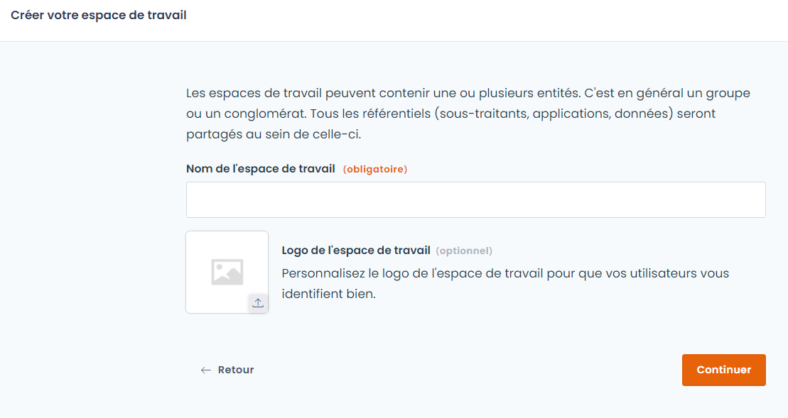
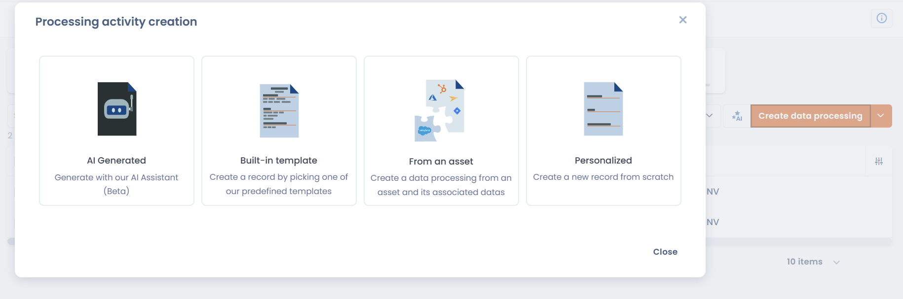
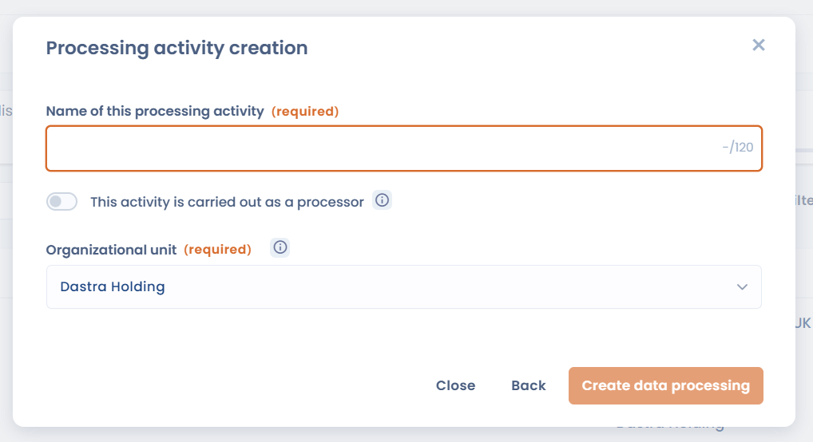

# Get started in 5 minutes

This guide takes you from zero to your first documented processing activity in the Dastra register. No advanced configuration — just the essentials to get going.

***

## Step 1 — Create your account (1 min)

Go to [https://app.dastra.eu/signup](https://app.dastra.eu/signup) and create an account.


The free trial lasts 30 days, no credit card required. You have access to all features.


***

## Step 2 — Create your workspace (1 min)

A **workspace** is the environment in which you will document your processing activities. In general, one workspace corresponds to one legal entity or one compliance scope.

1. After logging in, click **"New workspace"**
2. Give it a name (e.g. *GDPR Compliance – Company X*)
3. Click **Continue**

<figure><figcaption>
Give your workspace a name
</figcaption></figure>


[Learn more about workspaces](commencer/create-and-set-up-a-workspace.md)


***

## Step 3 — Add your first processing activity (2 min)

The core of Dastra is the **record of processing activities (ROPA)**. Start by documenting a simple activity — for example payroll management or email communications.

1. In the left menu, click **Record of processing activities**
2. Click **Create data processing**
3. Choose your creation mode:

<figure><figcaption>
Choose how to create your first processing activity
</figcaption></figure>

| Mode | Description |
|---|---|
| **AI Generated** | The AI Assistant generates a pre-filled record from a name or description |
| **Built-in template** | Start from a Dastra template (payroll, recruitment, CCTV…) |
| **From an asset** | Create a processing activity from an existing asset and its associated data |
| **Personalized** | Create a blank record from scratch |

To get started quickly, choose **Personalized** or **Built-in template**.

4. Fill in the two required fields:

<figure><figcaption>
Name and organizational unit are the only required fields at creation
</figcaption></figure>

   - **Name** of the processing activity (e.g. *Payroll management*)
   - **Organizational unit** — select the relevant entity


The organizational unit of type **entity** automatically sets the data controller. No need to fill it in separately.


5. Click **Create data processing**

Your first processing activity is now in the register. You can enrich it progressively (purpose, legal basis, data processed, processors, security measures…).


[Learn more about the record of processing activities](../features/editer-le-registre/README.md)


***

## Step 4 — Invite a colleague (1 min)

Compliance is a team effort. Invite a first colleague to start delegating.

1. Go to **Workspace Settings > Users**
2. Click **Invite a user**
3. Enter their email address and choose their role
4. Click **Send invitation**

They will receive an access link by email.


[Learn more about user management](commencer/invite-users.md)


***

## What's next?

You've laid the foundations. To go further:


[Full tutorial — practical GDPR case study](../commencer/tutorial/README.md)



[Configure your workspace in detail](commencer/README.md)



[Build your record of processing activities](../features/editer-le-registre/README.md)



[Govern your AI systems](../features/systemes-dia/README.md)

