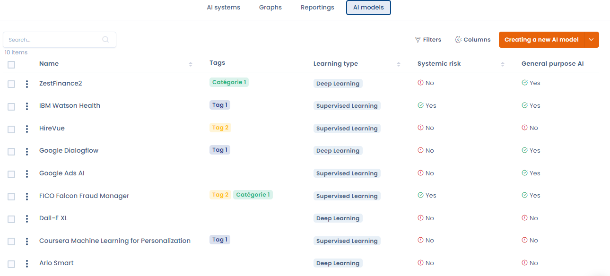
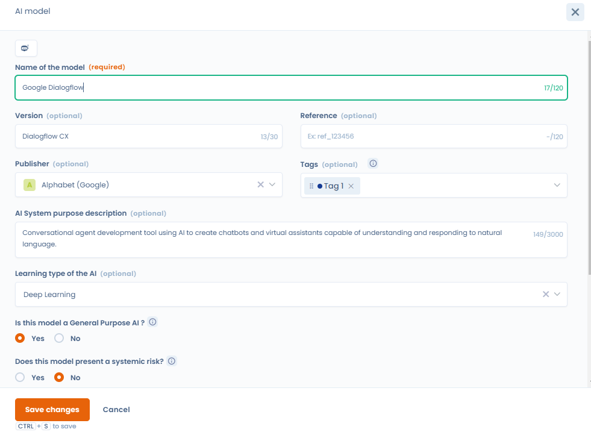
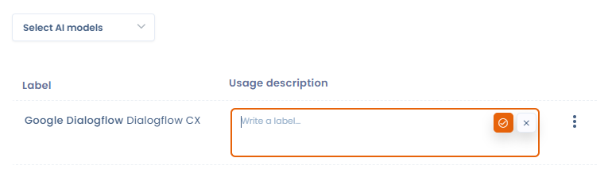

# AI Models repository

For each AI system you register, you'll need to enter the AI model(s) used.

<figure><figcaption>
AI Models repository
</figcaption></figure>

## Definition

An artificial intelligence model can be defined as a computer program designed to perform specific tasks using machine learning and data analysis techniques. Here's a more detailed definition:

* **Foundations** : An AI model is based on specific algorithms and architectures (such as neural networks for deep learning) that enable learning from data.
* **Learning**: This is trained by processing large data sets to identify patterns and relationships.This enables the model to make predictions or generate content based on the new data it receives.
* **Functionality**: This is the purpose for which the model is used.For example: image generation for the MidJourney model.
* **Use**: These models are deployed in a wide range of applications, from chatbots and virtual assistants to data analysis and content creation, providing advanced, automated solutions in a variety of fields.

## Create your AI models repository with Dastra

To create a repository, go to the "AI Models" tab.

Then click on the "Create an AI model" button. A window opens in which you can enter the required information.

Don't be afraid to go into great detail in the description section, adding the features and information you have on the model.

<figure><figcaption>
Register a new AI Model
</figcaption></figure>

You will also need to select its training type. The learning type of an AI model refers to the method by which the model is trained to perform its tasks. Each type is adapted to specific applications and influences the way the model generalizes the knowledge acquired. There are 4 of them, and you'll find a definition next to each one to help you choose.

### Generate an AI model record with the AI assistant

From the AI models list, you can **automatically generate an AI model record** using the AI assistant. This feature creates a complete record in just a few seconds from a simple model name or description — the assistant uses web browsing to look up and fill in the relevant information (architecture, training type, provider, capabilities, etc.).

To use it, click **"Generate with AI"** from the model creation dialog, enter the model name or a brief description, and confirm. Review the generated record before saving, as AI-generated content may contain errors.

## Link between AI Systems et Models

To link an AI system to a model, go to the AI system concerned. In the second section, entitled "AI Models", you'll find a selector from which you can choose one or more models from those you have saved in your model repository.

elect the models concerned, then fill in the "description of use" field. This explains how the model is used in the AI system concerned.

<figure><figcaption>
Link an AI system to a model
</figcaption></figure>
