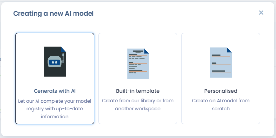
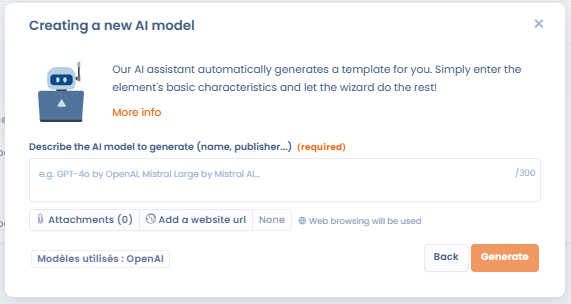
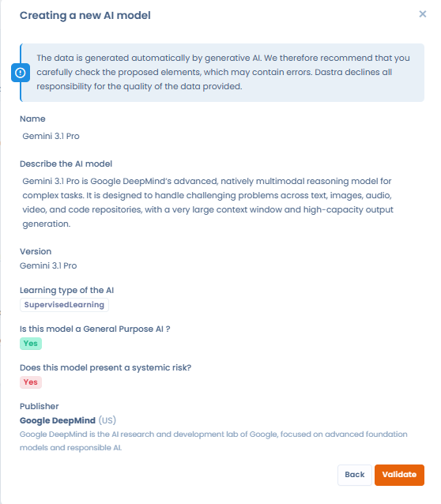
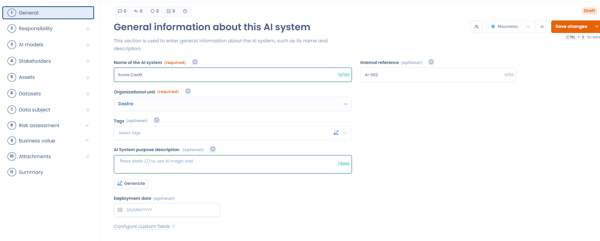

# Establishing a record of AI systems

To set up a record of your AI systems, you have two options:

* Either you already have a registry that you can import directly into Dastra (go to the next section: [Import your AI systems](import-your-ai-systems.md))
* Or you don't have one. In this case, you'll have to create one yourself

## Create a record of AI Systems

To add an AI system, click **"Create a new AI system"**. A window offers three creation modes:

<figure><figcaption>
Three creation modes: AI generation, built-in template, or blank form
</figcaption></figure>

* **Generate with AI** — The AI assistant automatically generates a complete record from a short description (name, publisher, URL…). It uses web browsing to enrich the information.
* **Built-in template** — Choose from the Dastra AI system library or from another workspace.
* **Personalised** — Create a blank record and fill in each field manually.

### Generate an AI system with the AI assistant

Select **"Generate with AI"**, then describe the system to document (name, publisher…). You can attach a file or provide a URL to help the generation.

<figure><figcaption>
Describe the system to generate — the assistant uses web browsing to complete the information
</figcaption></figure>

The assistant produces a pre-filled record (name, description, learning type, systemic risk, publisher…) which you can review and validate before saving.

<figure><figcaption>
The generated record should be reviewed before validation — AI can make mistakes
</figcaption></figure>


Data generated automatically by AI may contain errors. Review and correct the proposed record before saving it to your registry.


Once you've entered the required information, you'll be redirected to a 10-step form. This form will enable you to give as much detail as possible about the AI system.

<figure><figcaption></figcaption></figure>

## The 11 Steps of the AI System Form

Below are the 11 steps to complete when documenting an AI system.

***

### 1. General

Enter **basic information** about the AI system:

* **Name** of the system
* **Brief description** of its purpose and functionality

***

### 2. Responsibilities

Define your **role and responsibilities** under the European AI Act:

* **Provider**: develops and places the AI system on the market
* **Deployer**: uses the AI system within professional activities

***

### 3. AI Models

Specify the **AI model(s)** used to process data within this system.

> ℹ️ For more details, refer to the AI Models Repository.

***

### 4. Stakeholders

Identify **stakeholders involved** in implementing and managing this AI system, including their roles (e.g. Data Scientist, DPO, Product Owner).

***

### 5. Assets

Add the **assets supporting this AI system**, such as:

* Infrastructure components
* Software tools
* APIs
* Documentation resources

***

### 6. Datasets

List the **datasets associated** with this AI system. Indicate their usage among the following phases:

* **Training**: the dataset used to **train the AI model**, enabling it to learn patterns, relationships, or classifications based on historical data.
* **Validation**: a separate dataset used to **tune model parameters and prevent overfitting**. It helps assess model performance during training and guides adjustments for optimal results.
* **Testing**: another distinct dataset used to **evaluate the final performance** of the trained and validated model before deployment. It provides an unbiased measure of how the model will perform on new, unseen data.
* **Production inference**: data processed by the AI system **during actual operation**, where the trained model generates predictions, classifications, or decisions in real-world scenarios.

***

Ensure that each dataset’s **purpose, composition, and linkage to this AI system** are clearly documented for transparency and compliance purposes.

***

### 7. Data Subjects

Specify the **categories of data subjects** whose personal data is processed by the AI system (e.g. customers, employees, users).

***

### 8. Risk Analysis

Assess the **level of risk** based on:

* Types of data processed
* Processing activities
* Potential impacts on individuals’ rights and freedoms

***

### 9. Business Value

Determine a **business value score** reflecting the system’s contribution to your organization to:

* **Prioritize** high-value projects
* Align AI initiatives with strategic objectives

***

### 10. Documentation

Attach relevant **documents and information leaflets**, such as:

* User notices
* Technical guides
* Compliance assessments (e.g. DPIAs)

***

### 11. Summary

Review a **comprehensive summary** of all information entered for this AI system before final validation and registration.

***

## Linked processing activities and data synchronisation

The **Data processings** tab of an AI system record lets you associate one or more processing activities from your GDPR record with that system. This link keeps your processing register and your AI systems registry consist