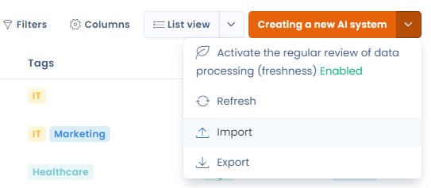

# Import you AI Systems


You can easily upload your existing register directly into Dastra. This saves you having to fill in everything by hand.

To do this, access the list view, entitled "AI systems". In the top right-hand corner, open the drop-down menu next to the "Create a new AI system" button, then click on "Import". A new page appears, at the bottom of which you can add your existing record.

<figure><figcaption><p>Import your AI Systems</p></figcaption></figure>

We recommend that you follow the steps on the [Import your data (Excel, Csv, JSON)](../generalites/importer-vos-donnees-excel-csv.md) page for further details.

## 🧩 Import Format for AI Systems in Dastra

This guide describes the expected format for the CSV file used to import AI systems into Dastra.

***

### 📄 CSV File Structure

The file must contain a header row matching the column names described below.\
All fields are optional **except `Label`**, which is required.

***

### 📘 Table of Import Fields

> 💡 **Important:** Enum-type fields must use _exactly_ the values listed under “Allowed values”.

| **Column**                    | **Description**                    | **Type**             | **Constraints**                                 | **Allowed values**                |
| ----------------------------- | ---------------------------------- | -------------------- | ----------------------------------------------- | --------------------------------- |
| **Label**                     | System name                        | String               | **Required**, 1–120 characters                  | —                                 |
| **Ref**                       | Internal reference                 | String               | Optional, max 50 characters                     | —                                 |
| **Description**               | System description                 | String               | Optional, max 4000 characters                   | —                                 |
| **State**                     | System status                      | AiSystemState        | Optional                                        | Draft, Cancelled, Pending, Active |
| **RiskLevel**                 | Risk level                         | AiSystemRiskLevel    | Optional                                        | Low, Medium, High, Unacceptable   |
| **RiskLevelJustification**    | Justification for the risk level   | String               | Optional                                        | —                                 |
| **BenefitLevel**              | Value / utility level              | AiSystemBenefitLevel | Optional                                        | Low, Medium, High                 |
| **BenefitLevelJustification** | Justification for the value level  | String               | Optional                                        | —                                 |
| **DateArchived**              | Archive date                       | DateTime             | Optional — Format: `DD-MM-YYYY` or `DD/MM/YYYY` | —                                 |
| **DateCreation**              | Creation date                      | DateTime             | Optional — Same format                          | —                                 |
| **DateUpdate**                | Last update date                   | DateTime             | Optional — Same format                          | —                                 |
| **DateDeployment**            | Deployment date                    | DateTime             | Optional — Same format                          | —                                 |
| **DateRetirement**            | Retirement date                    | DateTime             | Optional — Same format                          | —                                 |
| **TransparencyNoticeDone**    | Has a transparency notice          | Boolean              | Optional                                        | true / false                      |
| **TransparencyNoticeHtml**    | Transparency notice (HTML content) | String               | Optional, max 4000 characters                   | —                                 |

***

### 📝 Example of a CSV Line

> ✨ _A fully valid and nicely structured example:_

```
"Internal ChatGPT","SYS-001","Internal documentation assistant model","Active","Medium","Moderate risks with responsible use","High","Very high business value","01/02/2024","15/01/2024","01/03/2024","20/03/2024","","false","<p>This AI system is used to assist employees in drafting internal documents.</p>"
```

***

### 📥 Ready-to-use CSV Header Template

> 🧩 _You can paste this directly into a blank `.csv` file:_

```
Label,Ref,Description,State,RiskLevel,RiskLevelJustification,BenefitLevel,BenefitLevelJustification,DateArchived,DateCreation,DateUpdate,DateDeployment,DateRetirement,TransparencyNoticeDone,TransparencyNoticeHtml
```

