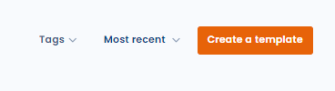
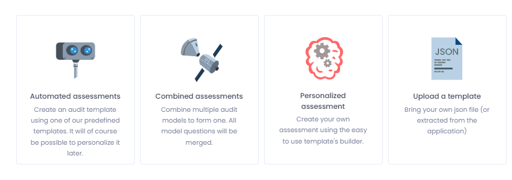
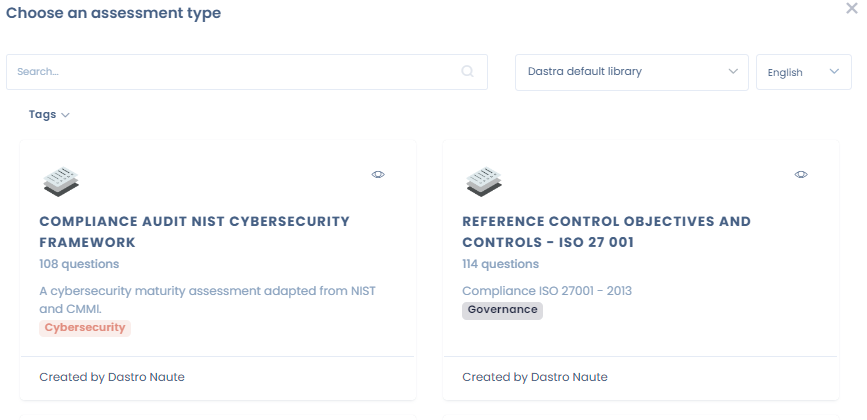
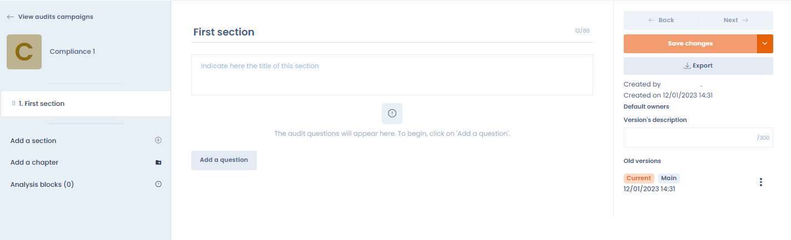
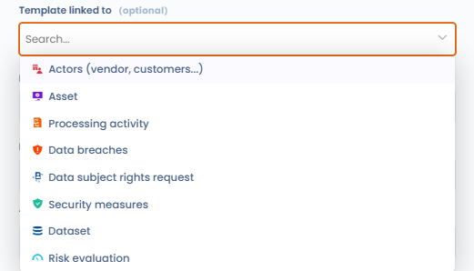
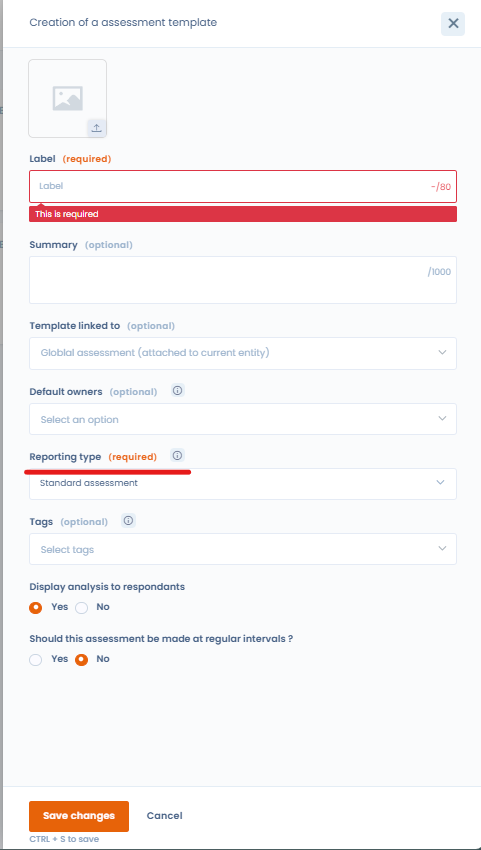

# Create or modify a questionnaire template

## Introduction

Creating or modifying a questionnaire template in Dastra is a breeze. To do so, access the "Questionnaires" functionality.

## Create or modify a questionnaire template

To create a questionnaire template, click the "Create Template" button on the "Questionnaires" tab. Then you can select one of the template types available in Dastra: automated, custom, or import from file.

<figure><figcaption></figcaption></figure>

This brings you to the template type selection interface:

<figure><figcaption></figcaption></figure>

* By clicking on the "Automated Questionnaire" tab, you will choose an existing predefined questionnaire template from the Dastra Questionnaire Library.
* By clicking on "Custom Questionnaire" you can build your own questionnaire template.


Unlike automated questionnaires, custom questionnaires are fully customisable. Based on the answers selected by respondents, you will be able to automatically generate an action plan or map the risks associated with the model.


## Automated questionnaire templates

Dastra offers a number of automated questionnaire templates to document compliance and drive processes. These include templates for privacy impact analysis (PIA/DPIA), legitimate interests assessment (LIA), transfer impact assessment (TIA), processor assessments, and more.

<figure><figcaption></figcaption></figure>

Once you have selected a template, you will be taken to the planning screen where you can either:

* modify the template by clicking on the "Modify template" button, or
* schedule a questionnaire by clicking on the "Schedule a questionnaire" button.


Some questionnaire types (PIA, TIA, LIA) can also be launched directly from within a processing activity — for example from the "Impact assessment", "Recipients" or "Purposes" tabs. See the dedicated pages below for details.


## Customised questionnaire templates

In Dastra, you can create your own custom questionnaire template. To do this, click on the "Custom Questionnaire" option. This will take you to the questionnaire template editing interface.

Build the questionnaire template you want and click on "Save and Continue".

<figure><figcaption></figcaption></figure>

## Items assessed

You can link questionnaires to items in Dastra. By choosing the type of item being assessed, you force all questionnaire responses based on that template to be linked to an object of the chosen type. For example, you can choose that this questionnaire template will always be linked to a process.

<figure><figcaption></figcaption></figure>

You can choose not to link a questionnaire to a particular object. In this case, the response will always be linked to an organisational unit. This may be the case for global compliance questionnaires for example.

## Types of templates

When creating a custom template, you will need to choose a template type.

<figure><figcaption></figcaption></figure>

These types allow for some customisation of questionnaire models.

* **Standard questionnaire**: this is a standard questionnaire
* **Compliance questionnaire**: currently a standard questionnaire
* **Impact analysis**: this questionnaire template allows a risk matrix to be displayed (with the required configuration) and to be called up at the PIA stage of a processing activity
* **Subcontractor questionnaire**: this questionnaire template is called at the subcontractor recipients stage of a processing activity
* **Transfer Impact Assessment (TIA)**: a questionnaire to analyse the risks related to a data transfer outside the EU
* **Legitimate Interest Assessment (LIA)**: questionnaire of the legal basis of legitimate interests to ensure that the interests do not override the rights and freedoms of individuals
* **Training questionnaire**: a questionnaire for conducting training quizzes. This type of questionnaire makes it possible to select a correct answer from the answers and to display the correct answers at the end of the questionnaire.

## Dynamic selection questions

Among the question types available in the template editor, two types allow you to connect a question directly to data in your Dastra workspace: **"Single dynamic selection"** and **"Multiple dynamic selection"**.

These question types display a list of objects from Dastra to the respondent: assets, processing activities, stakeholders, security measures, datasets, data fields, AI systems, contracts, etc. The respondent selects one or more items from their library as their answer.


For the list to display correctly, the respondent must have **read access** to the corresponding objects in Dastra. An external respondent without a Dastra account, or without the appropriate permissions, will not be able to see the list.


## Template version management

When modifying a template that is already in use, Dastra offers two options:

- **Overwrite the current version**: the changes apply immediately to the template. Existing questionnaires are not affected, but new campaigns will use the updated version.
- **Create a new version**: a new version of the template is created. You can leave it as a **draft** while preparing it, then promote it to **main version** when it is ready. Existing questionnaires continue to use the previous main version until you explicitly switch.

To navigate between versions, use the version selector available in the template interface. The version marked as main is the one used for all new campaigns.


The number of available templates depends on your subscription plan. This quota is shared across all workspaces in your organisation. The template recycle bin counts towards the quota — remember to empty it regularly to free up slots.


## Load a questionnaire template you own

Finally, it is possible to import one of your questionnaire templates, in json format. To do this, when creating the questionnaire, select the "Load a template" option.

## Go further


[scheduling-an-audit-or-a-pia.md](scheduling-an-audit-or-a-pia.md)



[share-an-audit-report-or-pia.md](share-an-audit-report-or-pia.md)



[pia-dpia.md](pia-dpia.md)



[tia.md](tia.md)



[lia.md](lia.md)

