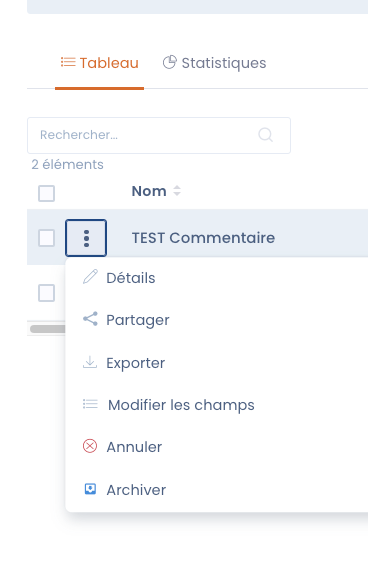
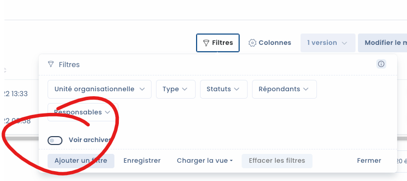
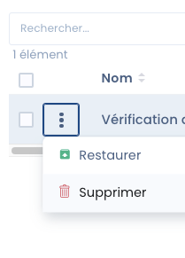
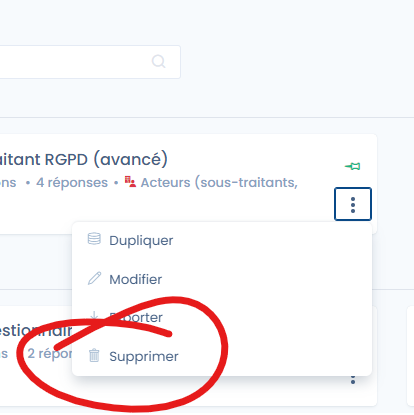

# Deleting an audit or an audit template

## Deleting an audit

Before deleting an audit, we've put a safeguard in place: an archive stage. This stage lets you keep the deleted document before permanent deletion. It works like a trash bin.&#x20;

### Archiving

First, you need to archive the audit using the **Archive** button in the audit's menu. To display the menu, go to the three dots in the audit list.

<figure><figcaption>
The Archive button is at the bottom of the list
</figcaption></figure>

Click **Archive** and your audit will move to the archives.

### Permanently deleting an audit

To **permanently delete** an audit, you need to display the archives and proceed with its deletion.&#x20;

<figure><figcaption>
Checkbox to display archives
</figcaption></figure>

Then, simply delete the audit via the audit's menu

<figure><figcaption>
You can also restore your audit if needed
</figcaption></figure>

## Deleting an audit template

To delete an audit template, go to the template list and select the **delete** button in the template's menu.&#x20;

<figure><figcaption></figcaption></figure>


Note that audit templates are not archived. Remember to download it in JSON format if you want to keep a copy to re-import later.&#x20;

