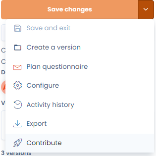
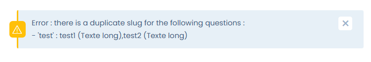
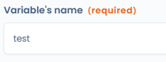
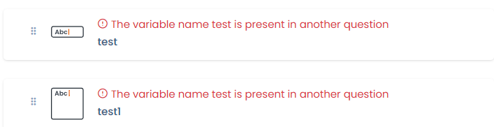
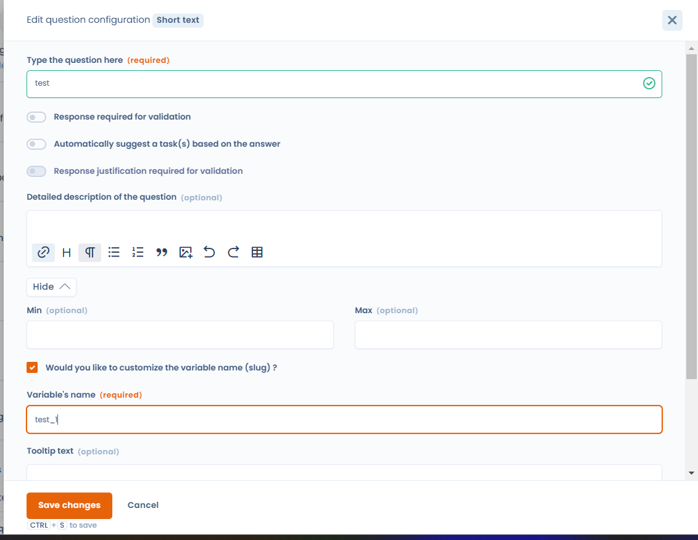
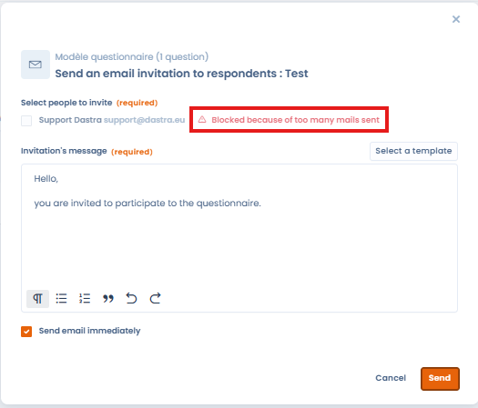
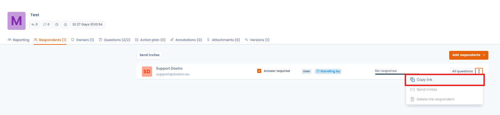
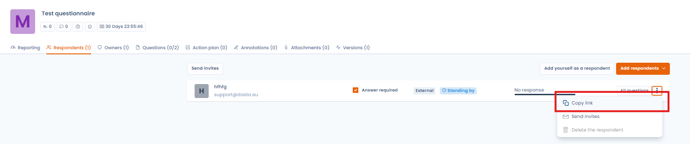

# FAQ

## Can I do a DPIA on multiple processing operations?

A data protection impact assessment may relate to one processing operation or a set of similar processing operations. A single DPIA may be used to assess several processing operations that are similar in nature, scope, context, purposes and risks.&#x20;

For example:

* local authorities each implementing a similar video-surveillance system could conduct a single analysis of that system even though it is subsequently implemented by separate controllers;&#x20;
* a railway operator (single controller) could conduct a single impact assessment on the video surveillance system deployed in several stations.&#x20;

In Dastra, the default PIA model is attached to a single processing operation. It is possible to change the template so that the PIA is not attached to a processing. In this case, you can make the PIA, export it and place it in the documentation of the concerned processing activities.

## Can an email template be set up automatically when a questionnaire is created?

You can create an email template that can be used in questionnaire invitations. It is not possible to perform automated actions via workflows for example. Questionnaires cannot be used as triggers.

## As an external respondent, can I put images in the answers?

No, this is not possible. This option is available if you are an internal respondent (Dastra user).

## Is it possible to automatically suggest a task based on a questionnaire's response?

Yes, it is possible from the "long text" question type by checking the box "Automatically suggest a task(s) based on the answer".

## Is it possible to publish a questionnaire template for all Dastra users?

Yes, you can do so from the questionnaire template editor by clicking on "Contribute":

<figure><figcaption></figcaption></figure>

## What to do when you get the error message "Error: there is a duplicate slug for the following questions" when saving a questionnaire? 

<figure><figcaption></figcaption></figure>

This message indicates that one or more questions in the questionnaire have exactly the same "Variable's name", which creates the error.

<figure><figcaption></figcaption></figure>

Questions with the same "Variable's name" can be identified by the error message "The variable name is present in another question" displayed above them.

<figure><figcaption></figcaption></figure>

To solve this problem, modify the "Variable's name" of each duplicate question to make it unique, for example by adding an incremented number at the end of each "Variable's name".

<figure><figcaption></figcaption></figure>

When the questionnaire no longer contains any duplicated "Variable's name", it can be saved normally.

## What to do when you get the error message "Blocked because of too many mails sent"? 

<figure><figcaption></figcaption></figure>

This message appears if 5 email invitations have already been sent to a respondent from the same questionnaire.

When this message appears, you can still invite the respondent by sending them the questionnaire invitation link available here:

<figure><figcaption></figcaption></figure>

## What should I do when I cannot "Review and validate the questionnaire" even though I am an owner of the questionnaire?

This can happen when the respondent has not yet finalized their questionnaire by clicking on the "Finalize" button after completing it.

In this case, as an owner, you can check the status of the questionnaire from the respondent's side using the respondent access link available here:

<figure><figcaption></figcaption></figure>

## Is there a limit on the number of questionnaire templates?

Yes, the number of available templates depends on your subscription plan. This quota is **shared across all workspaces** in your organisation. The **template recycle bin counts towards the quota**: deleted templates that have not been permanently removed still occupy a slot. If you reach the limit, empty the recycle bin from the template management interface to free up slots.

## Can a questionnaire access link be shared with multiple people?

Yes. When a respondent receives an invitation link by email, the **first access via that link does not require a PIN code**. However, if the respondent forwards the link to a colleague, that person will need to validate their access via a **PIN code received by email**. This mechanism ensures security while allowing collaboration within an external team, without requiring a Dastra account.

## Can an external respondent add other respondents themselves?

No, only the **questionnaire owner** can add new respondents from the Dastra interface. If an external respondent wishes to involve a colleague, two options are available: the owner can directly add the new email address from the questionnaire management view, or the respondent can share their invitation link — the colleague will then need to validate access via a PIN code sent by email.

## Is there an automatic reminder when a questionnaire is awaiting validation?

Currently, the owner receives a **notification** (in Dastra and by email) when the respondent finalises the questionnaire, but there is no periodic automatic reminder system. To avoid missing pending questionnaires, two alternatives exist: regularly check the **"My responses"** view in the Questionnaires module, or set up a **workflow rule** to automate sending a questionnaire or notification at regular intervals.

## Do dynamic selection questions require specific permissions for respondents?

Yes. The **"Single dynamic selection"** and **"Multiple dynamic selection"** question types display lists of objects from Dastra (assets, processing activities, stakeholders, etc.). For this list to appear, the respondent must have **read access** to the corresponding objects in Dastra. An external respondent without a Dastra account, or without the appropriate permissions, will not be able to see the list.
