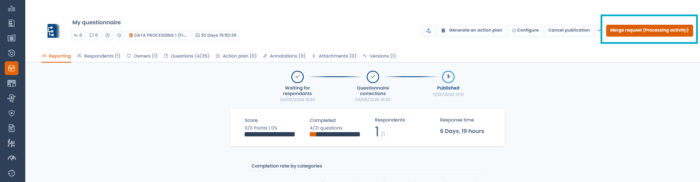

# Monitor questionnaires

## Response dashboard

From the **"View questionnaires"** tab, select a questionnaire template to access its response dashboard. It provides four views:

* **Responses**: list of all responses with their status (pending, validated, overdue), score and linked object
* **Detailed board**: side-by-side comparison of all responses by category and score — useful for benchmarking across entities or processing activities
* **Stats**: aggregated statistics across all responses for that template
* **Details**: configuration and metadata of the questionnaire

## Individual response reporting

Opening a response gives access to a detailed reporting view:

* **Status timeline**: progression from "Waiting for respondents" → "Started" → "Pending validation" → "Validated"
* **Score**: total score out of the maximum points
* **Completion**: number of questions answered out of the total
* **Response time**: how long the respondent took to complete the questionnaire
* **Red flags**: answers automatically flagged as requiring attention based on the template configuration
* **Result analysis**: automatic analysis blocks generated from the responses (compliance level, risk assessment, etc.)
* **Scoring by categories**: visualised as a radar chart or bar chart, broken down by questionnaire section

## AI analysis (beta)

From a response's reporting view, trigger an **AI analysis** to get:

* An overall compliance or risk score
* A written review summarising key findings
* A breakdown by analysis criteria (completeness, legal basis, security measures, etc.)
* Suggested tasks to address identified gaps


The AI analysis is a beta feature. Results should be interpreted with caution and reviewed by a qualified professional.


## Validating a response

Once you have reviewed a response, click **"Review and validate the questionnaire"** to move it to "Validated" status. This action is available to questionnaire owners.


If you cannot validate a response, check that the respondent has clicked the **"Finalize"** button. Without this step, the response remains in "Pending validation".


## Merging responses into the linked object

After completing a questionnaire linked to a Dastra object (processing activity, asset, actor, etc.), you can **merge the collected responses directly into that object's fields**.

This updates the corresponding fields in the target object from the information entered in the form, without any additional manual data entry.

To start the merge, open the completed response and click **"Merge request (Processing activity)"** — a confirmation window shows the details of the target object to update.

<figure><figcaption>
The "Merge request" button pushes questionnaire answers back into the linked Dastra object
</figcaption></figure>

<figure><figcaption>
Confirming the merge and creating the processing activity from the collected responses
</figcaption></figure>

This feature is particularly useful in external collection scenarios via Privacy Hubs, where third parties (suppliers, sub-processors) fill in information that then needs to be reflected in your internal records.

## Translating a questionnaire template with AI

Dastra lets you automatically translate all sections and questions of a questionnaire template into another language using the AI assistant.

To launch the translation, open a questionnaire template and click **"Translate questionnaire"**.

<figure><figcaption>
The "Translate questionnaire" button is available from the template editor
</figcaption></figure>

Choose the target language and the save mode:

* **New version** — replaces the current version of the template with the translation
* **New independent template** — creates a separate template with no link to the original

<figure><figcaption>
Selecting the target language and save mode for the translation
</figcaption></figure>

## Generating an action plan

From a response's reporting view, click **"Generate an action plan"** to automatically create tasks based on the answers provided. Tasks are suggested according to the template's configuration and added directly to Dastra's task management module.
