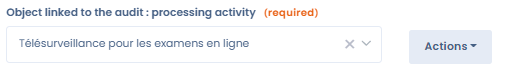

# Schedule a questionnaire

## Campaign planning

Once the questionnaire template has been created and customised, launch a campaign by clicking on the "Schedule a questionnaire" button.

### Redesigned home page

The questionnaire home page now lets you start scheduling directly from the main interface, without going through the template configuration. Available templates are displayed with their statistics (responses received, completion rate) to help you choose quickly.

### Quick creation (self-respondent)

A **quick creation** option is available when you are the sole respondent. In this mode, the correction/validation step by a third party is removed, simplifying the flow for internal self-assessments.

### Direct DPIA access from the processing register

For **PIA/DPIA**-type questionnaires, you can now launch an impact assessment directly from a processing activity record. A dedicated button in the "PIA" tab of the processing activity opens the corresponding questionnaire without leaving the processing context.

### Sending modes

Enter the name of the campaign and the respondents, invite both internal and external respondents and then wait for the responses. They will receive an email with a link to an online space where they can fill in their answers.

It is possible to re-invite those who did not respond to the questionnaire.

### Individual or collaborative questionnaire

When scheduling a questionnaire, you choose between two response modes:

- **Individual questionnaire**: if you add multiple respondents, Dastra generates a separate questionnaire for each of them. This mode is ideal for collecting comparable information from several people or entities (e.g. vendor assessments, department-by-department evaluations) and for generating consolidated reporting across responses.
- **Collaborative questionnaire**: a single questionnaire is shared among all designated respondents, who answer the same questions together. This mode suits long or multi-domain questionnaires involving several teams (e.g. a DPIA requiring input from legal, IT and business teams).

### AI-assisted response

Within an active questionnaire, the **AI assistant** can help you fill in answers automatically. By clicking **"AI-assisted response"**, you can provide documents as context (project notes, security policy, DPA, existing analysis, etc.): the AI analyses these documents and suggests answers for each question, which you can then review, adjust and validate before submitting.

This feature is particularly useful for long or complex questionnaires such as DPIAs, TIAs or LIAs, when you already have existing documentation available.


Using the AI-assisted response feature consumes AI credits. See the [AI Assistant](../generalites/ai-assistant/) page for details on your quota and usage.


## Linking the questionnaire to other objects in Dastra

It is possible to attach the questionnaire to another specific module. To do this, when configuring your questionnaire template, after giving it a name and a description, attach an element to it which will be the object of the questionnaire.

<figure><figcaption></figcaption></figure>

If your questionnaire has already been created, it is still possible to attach an element to it afterwards. Go to the questionnaire, click on the "Modify template" button, then on the "Configure" button located below the "Save" button. This will take you back to the initial template configuration tab.

These objects can be actors, assets, applications, data processing, data breaches, rights exercises, data sets, security measures, risk assessments.

Then, when you schedule your questionnaire, a new box "Object related to the questionnaire" will appear. The selector will allow you to choose more precisely to which object you will link the questionnaire.

<figure><figcaption></figcaption></figure>
