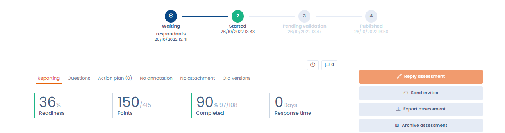

# Share a questionnaire report

Once the answers have been obtained, you can consult, validate, publish, review, export or archive your questionnaire report.

<figure><figcaption></figcaption></figure>

You can also view a questionnaire and risk score, as well as generate an action plan automatically based on the answers provided by respondents.
