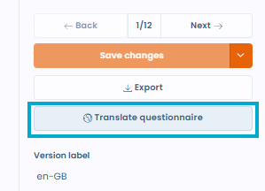
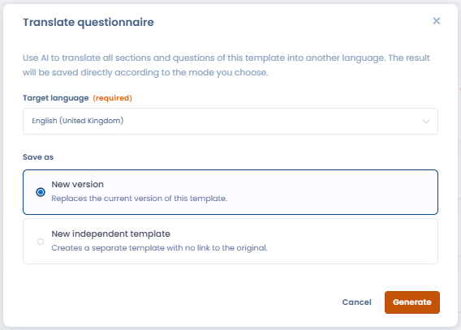

# Translate a form with AI

From the form editor, you can **automatically translate a form** into the language of your choice using the AI assistant.

To start a translation:

1. Open the form to translate in the editor.
2. Click **"Translate the form"** in the editor menu.
3. Select the target language.
4. Choose one of the two options:
   1. **Create a new template** from the current form in the target language
   2. **Create a new version** of the current form directly in the target language

<figure><figcaption></figcaption></figure>

The translation covers questions, sections, answers, and supporting text. Language availability depends on the LLM model configured in your workspace.

<figure><figcaption></figcaption></figure>
