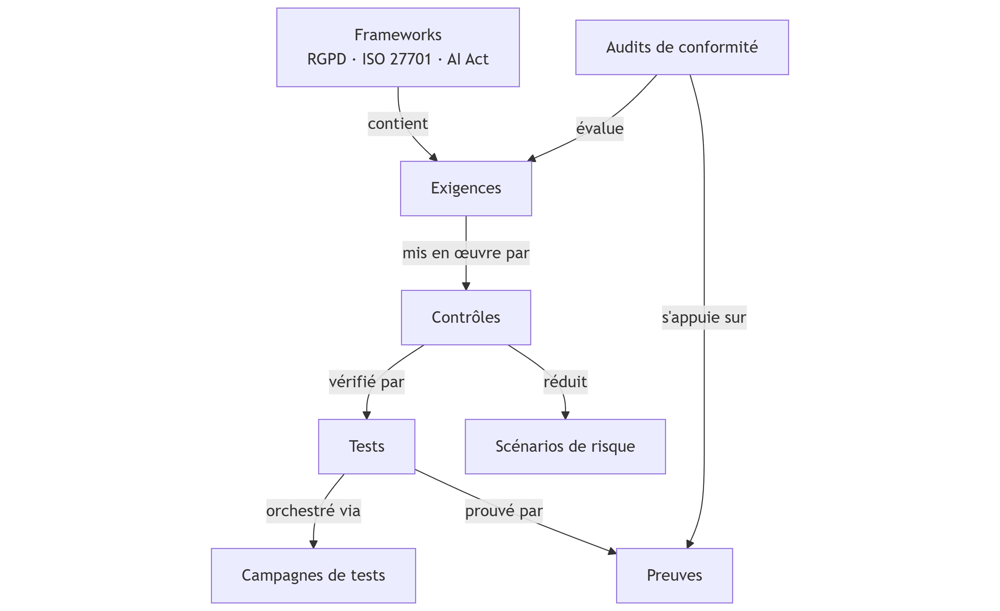

# Compliance

The **Compliance** module of Dastra makes it possible to manage regulatory compliance in a structured, traceable and auditable way, relying on a modular architecture aligned with compliance frameworks.

***

### Architecture of the Compliance module

The module is based on a logical chain of objects, from regulatory frameworks through to compliance evidence.

<figure><figcaption></figcaption></figure>

#### Frameworks

Examples: GDPR, ISO 27701, ISO 27001, AI Act.

A framework:

* defines the regulatory or normative framework,
* contains a set of applicable requirements.

***

#### Requirements

Requirements represent the obligations arising from a framework.\
Examples: access control, authorization management, logging.

Each requirement:

* is attached to a framework,
* is assessed during compliance audits,
* is implemented through one or more controls.

***

#### Controls

Controls describe **how** a requirement is applied concretely.\
Examples: periodic access review, authorization procedure.

A control:

* implements a requirement,
* is linked to one or more risk scenarios,
* is verified using tests.

***

#### Risk scenarios

Risk scenarios describe the feared events.\
Example: unauthorized access to sensitive data.

Controls make it possible:

* to prevent or reduce these risks,
* to demonstrate the remediation measures put in place.

***

#### Tests

Tests are used to verify the effectiveness of controls.\
Examples: recurring access review, validation delegation.

A test:

* checks one or more controls,
* produces measurable results,
* is supported by evidence.

***

#### Test campaigns

Campaigns make it possible to orchestrate tests at scale:

* sending campaigns to teams or clients,
* centralized collection of responses,
* tracking progress and statuses.

***

#### Evidence

Evidence demonstrates compliance.\
Examples: policies, procedures, access review reports.

A piece of evidence:

* is associated with a test,
* is used during audits,
* ensures the traceability of controls.

***

#### Compliance audits

Audits make it possible to assess the level of compliance:

* internal audits,
* self-assessments,
* preparation for external audits.

They rely on:

* requirements,
* controls,
* the associated tests and evidence.

***

### Overview

The Dastra Compliance module thus makes it possible to:

* structure regulatory requirements,
* connect obligations to risks,
* prove compliance through tested and documented controls,
* efficiently prepare for audits and certifications.

### The multi-framework principle in Dastra

The Dastra Compliance module is **natively multi-framework**.

This means that:

* a given **framework** (GDPR, ISO, AI Act…) contains its own requirements,
* a **requirement** belongs to **one framework**,
* a **control can address several requirements**, including ones from **different frameworks**,
* **tests and evidence** are shared and reusable.

Objective: **avoid duplication** and steer compliance in a cross-cutting way.

***

### Key relationships between objects

* **Framework → Requirements**: 1 → N
* **Requirements ↔ Controls**: N ↔ N
* **Controls ↔ Tests**: N ↔ N
* **Tests → Evidence**: 1 → N
* **Controls → Risk scenarios**: N ↔ N

A single control (e.g. access review) can thus:

* satisfy a GDPR requirement,
* satisfy an ISO 27001 requirement,
* reduce several risk scenarios.

**Explanatory diagram**

<figure><figcaption></figcaption></figure>
