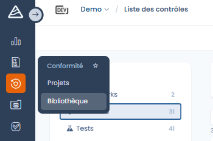

# Library

It constitutes the **common foundation** on which frameworks, compliance projects and risk management are built.



From the library, you can create, structure and maintain:

* **frameworks** (compliance frameworks),
* **requirements**,
* **controls**, the central elements linking requirements, tests and risks,
* as well as the associated **risks** and **threats**.



<figure><figcaption></figcaption></figure>




The library enables a **cross-cutting and reusable approach** to compliance:\
a single control can cover several requirements, be shared across several frameworks and be assessed using standardized tests.\
This centralization facilitates governance, improves the consistency of frameworks and offers a global view thanks to dedicated indicators and statistics.
