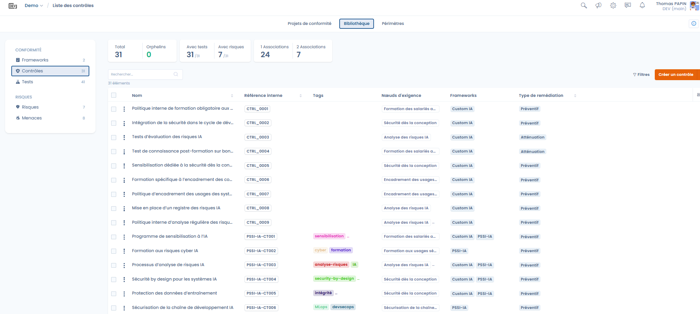
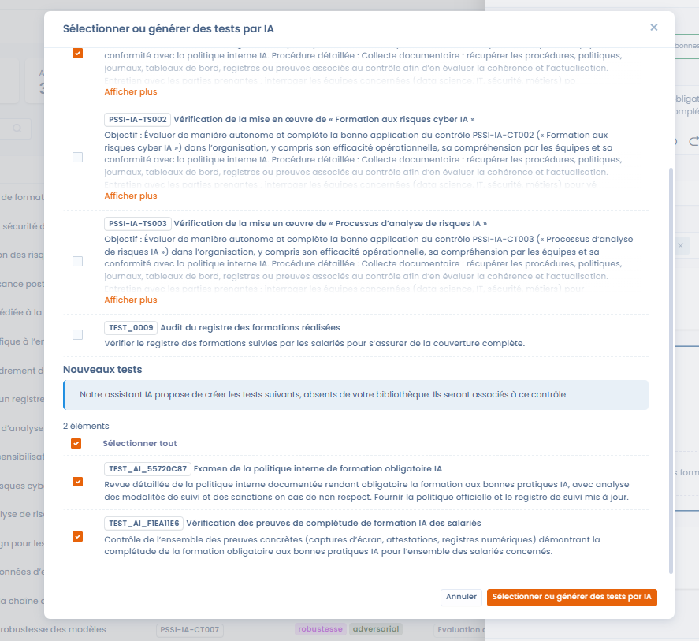
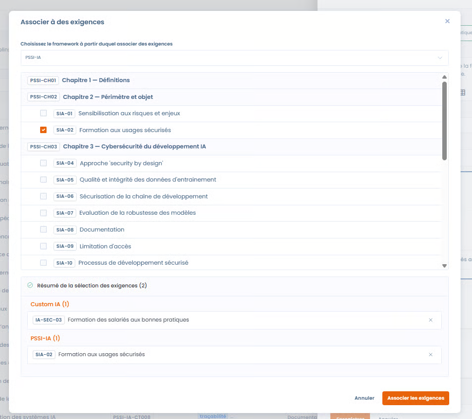
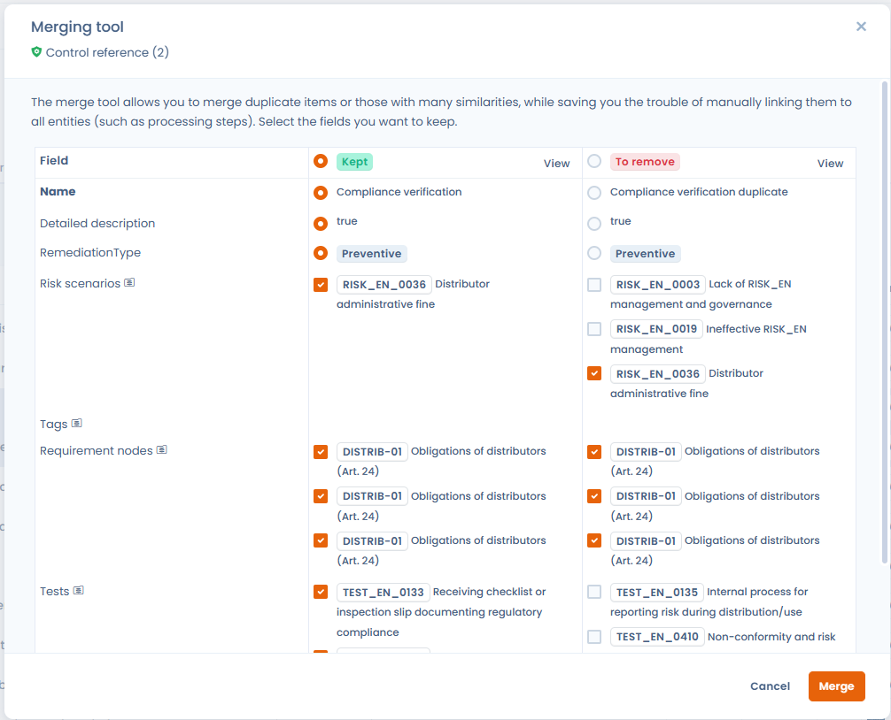

# Controls

Controls are the central element of the Dastra compliance model.

They translate the requirements of a framework into **concrete measures** that are measurable and auditable, making it possible to demonstrate the effectiveness of compliance over time.

A control can:

* cover **one or more requirements**
* be shared across **several frameworks**
* be associated with **tests** and **risks**

***

### Tracking and managing controls

<figure><figcaption></figcaption></figure>

Controls can be tracked from two complementary entry points.

***

#### 1. From the framework

In the **Controls** tab of a framework, the user can view:

* the controls attached to the framework's requirements
* their remediation type
* the requirements covered
* the associated tests and risks

👉 This view is ideal for:

* understanding the coverage of a framework
* identifying key controls
* steering compliance by framework

***

#### 2. From the control library

<figure><figcaption></figcaption></figure>

The **control library** centralizes all of the organization's controls, across every framework.

This view makes it possible to:

* benefit from **global statistics** (controls with tests, risks, multiple associations, orphans)
* identify controls reused across several frameworks
* improve the **quality and consistency** of the control library

👉 It is a key tool for governance and for industrializing compliance.

***

### Control editing window



The editing window makes it possible to precisely define the role of the control and its links with the rest of the framework repository.



<figure><figcaption></figcaption></figure>



***

#### Control label and reference

* **Control label**\
  Clearly describes the action or measure being implemented.
* **Control reference**\
  Unique identifier of the control in the library.



📌 A **reference generator** is available to automatically suggest a reference that is consistent with:

* the context of the control
* the naming conventions
* the associated frameworks

The user can freely adjust the proposed reference.



<figure><figcaption></figcaption></figure>



***

#### Remediation type

Each control must be associated with a **remediation type**, which specifies its nature:

* **Preventive**\
  The control aims to **prevent** a risk from occurring\
  &#xNAN;_(e.g. training, access rules, validation before going to production)_
* **Mitigation**\
  The control aims to **reduce the impact or likelihood** of a risk that already exists\
  &#xNAN;_(e.g. monitoring, detection, mitigation plan)_

👉 This distinction is essential in order to:

* analyze the risk management strategy
* balance prevention and detection
* steer compliance maturity

***

#### Tags

Tags make it possible to:

* categorize controls (e.g. training, AI, security, monitoring)
* make searching and filtering easier
* analyze the dominant themes of the library

***

### Associating tests

[**Tests**](tests.md) make it possible to verify the existence, application and effectiveness of a control.

#### AI-assisted association



<figure><figcaption></figcaption></figure>



The AI assistance suggests:

* **existing tests** in the library that are relevant to the control
* the **creation of new tests** when necessary

👉 This approach ensures:

* consistency between controls and tests
* time savings
* standardization of audit methods



***

### Associating requirements



A control can be associated with:

* several requirements of the same framework
* requirements from **different frameworks**

👉 This makes it possible:

* to share controls
* to link an internal control to a regulatory framework
* to create bridges between frameworks (e.g. Custom AI ↔ AI ISSP)



<figure><figcaption></figcaption></figure>



***

### Associating risks



<figure><figcaption></figcaption></figure>



Controls can be associated with:

* **existing** [**risks**](risks.md)
* or **new risks** created directly from the control sheet

The association makes it possible:

* to view the risks covered by a control
* to assess the impact of the control on the residual risk
* to structure a consistent approach to risk management



***

### Merging controls

Over time, the control library may contain redundant or nearly identical controls coming from different frameworks. The **merge** feature makes it possible to consolidate them into a single reference control.

#### How the merge works

From the control library or a project, select the controls to merge (up to 30), then trigger the merge via the **bulk actions**. A wizard prompts you to choose the **target** control (the one that will be kept): all the associations of the source controls — evidence, requirements, risk scenarios, covered controls — are automatically consolidated onto the target control, without data loss, and then the source controls are deleted.


The matching is **entirely manual**: Dastra does not automatically detect duplicates. It is up to you to select the similar controls to consolidate.


<figure><figcaption>
Select up to 30 controls, then trigger the merge via the bulk actions
</figcaption></figure>

The merge wizard displays the two controls side by side: **Kept** (target control) on the left, **To be deleted** (source control) on the right. For each multi-valued field (risk scenarios, requirements, tests), you choose the values to carry over to the target control.

<figure><figcaption>
Compare the controls side by side and choose, field by field, the values to keep — evidence, requirements, risk scenarios and covered controls are consolidated onto the kept control
</figcaption></figure>


The merge is irreversible. Check the associations of each source control before confirming the operation.


#### Typical use cases

* **Deduplication**: several framework imports have created equivalent controls — the merge consolidates them without loss of information.
* **Cross-cutting sharing**: a control covering both ISO 27001 and the AI Act framework can be obtained by merging the controls from each framework.
* **Library cleanup**: before an audit, removing orphaned or redundant controls improves the readability of the compliance dashboard.

***

### Summary: why controls are central

In Dastra, controls are the **point of convergence** between:

* the requirements (what is expected)
* the tests (what is verified)
* the risks (what is managed)

This approach enables:

* operational and measurable compliance
* cross-cutting governance
* smart reuse of compliance efforts
