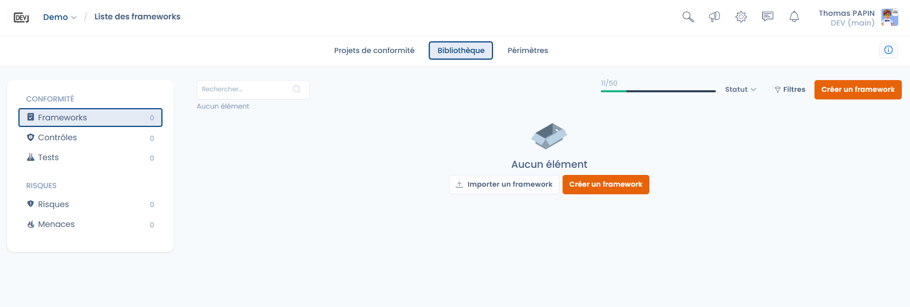

# Frameworks

The **Frameworks** page of the Library is the entry point to the compliance approach in Dastra.\
A framework represents a **structured compliance framework** (e.g. GDPR, E-Privacy, AI Act), bringing together requirements, controls, risks and threats.\
These frameworks serve as a **common foundation** for building your compliance projects, harmonizing your practices and ensuring full traceability between regulatory obligations, operational controls and risk management.

***

#### 1. Side navigation – Compliance library

<figure><figcaption></figcaption></figure>

The side menu provides access to the different objects of the library:

* **Frameworks**: compliance frameworks (central library)
* **Requirements**: chapters and requirements that structure a framework
* **Controls**: the central element linking requirements, tests and risks
* **Risks**: supports for risk assessment and monitoring
* **Threats**: events or scenarios that may materialize a risk

***

#### 2. List of frameworks

The central area displays the list of frameworks available in your environment:

* Frameworks created by your organization
* Frameworks imported from the Dastra library
* Number of frameworks in your quota (note that the quota is shared at the account level, not the workspace level)
* Filters by status (draft, published, etc.)

When no framework is present, Dastra directly offers:

* [**Import a framework**](import-et-modeles-dastra.md)
* [**Create a framework**](create-custom-framework.md)


Remember that the quota is shared across the entire organization, and not only the workspace. Keep an eye on your usage to avoid hitting the limits.

