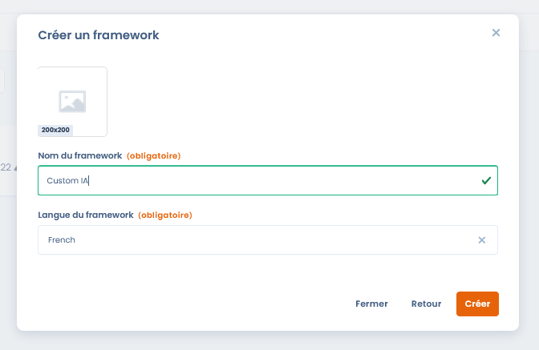
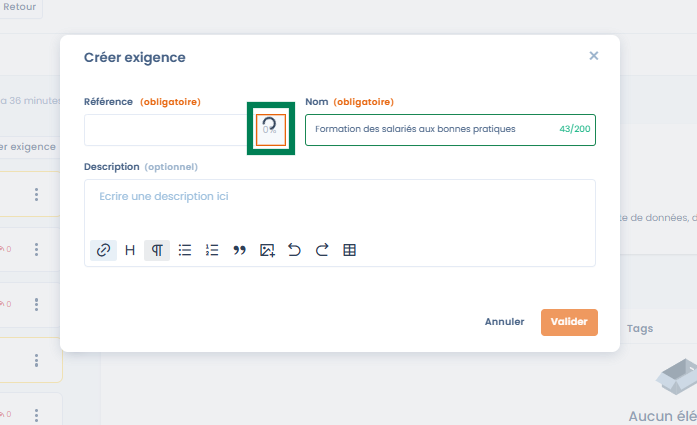
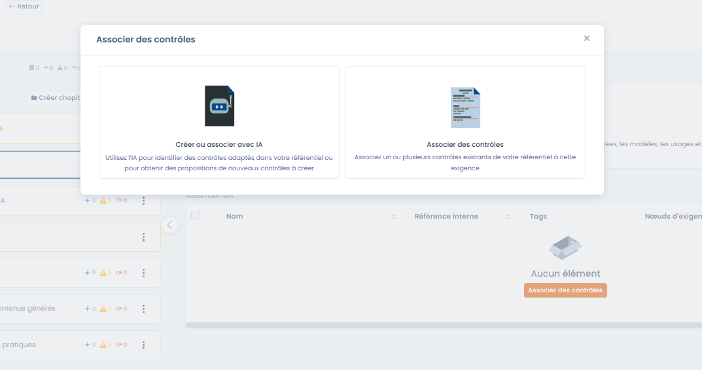

# Create a custom framework

#### Introduction

Creating a custom framework makes it possible to build a compliance framework **adapted to the organization's specific context**: internal policy, sector-specific framework, AI initiative, security, quality or governance.

A custom framework can be:

* built **entirely from scratch**,
* or serve as a **common foundation** for several compliance projects.

***

### Step 1 – Creating the framework



When creating a custom framework, the user defines:

* **The framework name** (e.g. _Custom AI_, _AI ISSP – Demo_)
* **The framework language**, which will determine the default language of the requirements and controls

Once created, the framework is added to the Library, in a **draft** state.



<figure><figcaption></figcaption></figure>



***

### Step 2 – Viewing and available actions

By default, a newly created framework is:

* **empty**
* **read-only**

#### Actions available as long as the framework has not been modified

* **Export**: retrieve the framework in JSON / Excel format
* **Duplicate**: create a copy of the framework
* **Move to trash**: delete the framework

👉 **No addition or modification is possible until the framework is in edit mode.**

***

### Step 3 – Switching to edit mode



To enrich the framework (chapters, requirements, controls…), it is necessary to:

1. Click on **Edit**
2. Switch the framework to **edit mode**

In edit mode, the user can:

* Create **chapters**
* Add **requirements**
* Progressively structure the framework




<figure><figcaption></figcaption></figure>




***

## Creating and structuring requirements

Once the framework has been created and switched to **edit mode**, the user can begin structuring the framework using **chapters** and **requirements**.\
This step makes it possible to translate a regulatory, normative or internal framework into elements that can be used in Dastra.

***

### Structuring by chapters



<figure><figcaption></figcaption></figure>



Chapters make it possible to organize the framework in a readable and coherent way.



#### Structuring rules

Dastra allows:

* **root chapters**
* **sub-chapters**

👉 The depth is intentionally limited to a **maximum of two levels** in order to:

* guarantee the readability of the framework
* avoid overly complex structures
* make it easier to use the requirements in compliance projects

#### Fields to fill in

When creating a chapter:

* **Reference**: internal identifier of the chapter
* **Name**: functional title of the chapter

&#x20;


_Best practice_: use chapters to structure by major themes\
(e.g. governance, security, operations, uses…).


***

### Creating a requirement



Requirements express the **compliance expectations** the organization must meet.\
They constitute the direct link between the framework and the operational controls.



<figure><figcaption></figcaption></figure>



#### Available fields

* **Reference (required)**\
  Unique identifier of the requirement within the framework
* **Name (required)**\
  Concise formulation of the requirement
* **Description (optional)**\
  Details of the expected content, scope and objectives of the requirement

***

### AI assistance for the requirement reference



<figure><figcaption></figcaption></figure>



When creating a requirement, Dastra offers **AI assistance** to automatically generate a reference consistent with:

* the name of the requirement
* the parent chapter
* the context of the framework




👉 This feature makes it possible:

* to harmonize naming conventions
* to avoid inconsistencies or duplicates
* to save time when creating custom frameworks

The user remains free to modify the proposed reference.

***

### Organizing and managing requirements

<figure><figcaption></figcaption></figure>

Once created, requirements can be:

* moved to another chapter
* deleted
* progressively enriched

Each requirement also displays summary indicators (links with controls, risks, tests), making it easier to understand its level of coverage.

***

### Associating controls with a requirement



Controls are the **operational** elements that make it possible to demonstrate compliance with one or more requirements.

To associate controls with a requirement, two approaches are possible.



<figure><figcaption></figcaption></figure>



***

#### Option 1 – Associate existing controls




The user can select one or more controls already present in the Library and attach them to the requirement.




<figure><figcaption></figcaption></figure>



👉 A single control can be associated with **several requirements**, promoting:

* sharing
* consistency of the framework
* better traceability

***

#### Option 2 – Create or associate controls with AI



<figure><figcaption></figcaption></figure>



Dastra offers an AI assistance feature that makes it possible to:

* automatically identify **relevant existing controls**
* propose the **creation of new controls** when necessary

The AI relies on:

* the content of the requirement
* the context of the framework
* the controls already present in the Library



👉 Controls created via AI can automatically include:

* their description
* their attachment to the requirement
* the associated tests

***

### Benefits of this approach

This approach makes it possible to achieve:

* a **progressive structuring** of the framework
* **intentional overlaps** between requirements
* the creation of cross-cutting controls covering several requirements
* a solid basis for risk management and compliance projects
