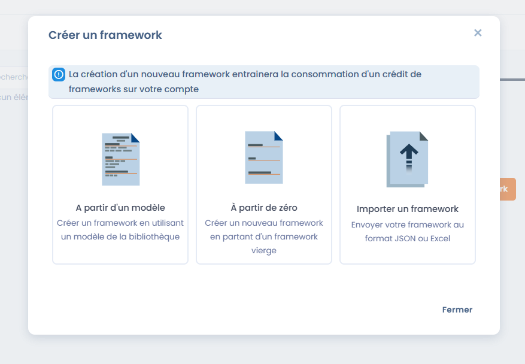
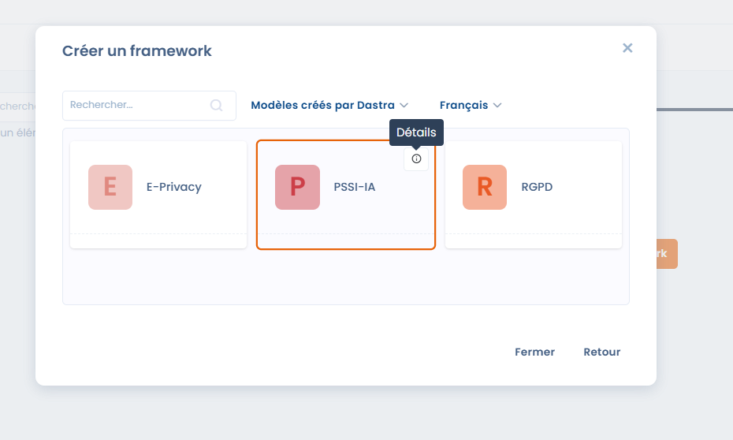
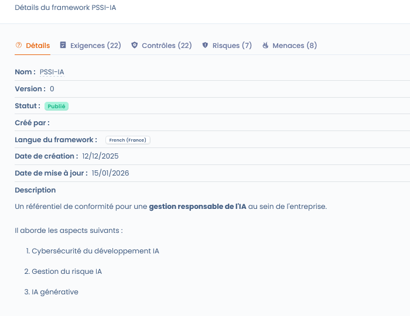
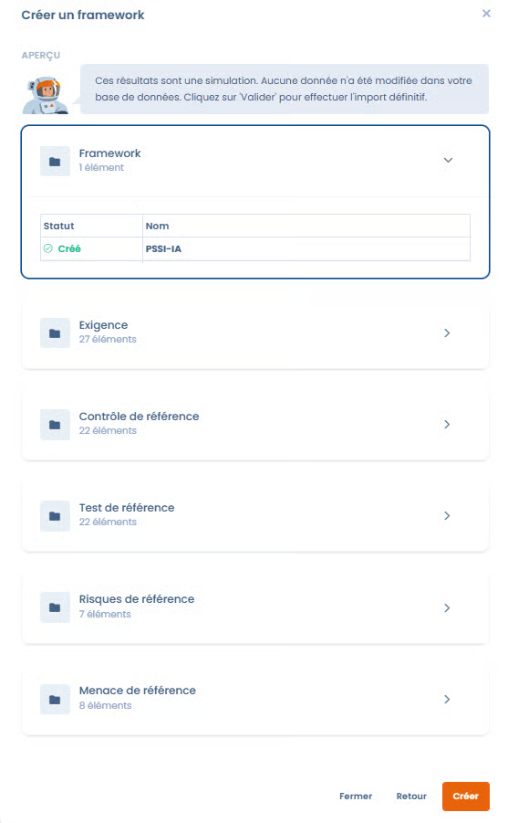

# Dastra import and templates

#### 1. Main actions



From this page, you can:

* **Create a framework** (blank or from a template)
* **Import a framework** (JSON or Excel)
* View the **details of an existing framework**







***

### Create a framework from a template

#### Why start from a template?

Importing a framework from a template makes it possible to **save time** and to rely on a framework that is already structured and compliant with regulatory or sector-specific best practices.

The templates offered by Dastra include:

* The structure of the chapters
* The associated requirements
* The controls
* The related risks and threats

They can then be **customized** to fit your context.

***

#### Steps to import a template



* Click on **Create a framework**
* Select **From a template**
* Access the Dastra template library
* Filter the templates by:
  * Author (e.g. _Templates created by Dastra_)
  * Language
* Select the desired template
* View the **framework details**:
  * Number of requirements
  * Controls
  * Risks
  * Threats
  * Functional description
* Confirm the import\
  → The framework is added to your Library and becomes **editable**.



<figure><figcaption></figcaption></figure>

<figure><figcaption></figcaption></figure>



⚠️ Creating a new framework consumes a **framework credit** on your account.

***

### Result after import



<figure><figcaption></figcaption></figure>



You will then be able to check the elements before creation.

All the objects contained in your framework will be created in your library.



Once imported, the framework:

* Is available in the library
* Can be enriched or adapted
* Serves as a basis for:
  * **Compliance projects**
  * The assessment of controls
  * Risk management
