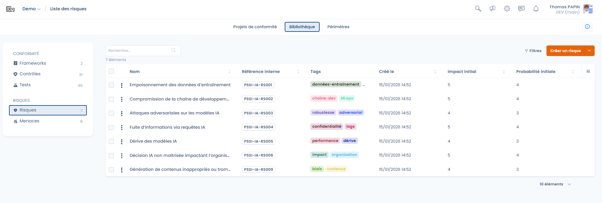
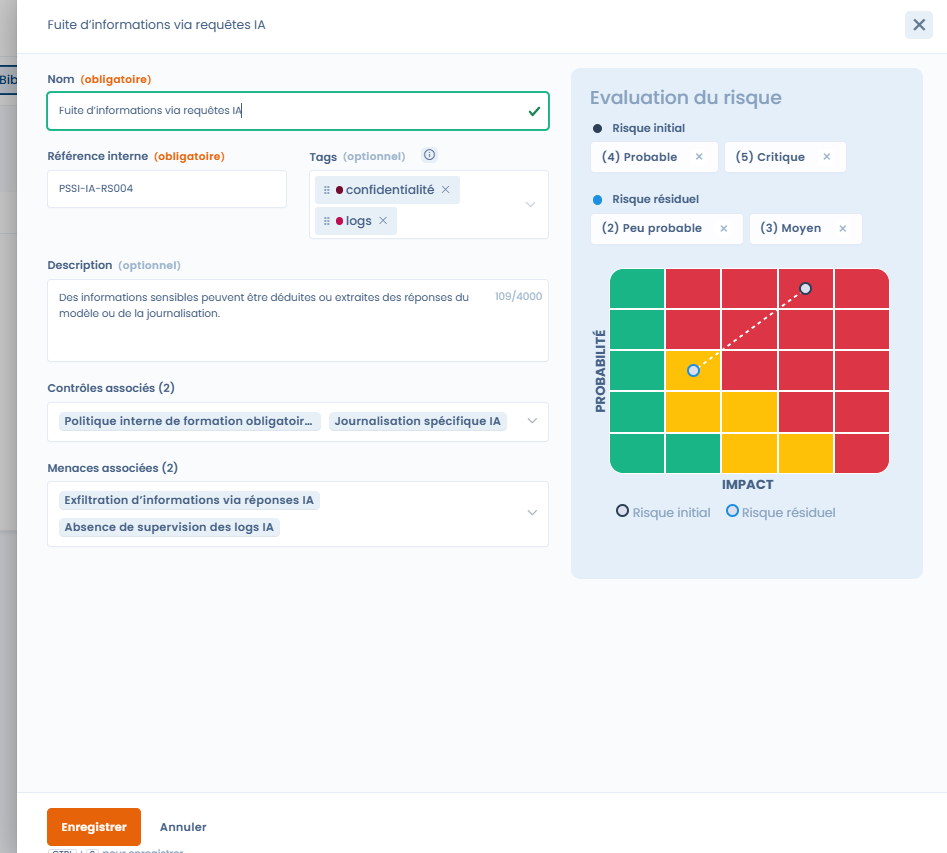
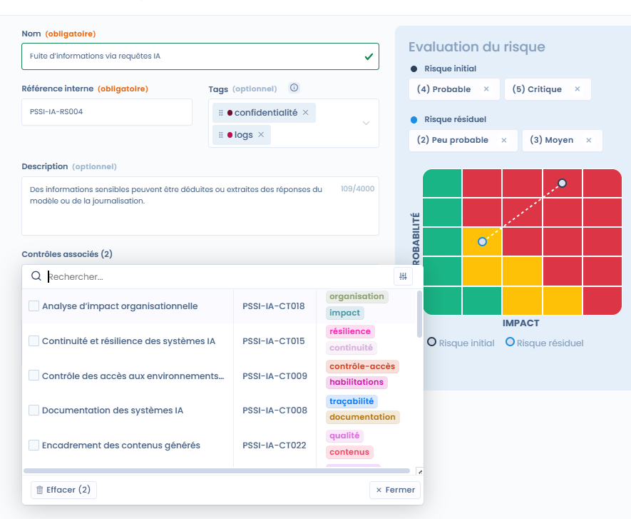

# Risks

In Dastra, a risk represents a **feared event** that may have a negative impact on the organization, in relation to the use, development or operation of systems (e.g. AI systems).

Risks are a **key steering element**: they make it possible to measure the organization's exposure and to assess the actual effectiveness of the controls that are in place.

***

### Risks and controls: a central relationship

An essential point to understand is that **risks are never isolated**.

👉 In Dastra:

* a **risk is covered by one or more controls**
* a **control contributes to reducing one or more risks**

Controls therefore constitute the **risk mitigation measures**.\
They make it possible to reduce:

* the **likelihood** of the risk occurring,
* and/or its **impact** on the organization.

This relationship makes it possible to move from a declarative approach to **operational risk management**, based on concrete and verifiable actions.

***

### Risk library view

<figure><figcaption></figcaption></figure>

The risk library provides a global view of the identified risks, including in particular:

* their reference and description,
* the associated tags (confidentiality, performance, robustness, etc.),
* the initial impact and likelihood levels,
* filters to facilitate cross-cutting analysis.

👉 This view makes it possible to:

* identify the major risks,
* verify their coverage by controls,
* prioritize compliance efforts.

***

### Creating and describing a risk



<figure><figcaption></figcaption></figure>



When creating or editing a risk, the user provides:

* **the name and reference of the risk**
* a **description** used to qualify the risk scenario
* **tags** to facilitate categorization



***

### Risk assessment

Each risk is subject to two distinct assessments:

#### Initial risk

The **initial risk** corresponds to the risk level **before the controls are implemented**.

It is assessed according to:

* a **likelihood**
* an **impact**

These two dimensions are positioned on a standardized **risk grid**.

***

#### Residual risk

The **residual risk** corresponds to the risk level **after the associated controls are applied**.

👉 Comparing the initial risk and the residual risk makes it possible to:

* measure the effectiveness of the controls,
* visualize the reduction of the risk,
* justify remediation choices.

📌 At this stage, the **risk grid is fixed** and common to all risks, in order to guarantee a homogeneous and comparable assessment.

***

### Associating controls



A risk must be associated with one or more **controls**, which represent the measures implemented to mitigate it.

The association makes it possible to:

* clearly identify the levers for reducing the risk,
* track the impact of the controls on the residual risk,
* ensure traceability between compliance and risk management.



<figure><figcaption></figcaption></figure>



***

### Associating threats

Risks can also be linked to **threats**, which represent the **events or causes** likely to trigger the risk.

👉 Example:

* **Threat**: lack of monitoring of AI logs
* **Risk**: information leakage through AI queries

This distinction allows a finer and more structured analysis of risk scenarios.

***

### Why include risks in the library

Centralizing risks in the library makes it possible to have:

* a cross-cutting view of risks across all frameworks
* better consistency in their assessment
* a direct link between risks, controls and requirements
* more effective steering of compliance and security
