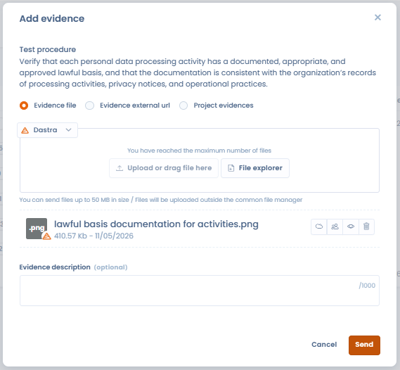
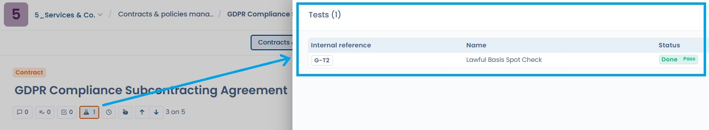
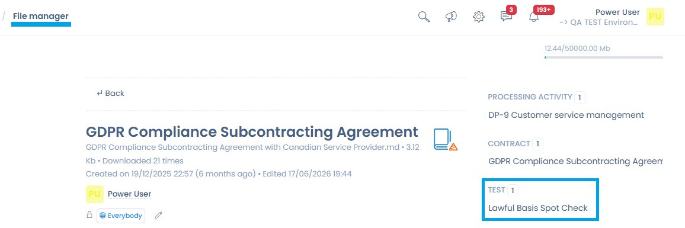

# Tests

A test defines **how** and **how often** a control is evaluated, and which evidence that evaluation relies on.

Tests are the operational link between:

* the **controls** (measures implemented),
* the **evidence** collected,
* and the **compliance results** observed over time.

***

### The role of tests in Dastra

A test makes it possible to answer a simple but essential question:

> _Is the control actually applied and effective?_

Each test is:

* associated with a **reference control**
* run according to a **defined frequency**
* used in **compliance projects** to produce usable evidence and results

***

### Test library view

<figure><figcaption></figcaption></figure>

The test library offers a cross-cutting view of all available tests, including in particular:

* their type (manual or automated),
* the creation date,
* the associated controls,
* advanced filters (framework, type, requirements, orphaned tests).

👉 This view makes it possible:

* to identify tests reused in several contexts,
* to detect unattached tests,
* to industrialize verification methods.

***

### Manual tests (default)

By default, a test is **manual**.

📌 A manual test relies on a **human action**, for example:

* documentary review,
* interview with teams,
* verification of a register,
* one-off audit of a process.

#### How it works within a compliance project

When a manual test is added to a project:

* it requires a **regular update of the evidence**
* according to the **frequency defined** in the test (monthly, quarterly, annual, etc.)

👉 This ensures **living** compliance that is kept up to date over time.

***

### Configuring a test



When creating or editing a test, the user defines:

* **the name and reference of the test** (with reference generator)
* **the frequency of the test**
* **the detailed description**, including:
  * the objective of the test
  * the procedure to follow
  * the expected evidence



<figure><figcaption></figcaption></figure>



This information serves as an operational guide when running the test within a project.

***

### Automated tests with Dastra connectors

Dastra offers several types of ready-to-use connectors (questionnaires, registers, policies, etc.), as well as a generic connector. These connectors are used directly in the **automated tests** of the Compliance module.

<figure><figcaption></figcaption></figure>

In addition to manual tests, Dastra makes it possible to configure **automated tests** using **connectors**.

An automated test relies on a Dastra connector to:

* directly query elements of the workspace
* automatically collect evidence
* verify compliance according to defined criteria

#### Connector examples

Connectors can, in particular, make it possible to:

* collect a **register of AI systems**
* verify the **presence and update of documents** (e.g. AI system documentation)
* query registers (assets, incidents, data processing)
* analyze questionnaires or policies

📌 Example:\
An automated test can verify that each AI system has compliant and up-to-date documentation, without any manual intervention.

### Adding a custom connector

In addition to the standard connectors, Dastra makes it possible to create **custom connectors** in order to automate the collection of evidence in compliance tests.

A custom connector makes it possible:

* to run a technical query (e.g. an HTTP request),
* to query an internal or external source,
* to automatically collect factual elements,
* to produce evidence usable in audits.

The connector thereby becomes a **recurring and traceable source of evidence**.

#### HTTP request

The **HTTP request** connector makes it possible to query any exposed API or endpoint.

It is particularly suited to:

* querying third-party tools,
* verifying the existence or state of a resource,
* automating technical or documentary controls.

### Configuring the HTTP connector

<figure><figcaption>
The HTTP connector configuration interface with its Auth, Headers, Query parameters and Body tabs
</figcaption></figure>

The HTTP connector configuration interface has been redesigned to make building and testing requests directly from Dastra easier.

The HTTP connector configuration interface makes it possible to build a request without knowing the JSON syntax:

* **Authentication method selector**: choose directly between **API Key**, **Authorization Token (Bearer)** or **Basic Authentication**, without manually entering headers in JSON format.
* **Masked credentials**: sensitive fields (token, password) are masked by default. An eye-shaped icon allows you to reveal them temporarily; these values never appear in clear text in the logs.
* **Key/value editors (Postman-style)**: easily configure custom headers and query parameters as key/value pairs, without writing any JSON.
* **Read-only preview**: a preview displays the headers that will actually be sent at execution time, with sensitive values remaining masked.

#### Request builder

A visual editor makes it possible to configure each component of the request:

| Field             | Description                                                                                        |
| ----------------- | -------------------------------------------------------------------------------------------------- |
| **URL**           | Endpoint to query (required). Supports variables in curly braces `{{variable}}`.                   |
| **HTTP method**   | GET, POST, PUT, PATCH, DELETE.                                                                     |
| **Headers**       | Add key/value headers — handling of token, API key, or custom header authentication.               |
| **Request body**  | JSON payload or free text (for POST/PUT/PATCH methods).                                            |
| **Variables**     | Declare reusable variables in the URL and request body, resolved at execution time.                |

#### Testing the request

A **Test request** button makes it possible to run the request live from the configuration interface and display the raw response. This makes debugging easier before linking the connector to a compliance test.

#### Analyzing the response

Define the **success criteria**: expected HTTP code, presence of a field in the JSON response, target value of an attribute. The result of the analysis is saved as evidence in the compliance project.

### Benefits of automated tests

Automated tests make it possible:

* to **continuously collect evidence**
* to reduce the operational workload
* to improve the reliability of controls
* to detect gaps more quickly

They are particularly suited to recurring or structured controls.

***

### Attaching evidence from the file manager

When adding evidence to a test, it is possible to select a file directly from the Dastra **file manager**, without having to re-import it. Click on **"File explorer"** in the add evidence window.

<figure><figcaption>
The "File explorer" button makes it possible to select evidence already present in the Dastra file manager
</figcaption></figure>

***

### AI analysis of evidence

Dastra can automatically analyze the evidence attached to a test and indicate whether it matches what the procedure expected. This feature is a **decision aid for the auditor** — it never replaces human judgment and neither accepts nor rejects evidence on behalf of the customer.

#### How it works

When evidence is added to a test procedure, the AI receives two elements:

1. The **procedure description** — what the test expects as evidence
2. The **content of the evidence** provided — analyzed according to its type (see below)

It compares the two and returns four pieces of information, displayed in the evidence table as a **colored badge accompanied by a tooltip**:

| Information          | Description                                                    |
| -------------------- | -------------------------------------------------------------- |
| **Assessment**       | `Correct` · `LikelyCorrect` · `NonCompliant` · `Unknown`       |
| **Confidence score** | From 0 to 100% — reflects the AI's certainty about its verdict |
| **Description**      | Short summary of the analyzed document                         |
| **Justification**    | Explanation of the verdict against the procedure's criteria    |

#### Supported evidence types

The analysis automatically adapts to the type of evidence provided:

| Evidence type                | Analysis method                          |
| ---------------------------- | ---------------------------------------- |
| Screenshot / image           | Visual analysis of the content           |
| Document (PDF, Word, text)   | Reading and extraction of the text content |
| URL / web page               | Retrieval of the page via the provided URL |
| No evidence attached         | Result automatically set to `Undetermined` |


A **tooltip** accessible from the analysis result explains the **method used** by the AI for the evidence concerned (OCR, reading of the label, comparison with the test procedure, etc.). It also contains a link to this documentation to learn more about how the analysis works.


#### Activation and settings

The feature is **optional** and disabled by default. To activate it, go to **Settings → Compliance** and enable the **"Automatic AI analysis of evidence"** option.


As long as the feature is not activated, **no evidence data is sent to the AI model**.


The AI model used for evidence analysis can be configured according to your organization's choice, via the AI assistant settings (model family or Custom AI provider).

#### What the analysis does not do

* It **neither accepts nor rejects** evidence automatically — the final decision always belongs to the auditor.
* It does not change the status of the test.
* It is non-binding: a low confidence score (`Undetermined` or `Likely correct`) simply signals that a human check is recommended.

***

### Merging tests

Just as with controls, the test library can accumulate redundant tests — particularly after importing several frameworks. The **test merge** feature makes it possible to consolidate these duplicates into a single reference test.

#### How the merge works

From the test library, select the tests to merge, then click **Merge**. Choose the **target** test to keep: the associations of the source tests (linked controls, execution results, frequency) are carried over to the target test, and then the source tests are deleted.


The merge is irreversible. Check the associations of each source test before confirming.


#### Typical use cases

* **Deduplication**: two framework imports have created a duplicate "Privacy policy verification" test — the merge consolidates them.
* **Rationalization**: several very similar manual tests can be grouped into a single, more complete test.
* **Cleanup before an audit**: reducing the number of orphaned tests improves the readability of the dashboard.

***

### Linking a test to a document

A compliance test can be associated with one or more **documents from the Dastra file manager** — contracts, policies, documentary evidence, subprocessing agreements. This link makes it easy to find the tests associated with each document, and vice versa.

#### From a document view

When a test is linked to a document, a **Tests** panel appears in the editing view of the document or contract concerned, displaying the reference, name and status of each associated test.

<figure><figcaption>
A linked test appears in the Tests panel to the right of the document (here: G-T2 Lawful Basis Spot Check — Done / Pass)
</figcaption></figure>

#### From the file manager

In the file manager, the detail sheet of a document displays, in the side column, all the Dastra entities to which it is attached: processing activities, contracts, and compliance tests.

<figure><figcaption>
The file manager displays the tests associated with each document in the detail column
</figcaption></figure>

This two-way traceability makes it easy to audit which tests rely on which document, and to find all documentary evidence from the file manager.

***

### Complementarity of the approaches

Dastra makes it possible to combine:

* **manual tests** for controls that require analysis or human judgment
* **automated tests** for objective and repetitive verifications

👉 This complementarity offers a balance between rigor, efficiency and pragmatism.
