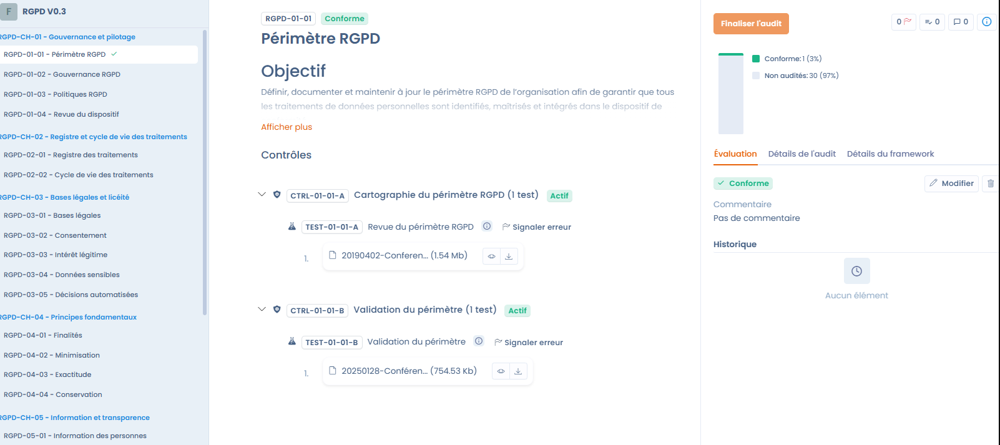

# Audits

The Audit phase makes it possible to officially validate the state of compliance at a given point in time. It builds on the preparation and monitoring work carried out beforehand to offer a structured assessment, whether it is performed internally or by external auditors.

**🎯 Objective of the phase**&#x20;

Prepare and carry out all compliance audits in a centralized manner, collaborate with stakeholders and ensure the follow-up of corrections following the detected gaps.

<figure><figcaption></figcaption></figure>

***

### Overview of the module

The Audit module transforms theoretical compliance into a measurable reality by bringing together frameworks, controls, risks and audits on a single platform. This phase is based on 4 major pillars:

1. Carrying out audits: Perform internal or external audits using standard frameworks (GDPR, AI Act...) or your own custom grids.
2. Collaboration: Facilitate exchanges through centralized access to evidence, a delegation system and fine-grained governance management.
3. Link with compliance: Directly reuse the controls and evidence already present in your projects to automate collection.
4. Gap management: Identify non-conformities and immediately turn them into corrective action plans.

#### An open architecture

Dastra offers multi-user management to steer compliance at the scale of a group, as well as full interoperability via APIs and multi-format exports.

<figure><figcaption></figcaption></figure>

***

### 1. Creating a new audit mission

Creating a mission is the starting point of your assessment. From the Audits module, click the create button to open the configuration form.

#### 1. General information

* Name (mandatory): A clear title for the mission (e.g. "Annual compliance audit"), limited to 80 characters.
* Description (optional): Specify the context or the specific scope (up to 500 characters).
* Auditors (mandatory): Select the users responsible for carrying out the assessment. If you are not on this list, you will not be able to answer the audit's questions (even if you are the owner of the organization).&#x20;

<figure><figcaption></figcaption></figure>

#### 2. Audit phase and Schedule

The choice of phase makes it possible to segment your mission and filter your governance dashboards.

| **Phase**        | **Description & Objective**                                                                       |
| ---------------- | ------------------------------------------------------------------------------------------------ |
| Initial analysis | Scoping phase: definition of the scope, the referential and the regulatory issues.               |
| Preparation      | Logistics phase: assignment of controls to auditors and planning of interviews.                  |
| Pre-audit        | "Mock audit": self-assessment to identify gaps before the official deadline.                     |
| Final audit      | Closing phase: final scoring, drafting of conclusions and generation of the official report.     |

* Key dates (mandatory): Indicate a Start date and a Deadline to frame the mission in time.

#### 3. Advanced options and automation

* Preserve the results of a previous audit: Makes it possible to start from an existing base for recurring audits. This can be useful for redoing an audit following an audit whose controls were not satisfactory.
* Set as active audit: Immediately integrates the audit into your real-time tracking indicators. This audit will be used in the dashboard to display the compliance rate.
* Notify the auditor by email: Automates the sending of an invitation to the designated collaborators.

***

### Expected result

At the end of this phase, the organization has an official status report, a complete audit trail (history) and a precise remediation plan to address the gaps and improve governance.

> Next step: Once the mission is created, you will be able to start assessing the control points and validating the associated evidence.

### 2. Steering and executing the audit mission

Once the mission is created and launched, you access the audit's operational dashboard. This centralized interface makes it possible to track the progress of the assessments and manage collaborators in real time.

#### Overview of progress

The dashboard displays a visual summary of your audit's health:

* Requirement indicators: Track the total number of requirements to audit (e.g. 0/31) and immediately visualize the blocking points via the "Tests in error" tab.
* Progress chart: A circular diagram makes it possible to visualize the breakdown of controls (not audited, compliant, non-compliant).
* Mission status: A reminder of the current phase (e.g. "Initial analysis"), the deadlines and the framework used (e.g. "GDPR V0.3").

#### Assessment and scoring interface

By clicking "Complete the audit", the auditor accesses the detailed workspace for each control point:

* Navigation by referential: The complete tree of the framework is displayed on the left (Governance, Register, Legal bases, etc.) for smooth navigation.
* Scoring tools: For each requirement, the auditor selects a precise status:
  * Compliant (Green)
  * Partially compliant (Yellow)
  * Non-compliant (Red)
  * Not applicable (Grey)
* Justification and evidence: A text editor makes it possible to enter detailed comments. The auditor can also switch to the "Framework details" tab to consult the theoretical requirements before validating.

#### Collaboration and Document management

The dashboard also serves as a collaborative hub for the audit team:

* Auditor management: Visualize the assigned team members and add new auditors during the mission if necessary.
* Attachments: Centralize all external evidence documents directly in the dashboard's "Attachments" tab so that they are accessible to all the controllers.
* Mapping: A dedicated tab makes it possible to visualize the links between the requirements and the elements of your compliance inventory.

***

Result of this step: The audit is now being executed. Each entry dynamically updates the project's overall compliance indicators.

### 3. Assessing requirements and verifying controls

Once the audit is launched, the assessment phase consists of reviewing each requirement of the referential to validate actual compliance on the basis of the existing controls and tests.

#### Structure of the assessment screen

The assessment interface is designed to offer complete visibility over the evidence without leaving the audit page:

* Navigation pane (left): Displays the framework tree (e.g. GDPR V0.3) broken down into chapters and requirements. A visual indicator (green check) confirms the points already handled.
* Central work area: Presents the objective of the selected requirement and the exhaustive list of associated controls and tests.
* Decision panel (right): Brings together the scoring tools, the comment entry and the history of modifications.

<figure><figcaption></figcaption></figure>

#### Verifying evidence (Controls and Tests)

The heart of the Dastra audit lies in its ability to link the audit to the monitoring evidence:

* Consulting controls: For each requirement, the auditor visualizes the active controls (e.g. Scope mapping).
* Examining tests: Under each control, the executed tests are listed with their attached evidence documents (PDF files, screenshots, etc.).
* Direct viewing: The auditor can open and consult the evidence files directly from the interface to validate their compliance.

#### Scoring and compliance statuses

After analyzing the evidence, the auditor assigns a final status to the requirement:

* Compliant: The requirement is fully satisfied by the provided evidence.
* Partially compliant: Evidence exists but is insufficient or incomplete.
* Non-compliant: Absence of evidence or control deemed ineffective.
* Not applicable: The requirement does not concern the audit's scope.

#### Real-time steering

During the assessment, the system dynamically updates the tracking indicators:

* Progress: A counter at the bottom of the page indicates the current position (e.g. 1/31).
* Compliance statistics: The chart on the right displays in real time the percentage of compliance reached (e.g. 3% compliant) relative to the points remaining to audit.
* Finalization: Once all the requirements are handled, the "Finalize the audit" button makes it possible to lock the assessment and move on to generating the report.

***

Expected result: Each requirement is now documented with an expert opinion and verified evidence, guaranteeing an unalterable audit trail for regulators or management.

### 4. Finalizing and closing the audit

Once all the requirements of the framework have been reviewed, the mission must be formally closed. This step locks the assessments in order to guarantee the integrity of the results and generate the final reports.

#### Final appraisal

When you click the "Finalize the audit" button, a validation window appears. Before closing, the auditor must provide a Final appraisal of the audit (mandatory, up to 1000 characters).

This summary makes it possible to:

* Give an overall opinion on the maturity level of the audited scope.
* Highlight the major points requiring attention or the successes observed.
* Attach final summary documents via the file explorer (limit of 50 MB per file).

> Warning: Once the audit is finalized, it is no longer possible to modify the individual assessments of each requirement.

***

#### Exploiting the results and Reporting

The finalized audit instantly feeds the organization's governance thanks to Dastra's output features:

**Compliance dashboard**

The results are consolidated into an overview displaying the percentage of compliance per audit (e.g. 75% for NIST, 57% for GDPR). These indicators make it possible to compare the security level between different entities or projects.

<figure><figcaption></figcaption></figure>

**Export and Archiving**

Thanks to an open architecture, you can communicate your results efficiently:

* Report generation: Exports available in many formats for internal or external distribution.
* Audit trail: Preservation of a structured, measurable and reusable history for the following years.

**Gap management (Action plan)**

The ultimate step consists of addressing the detected non-conformities:

* Automatic identification of gaps (red or yellow points during the assessment).
* Possibility of linking these gaps to new action plans to correct the weaknesses before the next monitoring cycle.

***

Final result: Your organization now has certified proof of compliance, enforceable in the event of an inspection, and a clear roadmap for the continuous improvement of its governance.
