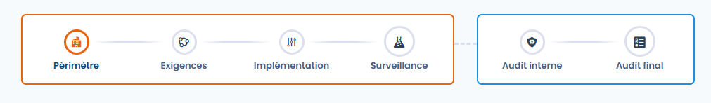
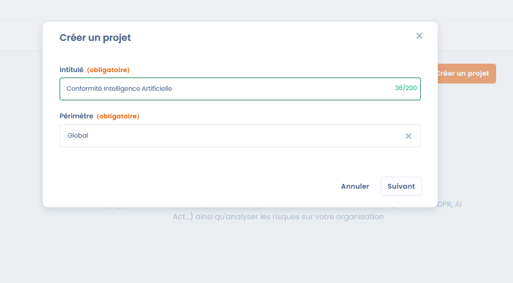
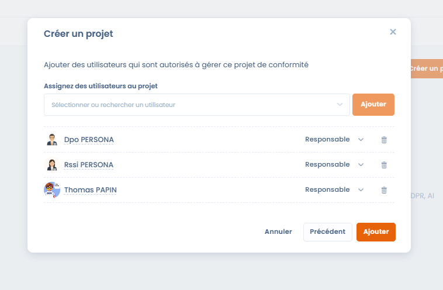
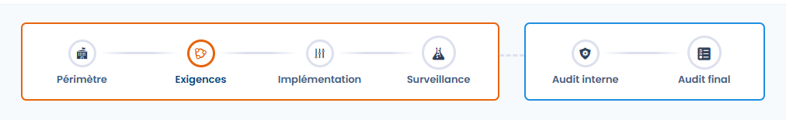
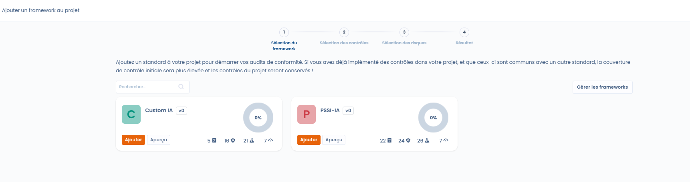
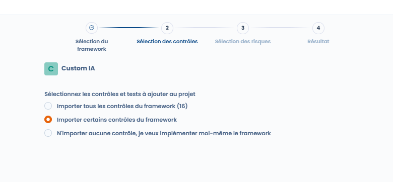
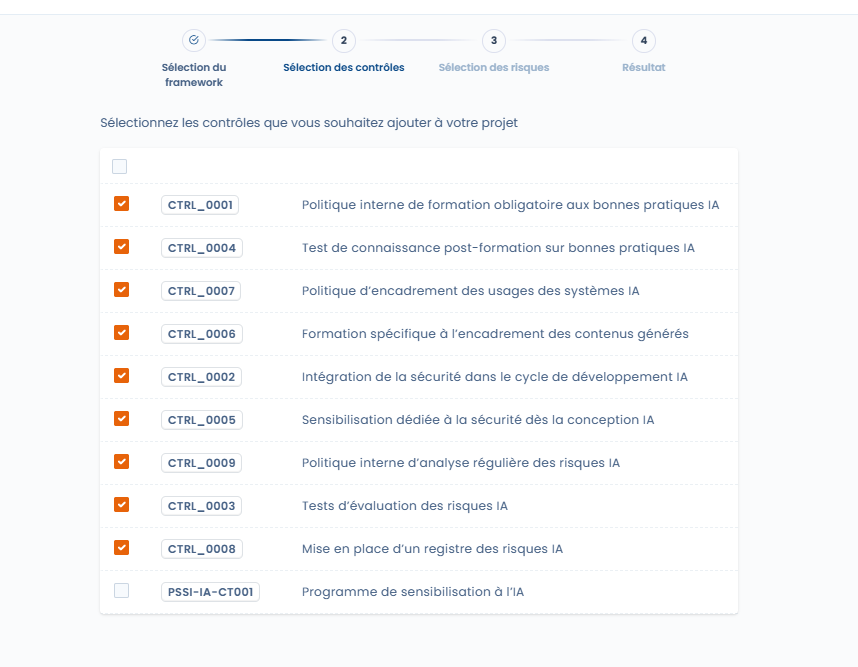
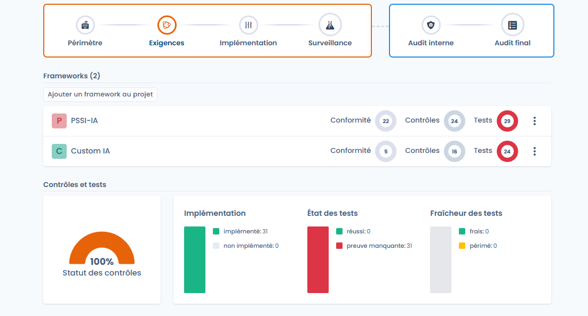
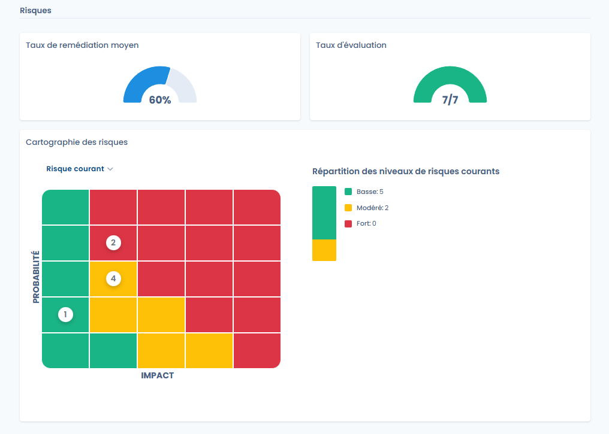

# Project design

It allows you to define the **organizational scope**, select the **applicable frameworks** and automatically initialize the associated controls, tests and risks.

This step lays the foundations of the project and determines the quality of monitoring in the following phases.

***

<figure><figcaption></figcaption></figure>

### 1. Creating the project and defining the scope

When creating the project, an **organizational scope** must be selected.\
The scope groups together one or more organizational units and determines **the scope of application of the compliance project**.



Once the project is created, the scope is displayed in the project header and used throughout the compliance cycle.



<figure><figcaption></figcaption></figure>



***

### 2. Assigning users to the project



<figure><figcaption></figcaption></figure>



The design phase also allows you to **designate the users authorized to manage the project**.

* Each user can be assigned a role (e.g. owner).
* These users will be entitled to steer the project's controls, tests and audits.



***

<figure><figcaption></figcaption></figure>

### 3. Adding compliance frameworks

A compliance project is based on one or more **frameworks** (standards, internal or custom referentials).

Adding a framework allows you to import:

* the **requirements**,
* the **controls**,
* the **tests**,
* and the associated **risks**.

<figure><figcaption></figcaption></figure>

Several frameworks can be added successively to the same project.

***

### 4. Sharing controls across frameworks

When several frameworks are added to the project, Dastra automatically detects the **common controls**.

* A control shared between several frameworks **is imported only once**.
* Its implementation simultaneously covers all the associated requirements.
* This makes it possible to increase compliance coverage without multiplying actions.

<figure><figcaption></figcaption></figure>

***

### 5. Selecting the controls to import

When adding a framework, several options are offered:

* import **all the controls** of the framework,
* import **only certain controls**,
* or **not import any controls** in order to implement them manually.

<figure><figcaption></figcaption></figure>

This flexibility makes it possible to adapt the project to the organization's maturity.

***

### 6. Initializing controls and tests



Once the frameworks are imported:

* The **selected controls** are automatically added to the project.
* They are considered **implemented by default**.
* The **associated tests** are also attached to the controls.

At this stage:

* the tests are set to the **"missing evidence"** status,
* no evidence has been collected yet.







***

### 7. Preparing the risk analysis

The **risks from the frameworks** can be selected during the import.

They constitute:

* the basis for the **initial risk assessment**,
* the reference point for calculating the **residual risk** after the controls are applied.

<figure><figcaption></figcaption></figure>

***

### Result of the Design phase

At the end of the design phase, the project has:

* a clearly defined scope,
* identified owners,
* the applicable frameworks imported,
* shared controls ready to be monitored,
* initialized tests,
* and a structured risk base.

The project is then ready to enter the next phase: **Implementation**.
