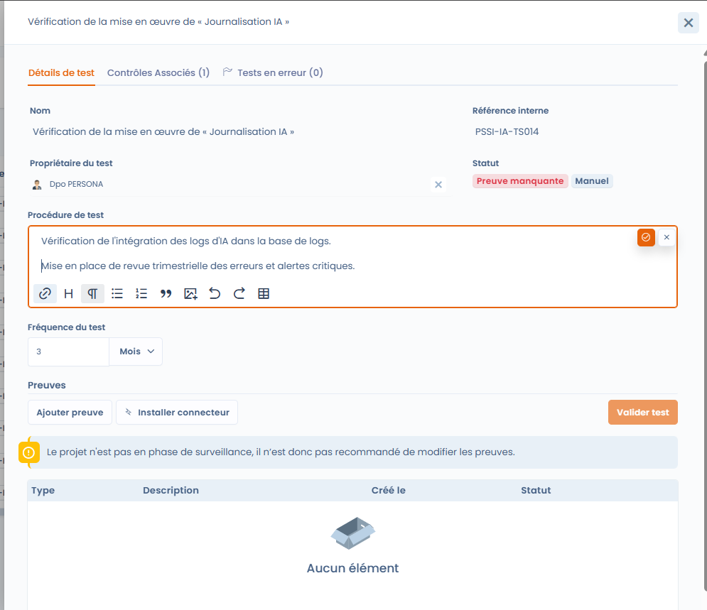
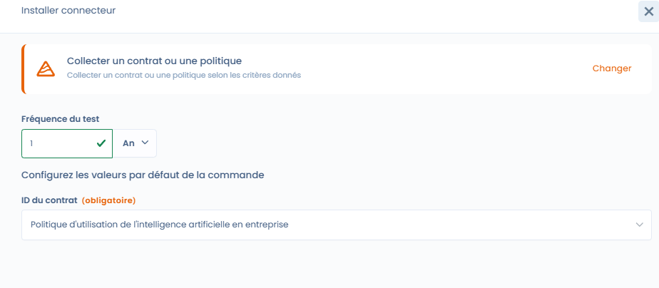
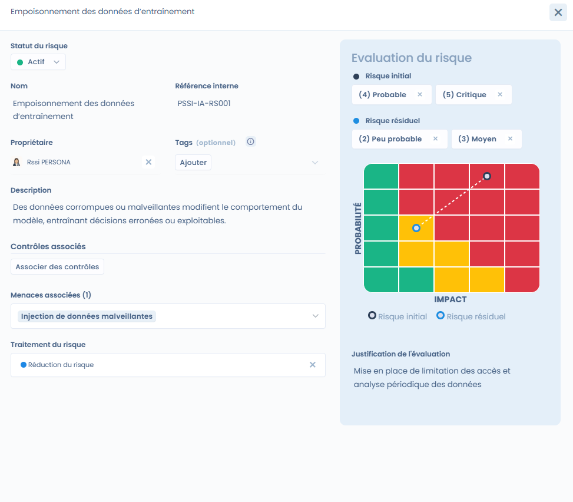
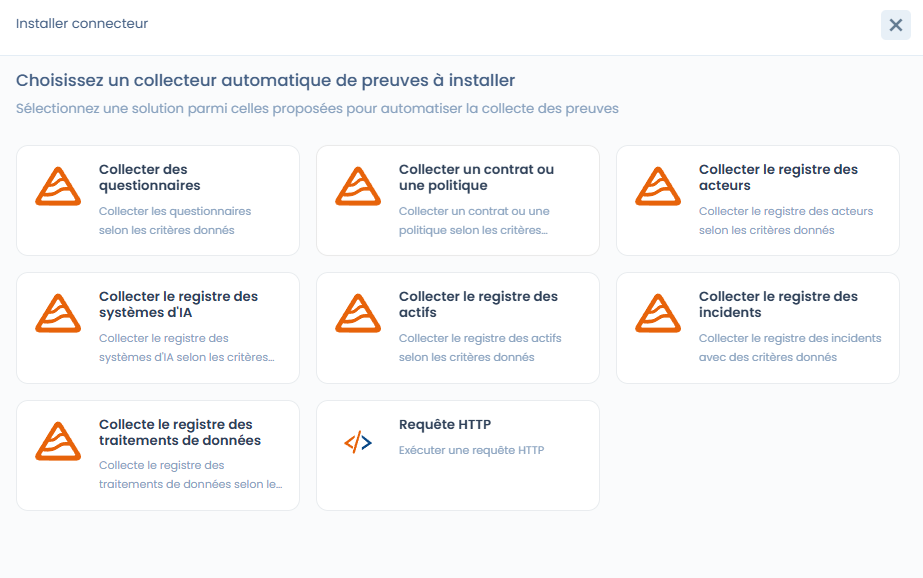

# Project implementation

It consists of **configuring the controls concretely**, defining the verification methods and preparing the collection of evidence.

At this stage, the project already has:

* its frameworks,
* its controls,
* its tests and risks initialized during the design phase.

***

### 🎯 Objective of the phase

The objective of the implementation phase is to:

* define **how the controls are verified**,
* configure the **tests (manual or automated)**,
* associate the **risks with the controls**,
* prepare the **collection of compliance evidence**.

***

### 1. Understanding the status of tests during the implementation phase

By default, all the project's tests are in the **"Missing evidence"** status.

This means that:

* the control exists,
* the test is defined,
* but **no evidence has yet been provided or collected**.

👉 As long as the project is not in the **monitoring** phase, modifying or validating the evidence is not recommended.

<figure><figcaption></figcaption></figure>

***

### 2. Configuring compliance tests

Each control can be verified using one or more **tests**.



A test allows you to define:

* a **verification procedure**,
* an **execution frequency** (e.g. monthly, quarterly, annually),
* a **test owner**.

Tests can be:

* **manual**, requiring a human action and evidence,
* or **automated**, via a Dastra or custom connector.



<figure><figcaption></figcaption></figure>



***

### 3. Associating and assessing risks

Controls can be linked to one or more **risks** in order to measure their impact on risk reduction.

For each risk, you can:

* define an **initial assessment** (probability × impact),
* define a **residual assessment**, after the controls are applied,
* choose the **risk treatment** (reduction, acceptance, etc.).

This approach makes it possible to concretely visualize the effect of the controls on the risk posture.

<figure><figcaption></figcaption></figure>

***

### 4. Linking threats, risks and controls

**Threats** represent the concrete scenarios that can trigger a risk\
(e.g. injection of malicious data, lack of supervision, information exfiltration).

A threat can be:

* linked to one or more **risks**,
* indirectly covered by the **controls** put in place.

This chaining allows complete traceability:\
**Threat → Risk → Control → Test → Evidence**

***

### 5. Installing a connector to automate evidence

For certain tests, it is possible to install a **Dastra connector** in order to automate the collection of evidence.

Connectors make it possible, for example, to:

* verify the presence of a policy or a contract,
* query a registry (AI systems, incidents, processing activities),
* automate recurring controls without manual action.

Each connector is configured with:

* an **execution frequency**,
* **collection parameters** adapted to the test.

<figure><figcaption></figcaption></figure>

***

### 6. Result of the implementation phase

At the end of the implementation phase:

* the **controls are configured**,
* the **tests are ready to be executed**,
* the **risks are assessed and linked**,
* any **connectors are installed**.

The project is then ready to enter the next phase: **Monitoring**, during which:

* the tests are executed periodically,
* the evidence is collected,
* and compliance is measured over time.
