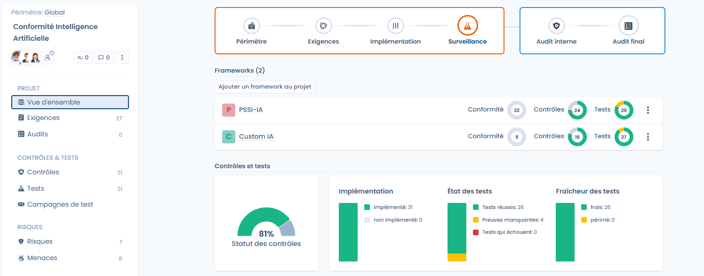

# Compliance monitoring

It aims to **verify the actual effectiveness of the controls over time**, collect the associated evidence and track the evolution of compliance through recurring test campaigns.

> 🎯 Objective of the phase\
> Collect evidence across the entire project using test campaigns, ensure that a maximum number of controls pass and maintain a level of compliance that is measurable over time.

***

### Overview of the monitoring phase

In this phase, the project shifts from a preparation logic to a **continuous execution** logic:

* the controls are already implemented,
* the tests are executed regularly,
* the evidence is collected, updated and assessed,
* the compliance indicators become usable.

<figure><figcaption></figcaption></figure>

***

### Overall monitoring of controls and tests

The monitoring page offers a synthetic view of the project's status:

* **Control status**: proportion of satisfactory controls or controls to be improved.
* **Test status**:
  * successful tests,
  * missing evidence,
  * failed tests.
* **Test freshness**:
  * up-to-date tests,
  * outdated tests requiring new evidence.

These indicators make it possible to quickly identify points requiring attention and to prioritize corrective actions.

<figure><figcaption></figcaption></figure>

***

### Evidence management



Evidence is the core of the monitoring phase.\
It can be added directly from a test and be **reused across several tests of the project**.

The available collection methods notably include:

* adding evidence files,
* external links,
* selecting evidence already present in the project.

Each piece of evidence can be documented in order to facilitate subsequent audits.




<figure><figcaption></figcaption></figure>



***

### Test campaigns

**Test campaigns** make it possible to orchestrate the execution of tests at scale.

A campaign allows you to:

* group together a set of tests to be executed,
* assign an owner to each test,
* define an overall deadline,
* track progress in a centralized manner.

When creating a campaign, it is possible to **automatically pre-select all the tests awaiting evidence**, in order to facilitate the launch.

<figure><figcaption></figcaption></figure>

***

### Launching and tracking campaigns



Once the campaign is configured:

* the users concerned receive an **invitation by e-mail**,
* a personalized message can be added to contextualize the request,
* each test progresses individually (_to do_, _completed_).

The overall progress of the campaign is visible in real time, allowing the project owner to quickly identify delays or blockers.




<figure><figcaption></figcaption></figure>



***

### Validating tests

Each test has a clear lifecycle:

* consulting the procedure,
* adding or updating the evidence,
* validating the test.

Once validated, the test automatically contributes to improving the status of the associated control and to the project's overall indicators. The invitation sends the user to a personalized tracking dashboard in which they can fill in the evidence for the tests they own.

<figure><figcaption></figcaption></figure>

***

### Expected result of the monitoring phase

At the end of this phase, the project has:

* **collected and traced evidence**,
* **regularly executed and updated tests**,
* a **reliable and measurable view of the actual compliance**,
* a solid base for preparing the **internal audit** and **certification** phases.
