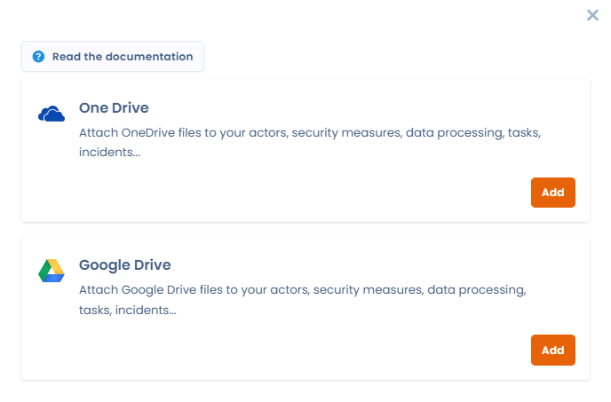
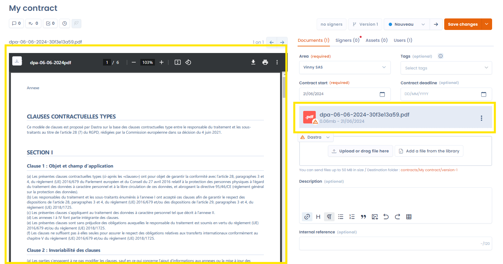
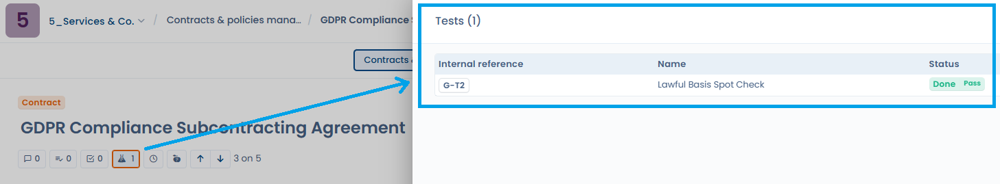

# Documents

### Attachments

In the documents section, you can add the relevant documents that make up your contract. This can include the contract itself, agreements, appendices or other files associated with the contract. To benefit from document previewing, you need to store .pdf files or images.

Document storage is linked to our [document-management](../document-management/README.md "mention") module. You can also install our cloud storage integration, which allows you to associate documents from your own OneDrive or Google Drive.

<figure><figcaption>
Our cloud storage integration to link your OneDrive or Google Drive
</figcaption></figure>

On the left you will find the document preview, and on the right a list of all documents associated with your contract. To preview a different document, simply click its name in the list on the right, or navigate using the left and right arrows on your keyboard (or by clicking the on-screen arrows). The document currently being previewed is highlighted in blue in the list of documents. \
\
The preview window remains active regardless of the contract tab you are on — useful for referring to the document while filling in the signers or the assets, for example.

The preview window remains active regardless of the contract tab you are on, which is useful for referencing the document while filling out signatories or assets, for example.

<figure><figcaption>
Previewing a document
</figcaption></figure>

### Metadatas

In this section, you can also change the organizational unit attached to the contract, add tags, fill in the contract's start and end dates, and add a description and an internal reference.&#x20;

The contract end date is particularly valuable for managing your contracts, as the statistics tab lists all contracts that have passed their deadline.

### Linked compliance tests

When a document or a contract is used as **evidence** for a test in the Compliance module, this link is visible directly from the contract. An icon shows the **number of linked compliance tests**; clicking it opens the list of those tests. Clicking a test displays its details without leaving the contract page.

<figure><figcaption>
The icon shows the number of linked compliance tests; a click opens the list and then the test details without leaving the contract
</figcaption></figure>
