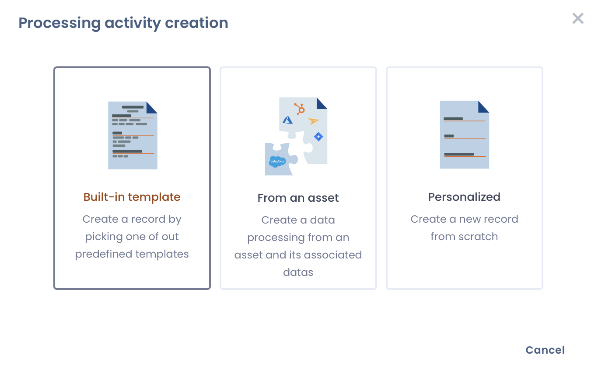
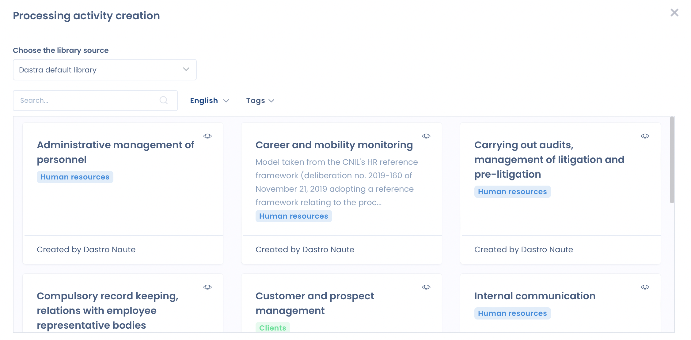
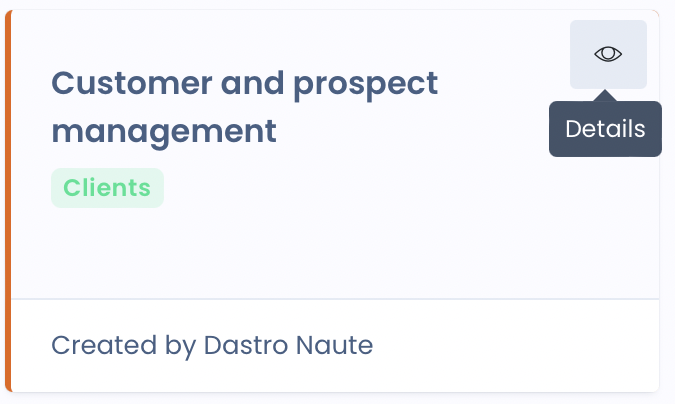
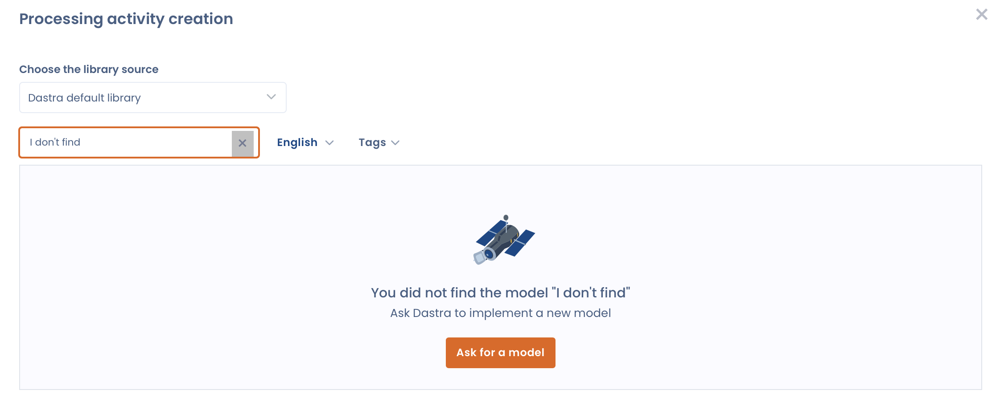
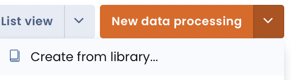
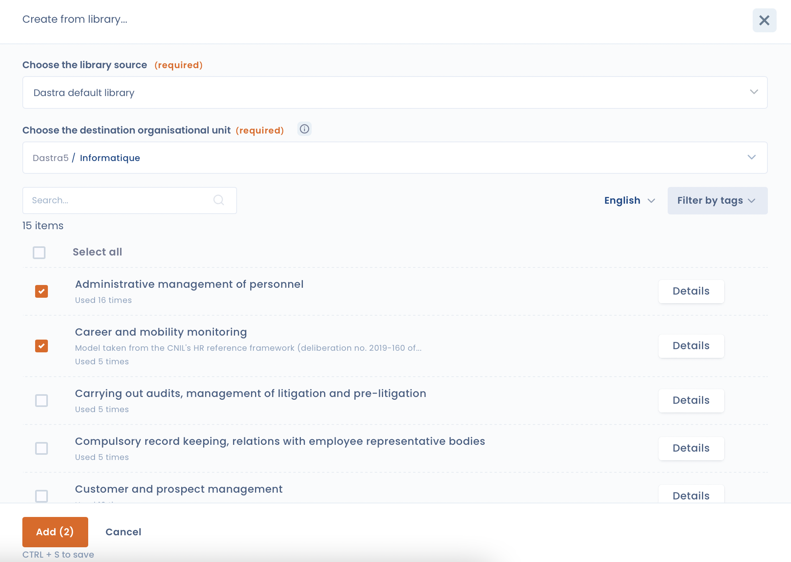

# Use a processing activity template

Dastra allows you to create your processing activity record from templates designed by our experts. Processing templates save time in entering common processing.

## Create a processing from a template

Go to "New data processing"

<figure><figcaption></figcaption></figure>

and select "Built-in template".

<figure><figcaption></figcaption></figure>

Then, you can search for processing models from the search bar.

<figure><figcaption></figcaption></figure>

The **tags** will allow you to filter the templates by industry.&#x20;

The **language** allows you to view the processing templates in other languages.&#x20;

To **view the content of the template** before importing it, you can click on the eye at the top right of the template.

<figure><figcaption></figcaption></figure>

## Suggest a processing template

If you don't find a model, you can suggest it to us.

<figure><figcaption></figcaption></figure>

## Create mass processing templates

You can select multiple processing templates and import them at once through the library.&#x20;

Go to the options of the "New data processing" button and then "Create from library...".

<figure><figcaption></figcaption></figure>

Select one or more templates, choose an organizational unit and click on "Add".

<figure><figcaption></figcaption></figure>

The "**Details**" button allows you to preview the template.&#x20;

Then your templates will be imported in the background.
