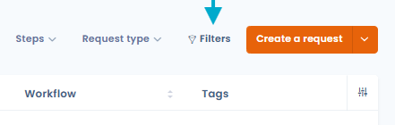
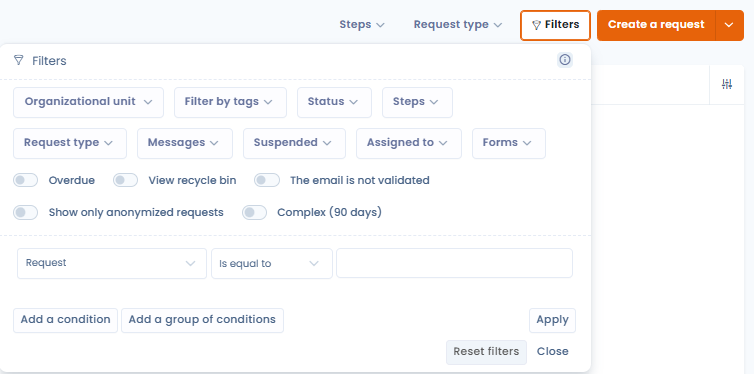
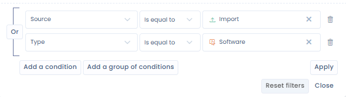
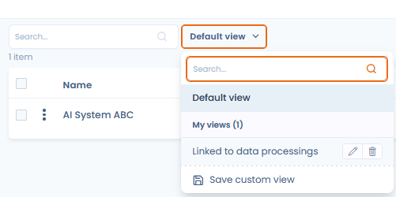
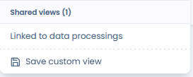
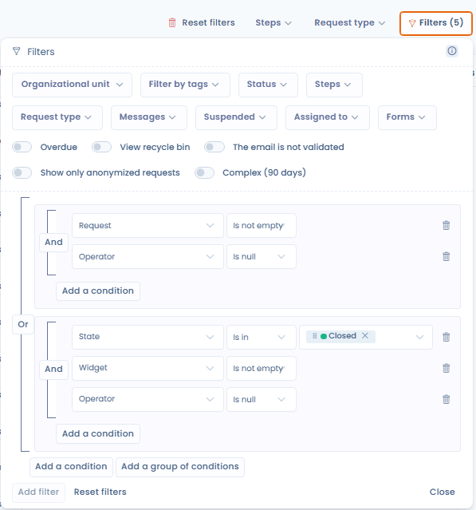

# Advanced filters



## Use

Advanced filters let you filter your data on almost any field of your entities.

* Go to a Dastra module (for example, the data subject rights module)
* Click the "Filters" button at the top right of the data table.

<figure><figcaption></figcaption></figure>

* A small window appears, presenting you with a list of the most commonly used standard filters; by applying one of these filters, the table updates automatically.

<figure><figcaption><p><em><mark style="color:$info;">Advanced filter combo for data subject requests</mark></em></p></figcaption></figure>


The combination of these filters is cumulative.

_For example: if I filter on one or two tags "complex" and "pending" + I select an organizational unit "Contoso": it will show me all rows that contain both tags "complex" and "pending" **and** that are in the organizational unit "Contoso"._


* If you don't find any filters that suit you, you can click the "Add a filter" button. There you will be able to edit the combination of filters that best fits your needs.

<figure><figcaption></figcaption></figure>

By default, Dastra persists the filters you select, which means that if you change pages or refresh your browser, the filters are retained. These filters are specific to your browser and your workspace (they are stored in **LocalStorage**).

## Custom views

You can save the current state of your filters (and your column selection) as a **named view**, then switch between your views with a single click from the toolbar of each list.

To create a view:

1. Apply the desired filters and column selection.
2. Click the **"Save"** button in the toolbar.
3. Give your view a name and confirm.

The view then appears directly in the toolbar of the relevant section — accessible with one click, without going back through the "Filters" panel.

<figure><figcaption></figcaption></figure>

You can **share a view** with the other users of your workspace. Shared views appear under the **"Shared views"** section in the toolbar.

<figure><figcaption></figcaption></figure>

<figure><figcaption></figcaption></figure>

This feature is available in all sections listing objects: data subject rights requests, record of processing activities, assets, contracts, AI systems, data breaches…

## Condition groups

Advanced filters support **condition groups**, allowing you to build complex filtering logic combining **AND** and **OR** operators within a single view.

### Principle

Without groups, all conditions in a filter are combined with an implicit **AND**: the result must satisfy _all_ conditions simultaneously.

With condition groups, you can create independent blocks. Within a group, conditions are linked by **AND**. Between groups, the logic is **OR**: the result must satisfy the conditions of _at least one_ group.

Example:

```
Group 1 : status = "In progress" AND priority = "High"
OR
Group 2 : status = "Overdue"
```

This filter displays all in-progress, high-priority requests, **and also** all overdue ones — regardless of their priority.

### Create a condition group

1. Open the filter panel and click **"Add a filter"**.
2. In the filter editor, click **"Add a group"**.
3. Choose the group operator (**AND** or **OR**) then add your conditions.
4. For more complex rules, nest **sub-groups** of conditions inside a group (for example: _(Step = "In progress" AND Address filled in) OR (Collection channel = "Incoming email")_).
5. Reorder or delete each condition or group individually using the dedicated controls.
6. Save the view to reuse this filter later.

<figure><figcaption><p>Example of condition group filters: two AND blocks connected by OR, with "Add a condition" and "Add a group of conditions" buttons</p></figcaption></figure>


Existing filters and custom views remain functional: they are automatically converted to the structured editor.


<figure><figcaption><p>Example of condition group filters: two AND blocks connected by OR, with the "Add a condition" and "Add a group" buttons</p></figcaption></figure>


Condition groups are available in all Dastra lists: record of processing activities, data subject rights requests, assets, contracts, AI systems, data breaches, etc.


## Known problems

### My data is no longer displayed?

If you encounter difficulties with the filters — you lose the display of your data — we recommend that you clear the browser data (cookies, localstorage, etc.). This will reset the state of your filters in your workspace.

### Some columns are not present in the advanced filters?

It may be that, technically, it is not possible to set up these filters for various reasons. In that case, we recommend that you either export the data in a raw form and produce the report in tools like Excel.

If it is a filter that is essential to your business, do not hesitate to submit a new feature request to us [via the Dastra community or the request system](../../commencer/support/request-support.md).
