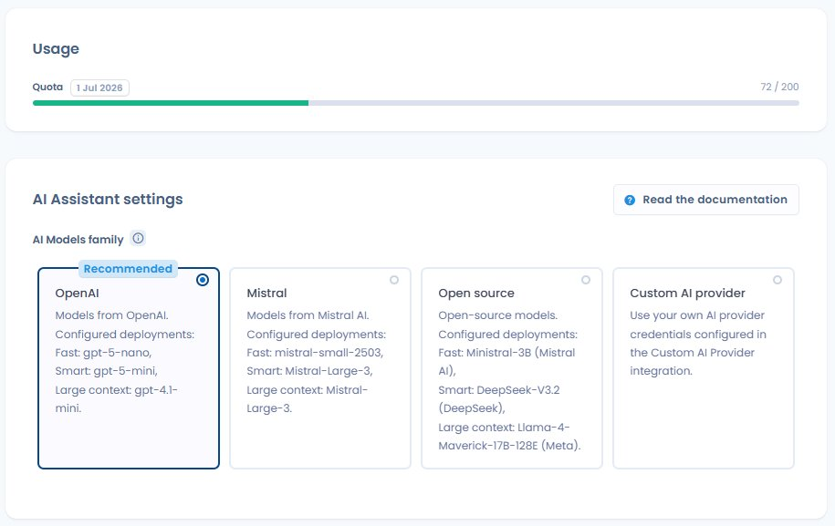
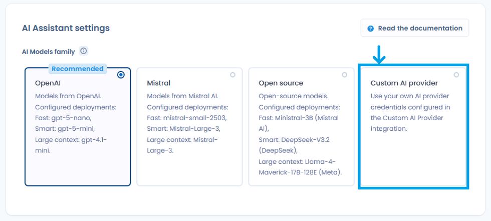
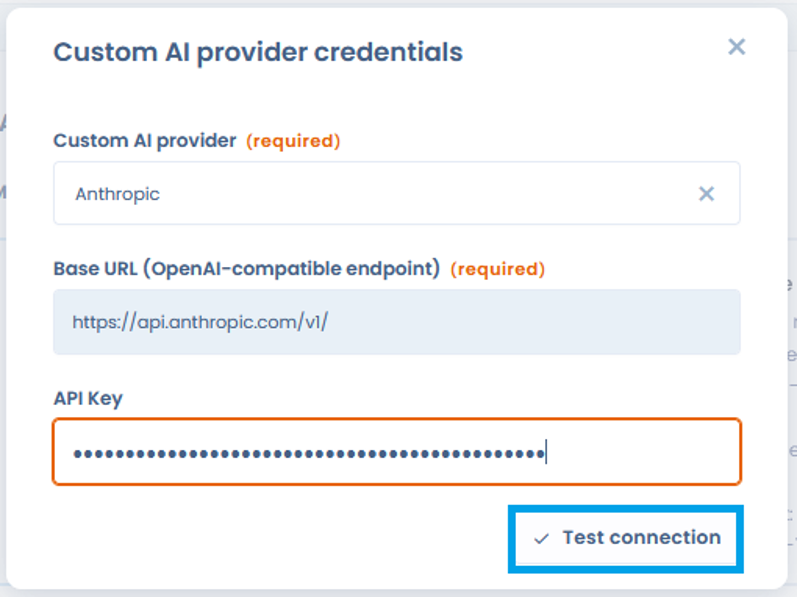
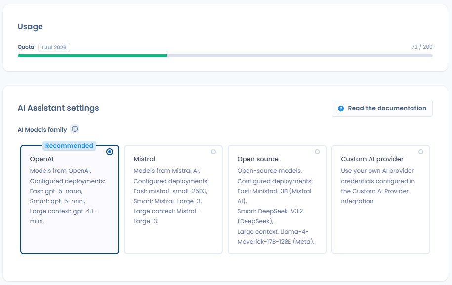

# How it works

### Models and hosting

<figure><figcaption>
Organisation Settings > AI Assistant — choose the model family and monitor the credit quota
</figcaption></figure>

Dastra uses pre-trained generative AI models, available in four families to choose from:

| Family                             | Configured models                                                                      | Hosting                   |
| ---------------------------------- | -------------------------------------------------------------------------------------- | ------------------------- |
| **OpenAI** _(recommended default)_ | Fast: gpt-4o-nano · Smart: gpt-5-mini · Large context: gpt-4.1-mini                    | Azure, France / EEA       |
| **Mistral**                        | Fast: mistral-small-2503 · Smart: Mistral-Large-3 · Large context: Mistral-Large-3     | Azure, France / EEA       |
| **Open source**                    | Fast: Ministral-3B · Smart: DeepSeek-V3.2 · Large context: Llama-4-Maverick-17B-128K   | Azure, France / EEA       |
| **Custom AI provider**             | Your own provider via API key _(see below)_                                            | Depends on your setup     |

For the first three families, models are hosted on Microsoft Azure infrastructure in France. They are not operated directly by OpenAI or Mistral: Dastra uses Azure managed services, meaning **your data does not transit through OpenAI's or Mistral's own infrastructure**.

For each family, three model tiers are used depending on task complexity:

* **Fast** (simple actions): generating descriptions, suggesting tags
* **Smart** (actions requiring more reasoning): generating structured objects in Dastra
* **Large context** (actions processing large volumes of data): answering a questionnaire, compliance analysis

You can configure the model family used in your **Organisation Settings > AI Assistant**.

***

### Custom AI provider

<figure><figcaption>
The Custom AI provider among the model families
</figcaption></figure>

Dastra lets you connect your own AI provider via an API key, provided it is compatible with the OpenAI API standard. Supported providers include OpenAI, Anthropic (Claude), Google (Gemini), Mistral, Microsoft Foundry, and any compatible self-hosted LLM.

To configure a custom provider, go to **Organisation Settings > AI Assistant > Custom AI provider**, then enter your credentials and map them to the three model tiers (Fast, Smart, Large context).

For recognised providers, the **Base URL** is pre-filled automatically — for Anthropic, it is `https://api.anthropic.com/v1/`. All that remains is to enter your **API key**.

* A **"Test connection"** button verifies the validity of the credentials before saving.
* You designate the model to use for each type of operation — fast, smart and large context — with a recommended model proposed by default.
* The API key is never displayed again in clear text, and credential management is reserved for users with rights over integrations.

<figure><figcaption>
Anthropic configuration: pre-filled Base URL, API key and "Test connection" button
</figcaption></figure>


When using a Custom AI provider, data sent to the model is subject to **your provider's** privacy policy, not the Azure guarantees described on this page. Review your provider's terms before enabling this option, especially if your prompts may contain personal data.


***

### What Dastra sends to the model

Dastra only transmits the information necessary for the requested generation: the text entered by the user, and where applicable the structured fields of the relevant object (processing activity, AI system, rights request, etc.).

The exact data transmitted per feature is detailed in the What data is transmitted to the model? section.

***

### What Dastra does not do

The following points are contractually guaranteed by Microsoft Azure for all models in the OpenAI, Mistral, and Open source families:

* Your prompts and results are **not available** to other Azure customers
* Your data is **not transmitted** to OpenAI, Mistral, or any other third party
* Your data is **not used** to train or improve base models
* Models are **stateless**: no prompt is stored in the model between requests

***

### Abuse monitoring and human review

Microsoft Azure maintains an automated mechanism for detecting potentially abusive content. In exceptional cases where content is flagged, a sample of prompts may be temporarily retained in a customer-isolated storage environment for review purposes. For resources deployed in the EEA (which is the case for Dastra), any human reviewers involved are also located in the EEA.

This retention remains exceptional and does not apply to normal platform usage. For more details, see the [Microsoft documentation on Azure Direct Models data privacy](https://learn.microsoft.com/en-us/azure/ai-services/openai/concepts/data-privacy).

***

### AI invocation logs

Dastra retains a history of AI assistant calls for the **last 90 days**, accessible via **Organisation Settings > AI Assistant > AI invocation logs**. For each call, the following information is recorded:

| Field           | Description                                       |
| --------------- | ------------------------------------------------- |
| **Date**        | Timestamp of the call                             |
| **Status**      | Success or failure of the generation              |
| **Operation**   | Type of prompt used                               |
| **Model**       | Name of the model used                            |
| **Duration**    | Processing time for the request                   |
| **User**        | Workspace member who triggered the generation     |

### AI credits and quotas

Dastra tracks AI Assistant consumption through an **AI credit** system. Each call to an AI feature consumes credits proportionally to the model used and the volume of data processed.

| Model tier        | Relative consumption |
| ----------------- | -------------------- |
| **Fast**          | Low                  |
| **Smart**         | Medium               |
| **Large context** | High                 |

Administrators can access the consumption dashboard under **Organisation Settings > AI Assistant** ([direct link](https://app.dastra.eu/general-settings/ai)): current-month AI credit consumption, available balance and renewal date.

The usage level is shown by a **coloured progress bar** that changes according to the share of the quota consumed:

* **Green** — moderate consumption, quota largely available
* **Orange** — high consumption, quota nearly reached
* **Red** — quota reached or about to be reached

When the monthly quota is reached, an explicit message informs you and offers a link to the quota increase options.

<figure><figcaption>
Tracking of current-month AI credit consumption with a coloured progress bar (green, orange, red)
</figcaption></figure>


When the quota is reached, AI features are disabled until the next renewal. The rest of the platform (data, workflows, exports) continues to work normally.



**Custom AI provider — credit counting disabled**

When your organisation uses a **Custom AI provider**, the Dastra credit system does not apply: credit counting is disabled. Consumption is then managed directly by your own provider according to its own billing terms.


To increase your quota, contact the Dastra team.

***

### What data is transmitted to the model?


Dastra transmits **no data from your workspace** to the AI model unless you initiate it. Only the information listed below, depending on the feature used, is included in the request sent to the model.


| Feature                                                    | Data transmitted to the model                                                                                                                                       | Potential personal data                                                 |
| ---------------------------------------------------------- | -------------------------------------------------------------------------------------------------------------------------------------------------------------------- | ----------------------------------------------------------------------- |
| **Generate a processing activity**                         | Free text entered by the user                                                                                                                                       | No — unless the user mentions individuals in the description            |
| **Generate an asset**                                      | Free text + the privacy policy URL provided                                                                                                                          | No                                                                      |
| **Generate an actor**                                      | Free text + URL or attachment provided                                                                                                                              | No                                                                      |
| **Generate a dataset**                                     | Free text entered by the user                                                                                                                                       | No                                                                      |
| **Generate a security measure**                            | Free text entered by the user                                                                                                                                       | No                                                                      |
| **Generate a privacy notice**                              | Structured fields of the processing activity (purposes, legal basis, retention periods, recipients, rights)                                                          | Potentially — if the fields contain named references                    |
| **Generate a description**                                 | Free text entered by the user                                                                                                                                       | No                                                                      |
| **Suggest tags**                                           | Text content of the object (name, description)                                                                                                                      | No                                                                      |
| **Generate a questionnaire template**                      | Free text entered by the user                                                                                                                                       | No                                                                      |
| **Answer a questionnaire (DPIA, risk analysis…)**          | Structured fields of the linked processing activity + any custom instructions                                                                                       | Potentially — depending on the processing activity content              |
| **Generate a response to a rights request**                | First and last name of the requester, request message, language, workspace name, purposes, operator name, request date and days remaining, request status and ID    | **Yes** — first name, last name and request content                     |
| **Generate a data breach post-mortem**                     | Structured fields of the breach (description, affected data, measures taken)                                                                                        | Potentially — depending on the breach record content                    |
| **Extract contract metadata**                              | Text content of the transmitted document (attachment or URL)                                                                                                        | Potentially — depending on the contract content                         |
| **Generate a custom document**                             | Instructions entered by the user + any source content                                                                                                               | Potentially — depending on the instructions provided                    |
| **Generate a custom report**                               | Instructions entered by the user                                                                                                                                    | No — unless the user includes data in the instructions                  |
| **Risk analysis (AI system)**                              | Structured fields of the AI system (description, purposes, data processed, stakeholders)                                                                            | Potentially — depending on the AI system content                        |
| **Generate an AI system description**                      | Free text + URL or attachment provided                                                                                                                              | No                                                                      |
| **Generate an AI system notice**                           | Structured fields of the relevant AI system                                                                                                                         | Potentially                                                             |
| **Suggest controls / requirements / tests**               | Context of the relevant object (name, description, framework)                                                                                                       | No                                                                      |
| **AI analysis of test evidence (Compliance)**              | Test procedure description + evidence content (extracted text, image, or fetched URL)                                                                               | Potentially — depending on the evidence content                         |


**Best practice**: avoid including personal data directly in free text fields (descriptions, custom instructions). Use identifiers or generic terms where possible.


#### Data that is never transmitted

The following are **never** part of the requests sent to the AI model:

* Dastra user credentials and passwords
* Data from other records in your workspace (only the object you are working on is in scope)
* Session metadata (logged-in user name, IP address, etc.)
* Attachments not explicitly provided in the relevant feature

#### Prompt retention

The Azure models used by Dastra are **stateless**: prompts and results are not stored in the model and are not used to retrain or improve base models.


**Exception — abuse detection**: Microsoft Azure maintains an automated mechanism for monitoring potentially abusive content. If a prompt is flagged, a sample may be temporarily retained in a customer-isolated storage environment for review purposes. For resources deployed in the EEA (which is the case for Dastra), any human reviewers involved are also located in the EEA. This retention remains exceptional and does not apply to normal platform usage.


For more information, see the [Microsoft documentation on Azure Direct Models data privacy](https://learn.microsoft.com/en-us/azure/ai-services/openai/concepts/data-privacy).
