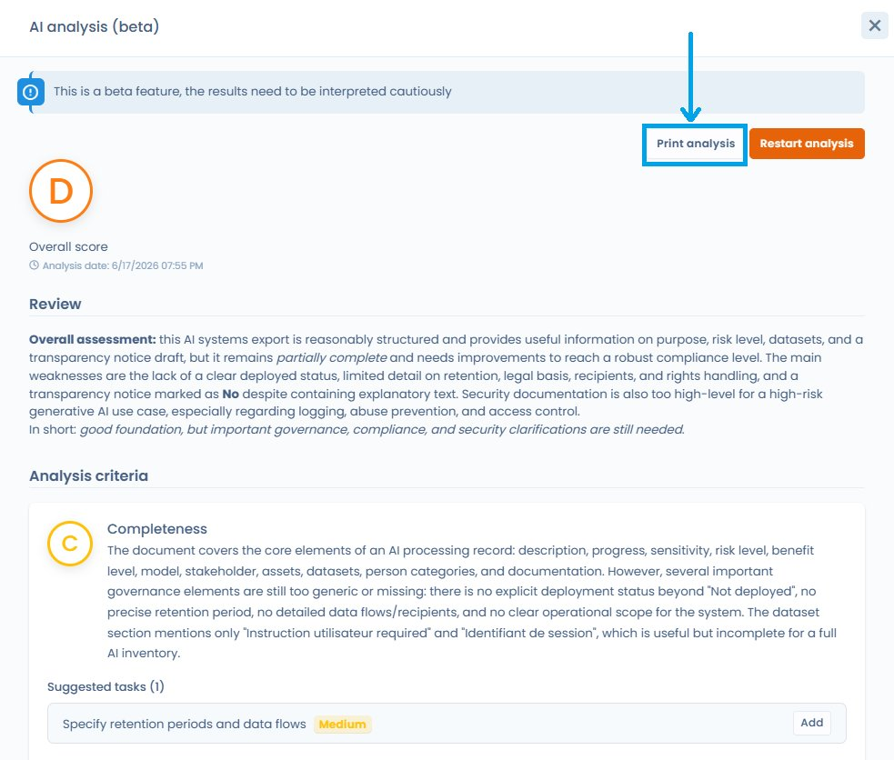

# AI Assistant — Use cases


**Note on generated content quality**: all content generated by the assistant is a proposal only. It must be reviewed and updated by a qualified person before use. Dastra makes no commitment as to the quality of the suggested information.


### Processing activities

#### Generate a processing activity

Quickly generate a processing activity in the format expected by Dastra from a short description. The assistant will suggest a name, one or more datasets with their fields, a retention period, security measures, recipients, and a description.

1. Click **Create a processing activity** > **Generate with AI assistant**
2. Enter a short description of your processing activity
3. Click **Next** and wait a few moments
4. On the summary screen, apply your corrections and click **Create**

#### Generate a dataset

1. Go to the **Datasets** page
2. Click **Create a dataset** > **Create with AI assistant**
3. Enter a short description of your dataset
4. Click **Next** and wait a few moments
5. On the summary screen, apply your corrections and click **Create**

#### Generate a privacy notice

1. Go to the editing page of a processing activity
2. In section **11. Documentation**, click **Generate a privacy notice**
3. Choose the desired format — you can customise the instructions by selecting **Custom**
4. Click **Generate**, then copy or insert the text into your documentation

#### Generate a compliance analysis for a processing activity

The assistant can analyse an existing processing activity and produce an assessment of its compliance with GDPR documentation requirements.


**Beta feature**: results may be less consistent than a stable feature and should be treated with extra care. This analysis is a decision-support tool, not legal advice.


Once the analysis is generated, click **Print analysis** to export the result as a PDF or send it directly to the printer. This document can be attached to your compliance file.

***

### Questionnaires (DPIA, risk analysis…)

#### Generate an AI-assisted response

1. Go to **Questionnaires** and select the desired template (e.g. CNIL DPIA)
2. Click **Schedule a questionnaire**
3. Select **AI-assisted response**
4. Specify the processing activity to use as a source, or enter custom instructions
5. Once the response is generated, apply your corrections directly in the questionnaire

#### Generate a questionnaire template

1. Go to **Questionnaires** and click to create a questionnaire template
2. Select **Create from AI**
3. Provide a description of the questionnaire (up to 300 words) and a type
4. Adjust the number of sections and questions
5. Click **Generate**

***

### Data subject rights requests (DSR)

#### Generate a response to a request

Generate responses in multiple languages, with customisation options (length, formal or informal tone, etc.).

1. Open a DSR currently being processed
2. Fill in the information up to the **Communication / Transmission** step
3. Click **Generate with AI** — the assistant generates a response based on the following information:
   * First and last name of the requester
   * Request message
   * Language to use
   * Workspace name
   * Purposes of the relevant processing activity
   * Name of the request operator
   * Request date and days remaining
   * Request status and ID
4. Edit the proposed text or use the reformulation options (shorten, lengthen, change tone)
5. Click **Validate this message**, add any attachments, then click **Send**


A rate limit per minute is in place for this feature.



**AI Act — Article 50**: when a response is generated by the AI assistant, the strict transparency obligation of Art. 50(1) (informing the recipient that they are interacting with an AI system) does **not** apply, because there is no direct interaction between the AI system and the data subject — a human user reviews, validates and sends the response. That said, disclosing that the response was AI-assisted remains a recommended best practice under the GDPR principle of fairness (Art. 5(1)(a)). See the [FAQ](ai-assistant-faq.md#do-i-need-to-inform-data-subjects-that-i-used-ai-to-respond-to-their-requests) for full details.


***

### Assets and actors

#### Generate an asset

Quickly generate an asset (software, tool, etc.) in the format expected by Dastra. The assistant will suggest a name, links to the actor's privacy policy, and create an actor as publisher.

1. Click **Create an asset** > **Generate with AI assistant**
2. Enter a description or a URL to the privacy policy
3. Review and complete the suggested information before validating

***

### Data breaches

#### Generate a post-mortem

From an existing breach record, the assistant generates a structured post-mortem document including a description of the incident, affected data, and measures taken.

Access this feature from the editing page of a breach record, in the section dedicated to documentation.

***

### Contracts

#### Extract contract metadata

Import a contract document (PDF or URL) and let the assistant automatically extract its metadata: parties, subject, duration, key clauses, etc.

Access this feature from the **Contracts** module when creating or editing a contract.

***

### Custom documents and reports

#### Generate a custom document

Enter your own instructions and optionally provide a source document. The assistant generates a structured document according to your specifications.

#### Generate a custom report

From the **Custom reports** module, describe the desired report in natural language. The assistant produces a first version that you can then refine.

***

### AI systems

#### Generate an AI system description

1. Go to the **AI Systems** module
2. Create or open an AI system record
3. Click **Generate with AI assistant** in the description field
4. Enter a free description or provide a URL

#### Generate a notice for an AI system

From an AI system record, click **Generate a notice** to automatically produce the information document intended for users or data subjects.

#### Generate a risk analysis for an AI system

The assistant analyses the fields filled in on the AI system record and produces an assessment of the associated risks.


**Beta feature**: treat with extra care and validate with an expert before any decision.


Once the analysis is generated, click **Print analysis** to export the result as a PDF. This document can be attached to your AI Act compliance file.

<figure><figcaption>
The "Print analysis" button exports the analysis result as a PDF
</figcaption></figure>

***

### Frameworks and controls

#### Suggest controls, requirements and tests

From a compliance framework in the compliance module, the assistant can suggest relevant controls, requirements or tests based on the context of the relevant object (name, description, associated framework).
