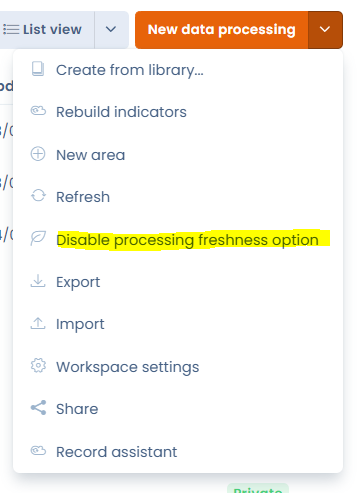

# 😇 Frequently asked questions

## How do I import datasets?

To import datasets, go to the data mapping module and select datasets.&#x20;

You can get there by clicking on this button: [https://app.dastra.eu/workspace/0/referentials/data-retention-rules](https://app.dastra.eu/workspace/0/referentials/data-retention-rules)

In the submenu of the "Create a dataset" button, click on import.&#x20;

&#x20;

<figure><figcaption></figcaption></figure>

You'll then be able to download the file template and see the expected column format in the import file template. All that's left to do is upload the import file for the import to be carried out.&#x20;
