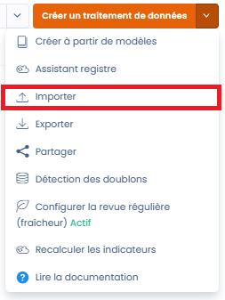
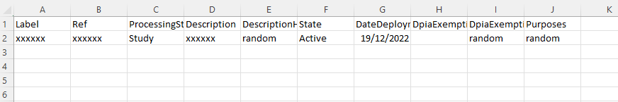
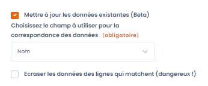
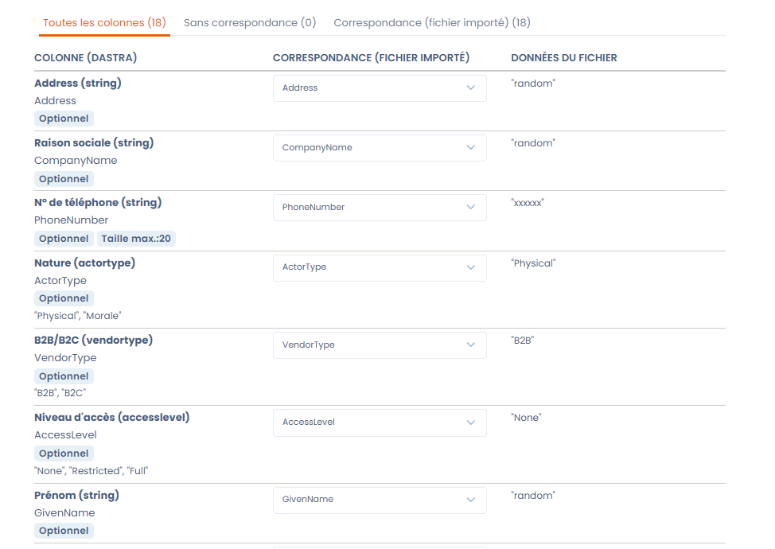
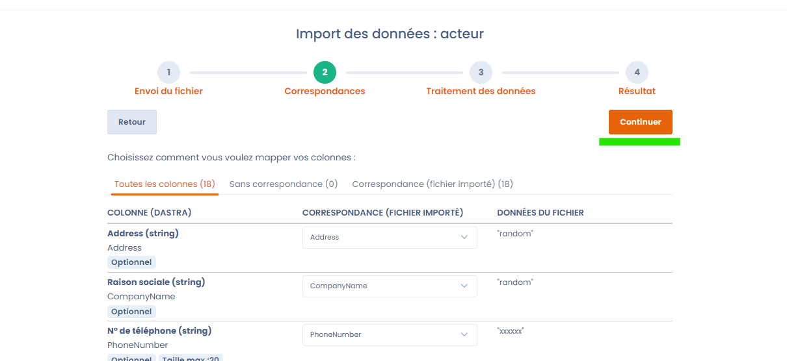

# Import your data (Excel, Csv)



## Importing data into Dastra

Dastra lets you very easily import your own data in spreadsheet format directly into the application.

Imports are possible in the following modules:&#x20;

* import of the record
* import of actors
* import of assets
* import of datasets
* import of fields
* import of security measures
* import of categories of persons concerned
* import of audit responses
* import of audit templates (to come)
* import of risk types
* import of data subject rights requests
* import of data breaches
* import of tasks

In each import, the process is the same.&#x20;

It is done in 4 steps:&#x20;

1. [Preparation of the data file](importer-vos-donnees-excel-csv.md#1.-preparation-of-the-data-file)
2. [Downloading the file](importer-vos-donnees-excel-csv.md#2.-load-the-file)
3. [Checking data before import](importer-vos-donnees-excel-csv.md#3.-check-your-data)
4. [Importing the data](importer-vos-donnees-excel-csv.md#4.-import-the-data)

### 1. Preparation of the data file

Dastra supports only the following data formats:

* **Excel** (.xlsx)
* **Flat files** (.csv, .txt) with separator ; and UTF-8 encoding (the encoding matters in order to keep accents)
* **JSON** (Only for the import of the full record and processing activity templates)

To access the data import menu, click the "import" button under each arrow of the create button.

<figure><figcaption></figcaption></figure>

Select Excel if you are asked to:&#x20;

<figure><figcaption></figcaption></figure>

#### Downloading the file template

Then, download a file template by clicking the "Download file template" button.

<figure><figcaption></figcaption></figure>

The file template is a **CSV file** that you can easily edit with a spreadsheet tool such as Libre Office, Wordpad, Excel or Google Sheets.

It contains all the necessary columns with sample data.

Example file (for the record):&#x20;

<figure><figcaption>
Line 2 contains example data that must be replaced
</figcaption></figure>

#### Filling in the file template

Fill the downloaded file with your data.

For each data file, you can display the expected values for the columns:&#x20;

<figure><figcaption>
Expected values for the record import file
</figcaption></figure>

The imports contain expected values in English. This is perfectly normal. Indeed, this is a technical import into the database.&#x20;

The English values correspond to the drop-down lists of the selection buttons.&#x20;

For example, in the record import, the "processing state" field corresponds to the "état du traitement" field in Dastra. This is the field shown in the first step, "General information".

The "State" field corresponds to the status of the processing activity ("brouillon" for "Draft" or "publié" for "Active").&#x20;

### Datasets: import of associated fields

The export and import of datasets include their associated **data fields**. For each dataset, the exported file lists all the linked fields (label, sensitivity classification, personal data category) and can be re-imported directly to restore these associations, without any additional step.

During an import in **overwrite** mode (updating existing data), the field associations are aligned with the content of the file:

* fields absent from the file are **dissociated** from the dataset;
* fields that do not yet exist in the workspace are **created automatically**.


Check the content of your file before an import in overwrite mode: any field not listed will be removed from the corresponding dataset.


### 2. Load the file

Once your data file is ready, in some cases you will need to specify an organizational unit. All imported files will be placed in this organizational unit.&#x20;


Only imports of objects that can be attached to organizational units are concerned. For example, the record of processing activities or data breaches. Actors, measures or datasets are not concerned.


#### Update data via import

You are offered to tick a box allowing you to update existing data.&#x20;

This feature lets you update the data in Dastra from the data in the Excel file.&#x20;

By default, the import creates new objects. If the object already exists (an actor, for example), the import will not create a new object.&#x20;

It is possible to update an existing object (for example an actor).&#x20;

In this case, tick the "Update existing data" box and choose the matching field. This field is the key used to identify the fields to update.&#x20;

<figure><figcaption>
Updating data
</figcaption></figure>

By clicking the "Overwrite the data of matching rows" button, the corresponding data is replaced by the data from the import.

#### Sending the file

Send the file by clicking in the zone.

<figure><figcaption></figcaption></figure>


You can also send your files by dragging and dropping them into the file upload zone.


### 3. Check your data

The following utility lets you validate and, if needed, map the columns of your Excel file onto the columns expected in the import format.

<figure><figcaption></figcaption></figure>

If everything looks correct to you, you can start the data import.

### 4. Import the data

Start the data import by clicking the continue button. The import process will then begin.

<figure><figcaption></figcaption></figure>

### 5. That's it!

Well done! You have reached the end of this guide! We recommend that you verify that the data has been correctly imported into the tool.
