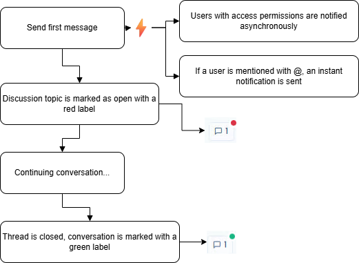

# Internal discussions

### How it Works

You can chat about any items in Dastra: tasks, processing activities, AI systems, incidents, assets, and more.

#### How to Use It

1. Go to a processing activity, asset, or any other record.
2. Click this button:
3. Enter your message, and optionally attach any files.
4. Click the “Send” button.

Below is a diagram explaining the workflow of internal discussions:

<figure><figcaption></figcaption></figure>

***

### Mentions

You can **mention** relevant users by using the “@” shortcut on your keyboard. A list of users will be suggested. You can search all users within your workspace.

<figure><figcaption></figcaption></figure>

The purpose of a mention is to automatically send an email notification to the mentioned user.

***

### Notifications

Message notifications are automatically sent whenever a message is posted on the relevant item. There are two types of notifications sent automatically:

* **Asynchronous notification:** A message is sent to all workspace members who have access to the item.
* **Instant notification:** A message is sent to all users mentioned in the conversation.

For more information, please refer to our notifications page. 


If you use Slack, you can enable automatic user notifications in Slack via the [integration page in your workspace](https://app.dastra.eu/workspace/0/settings/integrations).


***

### Opening/Closing a Conversation

When a message is sent to an item that does not have an existing conversation, or if the discussion was previously closed, the conversation status changes to “Open.” It will then appear in the interface with a small red dot, as well as in the general conversation hub.

<figure><figcaption></figcaption></figure>

Once the conversation is finished, if you have the rights to close conversation topics, you can click the “Close Conversation” button. This will display the conversation indicator in green.

<figure><figcaption></figcaption></figure>

***

### Conversation Hub

To centralize all open conversations in Dastra, you can access the central conversation hub.\
You can find it by clicking this link in the navigation bar.

<figure><figcaption></figcaption></figure>

This hub brings together all conversations within your workspace. You can answer all your users’ questions while accessing the records of the relevant items.
