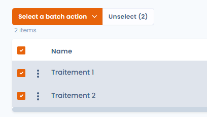
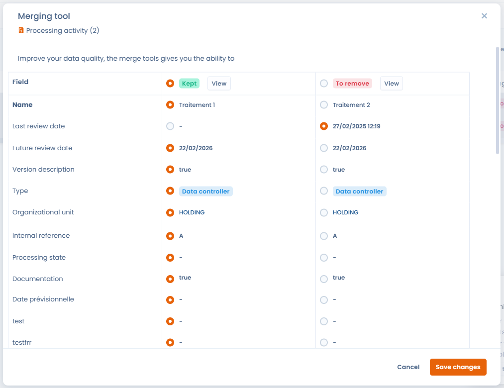

# Merging elements

## What the merge tool does

Dastra's Item Merge functionality has been designed to simplify the management of duplicates and similar items in your compliance data. It enables you to combine several identical or similar items into a single one, without having to manually perform the complex task of linking them to all the associated entities.\
This feature is designed to ensure the consistency of your referential while limiting manual handling, saving you time and increasing reliability.

## On which elements can the merge tool be used?

The merge tool can be used on :

* processing activities
* Assets
* Stakeholders
* Datasets
* Data glossaries
* Measures
* Categories of data subject
* Tasks

## How do I merge elements?

Simply select the items you wish to merge :

<figure><figcaption>
 
</figcaption></figure>

Then click on “Choose a grouped action” and “Merge data” :

\

This will take you to a dedicated page where you can :&#x20;

\
Select the main element to be retained after merging.

\
Select the fields of the elements to be deleted that you wish to retrieve from the main element. 

<figure><figcaption></figcaption></figure>

If fields do not appear on this page, the values of the fields in the retained element are automatically retained.\
\
You can then click on the “Save” button to launch the merge.


Entities (treatments, analyses, etc.) associated with deleted items will be automatically attached to the retained item, avoiding any loss or disconnection in your registry.


## Data quality tool — automatic duplicate detection

Dastra includes a **data quality tool** that automatically scans your repository to detect potentially duplicate items, without requiring a manual pre-selection.

### How automatic detection works

The algorithm uses **explainable scoring**: for each pair of potential duplicates, it analyses several dimensions (name, publisher, organisational unit, URL, category) and assigns a **confidence score**. This score lets you make an informed decision before merging or deleting anything.

### Supported modules

The data quality tool is available for:

* Assets
* Measures
* Stakeholders
* Datasets
* Data glossaries
* Processing activities
* Categories of data subjects

### How to access the tool

In each of these modules, click the **main menu button** (⋮ or "Actions") and select **"Data quality tool"**. All detected duplicates are listed with their confidence score. You can then choose to **merge** or **delete** each identified duplicate.
