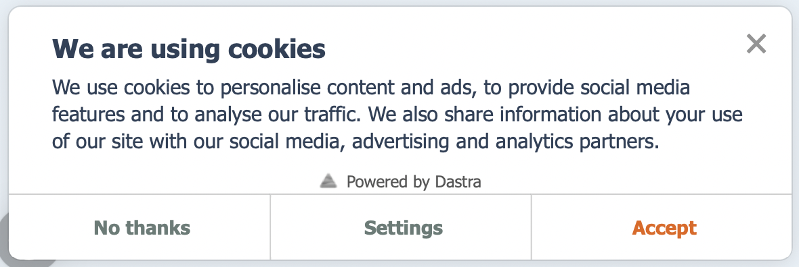
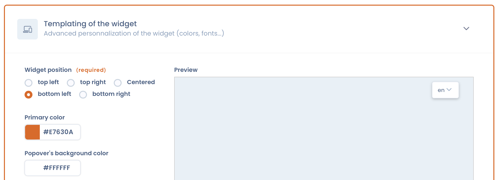

# Implement a cookie consent widget

DASTRA allows you to set up a cookie consent widget directly on your site in compliance with the recommendations of the CNIL (French Data Protection Authority) on cookies and other tracking devices.

## What is the Dastra cookie consent widget?

This widget is composed of several elements:

<figure><figcaption>
A fold-out introduction window
</figcaption></figure>

## Prerequisites&#x20;

To implement your cookie consent widget, you must first **identify** and **classify** the cookies **placed on your website by purpose**. DASTRA's Cookie Consent module allows you to do this in just a few clicks.


To make the implementation of the cookie consent widget easier, Dastra has integrated all the necessary steps, from setting up the prerequisites to the lines of code, in the same module.


To scan the cookies placed on your website, go to the following page:


[scannez-les-cookies-deposes-sur-votre-site-web.md](scannez-les-cookies-deposes-sur-votre-site-web.md)


To classify cookies by consent categories, go to the following page:


[classifiez-les-cookies-par-categories-de-consentement.md](classifiez-les-cookies-par-categories-de-consentement.md)


## Set the appearance of your target cookie consent widget

To set up a cookie consent widget on your website, you must go to the "Appearance" interface of the DASTRA cookie consent module.

<figure><figcaption>
DASTRA Cookie Consent Module "Templating" Interface
</figcaption></figure>

From this interface, you can **fully customize your widget** so that it displays the way you want it to on your website.


You can also make other more general changes to the widget in the "Configuration", "Texts and translations" and "Triggers" sections.


Once the settings are complete, click on "Save and continue".

## Insert the widget code on your website

Once you have defined your target cookie consent widget, you can integrate it directly into your website using **lines of code automatically generated by DASTRA**.

To do this, go to the "Installation" interface of the DASTRA Cookie Consent module, and insert the automatically generated code before the end of the html tag on your website.


You can use the Google tag manager to dynamically insert this code on each page.


Don't hesitate to ask your webmaster to do this step. Once this is done, a widget will appear on your screen.


For security reasons, only sites with an "https" SSL certificate can set up a widget.

