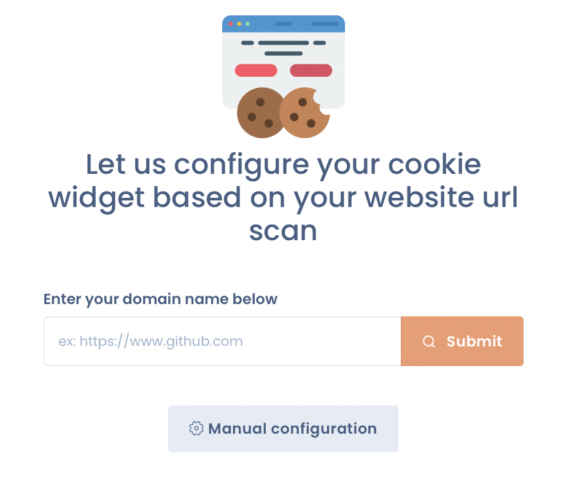
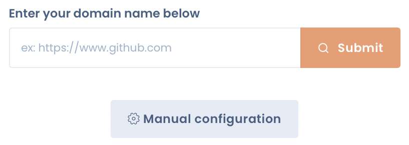

# Cookies scanning

DASTRA allows you to scan the cookies placed on your website thanks to its **cookie scanning** functionality, directly integrated into its "Cookie consent widget" module.

## Access the "scan cookies" function Dastra

You must first log into your Dastra workspace. To learn how to do this, go to the following page:


[Broken link](/broken/pages/-LvaGKB4EL4Jf4xLoJUG)


Then, you must go to the "Consent to cookies" module, and click on the "New widget" button.

<figure><figcaption>
Icon of the "Cookies" module
</figcaption></figure>

<figure><figcaption>
Click on the "New widget" button
</figcaption></figure>

A new screen appears. You are in the "Cookie Scan" section.

<figure><figcaption></figcaption></figure>

## Scan the cookies placed on your website

Once in the "Scan cookies" section, simply enter the domain name of your website in the space reserved, and click on "Submit".

<figure><figcaption></figcaption></figure>


Your domain name must include the entire prefix "https: // www." to be taken into account by our engine. Websites without SSL are not eligible to the scan feature.


Wait a few seconds, and that's it, the cookies placed on your website are identified!

Once the cookies placed on your website are scanned, you can proceed to their classification.


[classifiez-les-cookies-par-categories-de-consentement.md](classifiez-les-cookies-par-categories-de-consentement.md)


***

## Limitations and best practices

### Cookies set after consent (opt-in services)

By default, a cookie scanner browses your site without giving consent. Cookies that are only placed after opt-in (analytics, marketing, etc.) are never triggered and therefore cannot be detected.

**Exception: if the Dastra SDK is already integrated on your site**, the scanner is able to bypass the consent banner and collect all cookies actually placed — including those from opt-in services. In that case, the scan produces a complete result without any manual intervention.

If the Dastra SDK is not yet in place on the scanned site, opt-in services will need to be **added manually** via the service library.

### Manually added services — excess cookies

When you add a service from the Dastra library (e.g. Google Analytics, Meta Pixel), Dastra imports the full list of cookies that service *can* place across all its possible configurations. Your implementation likely only uses a subset of those.

It is recommended to **remove cookies that your specific implementation does not actually place**. Declaring cookies you do not use is misleading to visitors and may raise questions during a compliance audit.

To identify which cookies to keep, cross-reference the automated scan results (which detect what is actually placed) with the list imported from the library, and remove entries that do not appear in the scan.
