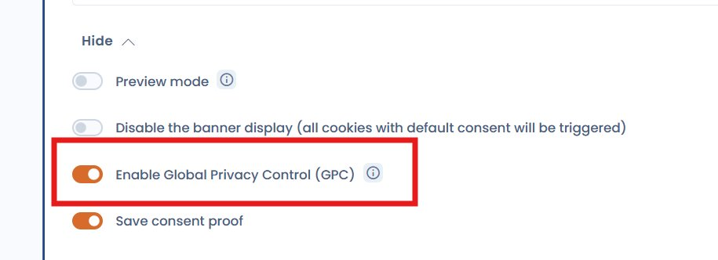

# US Privacy: CCPA, GPC and DoNotTrack

## Regulatory context

Unlike the GDPR which requires **opt-in** (prior consent), US privacy law is primarily based on an **opt-out** model: trackers can be placed by default, but users must be able to object easily.

Key regulations to be aware of:

| Law         | State       | Model   | In force since |
| ----------- | ----------- | ------- | -------------- |
| CCPA / CPRA | California  | Opt-out | 2020 / 2023    |
| CPA         | Colorado    | Opt-out | 2023           |
| VCDPA       | Virginia    | Opt-out | 2023           |
| CTDPA       | Connecticut | Opt-out | 2023           |


**GPC is mandatory in California**

Since CPRA (2023), businesses must honour the **Global Privacy Control (GPC)** signal as an opt-out request from the sale and sharing of personal data.


---

## Recommended approach with Dastra

### 1. Create a geo-targeted variant for the United States

The simplest way to handle your US users is to create a **geo-targeted variant** from the **Variants** tab of your widget.

For **California (CCPA/CPRA)**, configure the variant with an opt-out model: non-essential cookies are active by default, and users can opt out. Also consider adding a **"Do Not Sell or Share My Personal Information"** link in your site footer that opens the widget directly.

For **other US states** without a banner requirement, you can enable the **"Do not display a banner"** option with default consent values configured according to your policy.


[geo-targeted-variants.md](geo-targeted-variants.md)


---

### 2. Honour GPC and DoNotTrack signals

Two browser signals allow a user to express their refusal to be tracked without interacting with a banner:

| Signal                           | Standard | Legally binding (CA) | Description                                                |
| -------------------------------- | -------- | -------------------- | ---------------------------------------------------------- |
| **GPC** (`globalPrivacyControl`) | W3C      | ✅ Yes (CPRA)        | Opt-out signal for the sale/sharing of personal data       |
| **DNT** (`doNotTrack`)           | W3C      | ❌ No                | "Do not track" preference signal (not legally enforceable) |

#### Native activation (recommended)

Dastra now supports these signals **natively** via a toggle in the widget configuration. Enable the **"Enable Global Privacy Control (GPC)"** option from **Widget configuration > Advanced settings**.

<figure><figcaption><p>GPC option in the cookie consent widget advanced settings</p></figcaption></figure>

When this option is enabled, the widget automatically refuses analytics and marketing cookies for any visitor whose browser sends a GPC or DoNotTrack signal — with no additional code required.


Native activation is available from the current version of the Dastra widget. It covers both the `globalPrivacyControl` and the `doNotTrack` signals.


#### Advanced option — Custom JS snippet

If you need finer control (for example displaying an acknowledgment message or applying opt-out to specific categories), you can use the following JS snippet **in addition to** the native toggle, or instead of it if you manage the widget via the JS API:

```html
<script>
  var isOptOut =
    navigator.globalPrivacyControl === true ||
    navigator.doNotTrack === '1' ||
    window.doNotTrack === '1'

  if (isOptOut) {
    window.dastra = window.dastra || []
    window.dastra.push([
      'cookieReady',
      function (manager) {
        if (!manager.consent.hasConsented()) {
          manager.consent.setPurposeConsent('Analytical', false)
          manager.consent.setPurposeConsent('Marketing', false)
          manager.consent.dispatchEvent() // apply choices without persisting them
        }
      }
    ])
  }
</script>
```


**`dispatchEvent()` vs `save()` — what's the difference?**

- **`dispatchEvent()`** applies the consent choices for the current session **without writing anything** to the browser's localStorage. The GPC or DNT signal is re-evaluated on every page load. If the user later disables GPC in their browser, normal behaviour resumes automatically. This is the recommended approach for honouring these signals.
- **`save()`** persists the consent in localStorage, as if the user had made an explicit choice through the widget. Use this only when you want to remember a choice across sessions.



**What does `hasConsented()` do?**

This check ensures the automatic opt-out does not override a consent choice the user has already made explicitly through the widget. If the user has already expressed a preference, that preference is respected.



This snippet must be placed **before** the Dastra widget loading tag so it is taken into account on the very first page load.


Category labels to use with `setPurposeConsent`:

| Category     | Label          |
| ------------ | -------------- |
| Necessary    | `Necessary`    |
| Preferences  | `Preference`   |
| Analytics    | `Analytical`   |
| Marketing    | `Marketing`    |
| Other        | `Other`        |
| Unclassified | `Unclassified` |

### 3. Displaying an "Opt-Out Request Honored" acknowledgment message

When a GPC or DNT signal is detected, regulations such as CPRA recommend informing the user that their opt-out request has been acknowledged. Dastra does not generate this message natively — you need to inject it into the page yourself.

Two approaches are available depending on the user experience you want.

#### Option A — Ephemeral toast

A message that appears for a few seconds then disappears automatically. Easy to implement, but the user may miss it if they are not looking at the page at the right moment.

```html
<script>
var isOptOut = navigator.globalPrivacyControl === true
            || navigator.doNotTrack === "1"
            || window.doNotTrack === "1";

if (isOptOut) {
  window.dastra = window.dastra || [];
  window.dastra.push(['cookieReady', function(manager) {
    if (!manager.consent.hasConsented()) {
      manager.consent.setPurposeConsent('Analytical', false);
      manager.consent.setPurposeConsent('Marketing', false);
      manager.consent.dispatchEvent();

      var notice = document.createElement('div');
      notice.setAttribute('role', 'status');
      notice.style.cssText = 'position:fixed;bottom:16px;left:16px;background:#222;color:#fff;padding:12px 18px;border-radius:6px;font-size:14px;z-index:9999;max-width:320px;';
      notice.textContent = 'Opt-Out Request Honored: analytics and marketing cookies have been disabled.';
      document.body.appendChild(notice);
      setTimeout(function() { notice.remove(); }, 6000);
    }
  }]);
}
</script>
```

#### Option B — Persistent banner (recommended)

A fixed bar at the bottom of the page, visible as long as GPC is active in the browser. More robust for compliance: the indication is permanent, not only visible on first load. A Dismiss button lets the user close it.

```html
<script>
var isOptOut = navigator.globalPrivacyControl === true
            || navigator.doNotTrack === "1"
            || window.doNotTrack === "1";

if (isOptOut) {
  window.dastra = window.dastra || [];
  window.dastra.push(['cookieReady', function(manager) {
    if (!manager.consent.hasConsented()) {
      manager.consent.setPurposeConsent('Analytical', false);
      manager.consent.setPurposeConsent('Marketing', false);
      manager.consent.dispatchEvent();

      var bar = document.createElement('div');
      bar.setAttribute('role', 'status');
      bar.setAttribute('aria-live', 'polite');
      bar.style.cssText = 'position:fixed;bottom:0;left:0;right:0;background:#1a1a1a;color:#fff;font-size:13px;padding:10px 20px;display:flex;align-items:center;justify-content:space-between;z-index:9999;border-top:1px solid #333';
      bar.innerHTML = '<span>🔒 Opt-Out Request Honored — analytics and marketing cookies are disabled.</span>'
        + '<button onclick="this.parentNode.remove()" style="background:none;border:1px solid #555;color:#fff;padding:4px 12px;border-radius:4px;cursor:pointer;font-size:12px;margin-left:16px">Dismiss</button>';
      document.body.appendChild(bar);
    }
  }]);
}
</script>
```


Adapt the message text to your editorial style and your users' language. For multilingual sites, conditionally set the text based on the page locale.


***

## Summary

| Mechanism                    | Implementation                              | Legally required (CA) |
| ---------------------------- | ------------------------------------------- | --------------------- |
| CCPA geo-targeted variant    | Dastra interface                            | ✅ Yes                |
| GPC detection                | Native toggle (widget config) — recommended | ✅ Yes (CPRA)         |
| DNT detection                | Native toggle (widget config) — recommended | ❌ Recommended        |
| Acknowledgment message       | JS snippet (advanced option)                | ❌ Recommended        |
