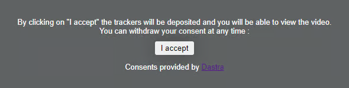

# Blocking iframes (twitter/youtube...)

## Examples of services using iframes

Video players: YouTube, Vimeo, DailyMotion, etc.\
Social media: Twitter, Facebook, etc.\
Podcast players\
Audio players

## Method 1: Using the SDK

Our SDK will allow you to block all iframes on the page by displaying a customizable blocking message:\


<figure><figcaption></figcaption></figure>

By clicking on “I accept,” consent to the specific service will be automatically dispatched. The system also allows you to capture a refusal of cookies in the Dastra CMP.\
A simple example with YouTube video player iframes:

```markup
<iframe width="560" height="315" src="https://www.youtube.com/embed/aJ1qDx8lv2Y" allowfullscreen></iframe>
<script>
  // Set up youtube iframe blocking
  dastra.push(['iframeBlock', {
    selector: 'iframe[src*="youtube.com"]',
    service: 'youtube', // service slug (Check your Dastra cmp config)
    body:'<p>By clicking on "I accept" the trackers will be deposited and you will be able to view the video. You can withdraw your consent at any time :</p>',
    buttonLabel:'I accept',
    buttonClass: 'btn btn-primary'
  }])
</script>
```


You can customize the appearance of the message (background, fonts, etc.) using your CSS sheet. The blocking message is integrated into the page's DOM with a class “.datra-blocking-iframe”.


## Method 2: Manual implementation

You can also implement your own logic :&#x20;

```markup
<script>
  // Select all youtube iframes 
  var iframes = document.querySelectorAll('iframe[src*="youtube.com"]');

  // Foreach iframe disable the iframe by transforming "src" attribute to "data-blocked-src"
  iframes.forEach(function(iframe){
    var iframeSrc = iframe.getAttribute('src');
    iframe.setAttribute('data-blocked-src', iframeSrc );
    iframe.setAttribute('src','about:blank');
    var divAlert = document.createElement('div');
    divAlert.classList.add('alert-iframe-cookie')
    divAlert.innerHTML = '<p>En cliquant sur « j’autorise » les traceurs seront déposés et vous pourrez visualiser la vidéo. Vous gardez la possibilité de retirer votre consentement à tout moment. En cliquant sur « je refuse », vous ne pourrez pas accéder à la vidéo. : </p><div class="button-container"><button type="button" onclick="SetConsent(\'youtube\', true)" href="#" class="btn btn-success" >Accept the cookies</button></div><p>Consentements fournis par <a href="https://www.dastra.eu">Dastra</a></p>';
    iframe.after(divAlert);
  });

  // On cookie consent, 
  window.addEventListener('dastra:consent:youtube', function() {
    // Load iframe when accepted
    document.querySelectorAll('iframe[data-blocked-src*="youtube.com"]').forEach(function(iframe){
      iframe.setAttribute('src', iframe.getAttribute('data-blocked-src'));
      iframe.removeAttribute('data-blocked-src');
    });
    
    // Delete message when accepted
    document.querySelectorAll('.alert-iframe-cookie').forEach(function(alert){
      alert.style.display = "none";
    });
  });

  function SetConsent(service, consent){
    dastra.cookieConsent.consent.setServiceConsent(service, true);
    dastra.cookieConsent.consent.save();
  };

</script>
<style>
  .alert-iframe-cookie{
    background-color:#CCC;
    padding: 20px 20px;
    color:#fff;
    text-align:center;
  }
  
  .button-container{
    margin: 10px auto; 
  }
  
</style>
```
