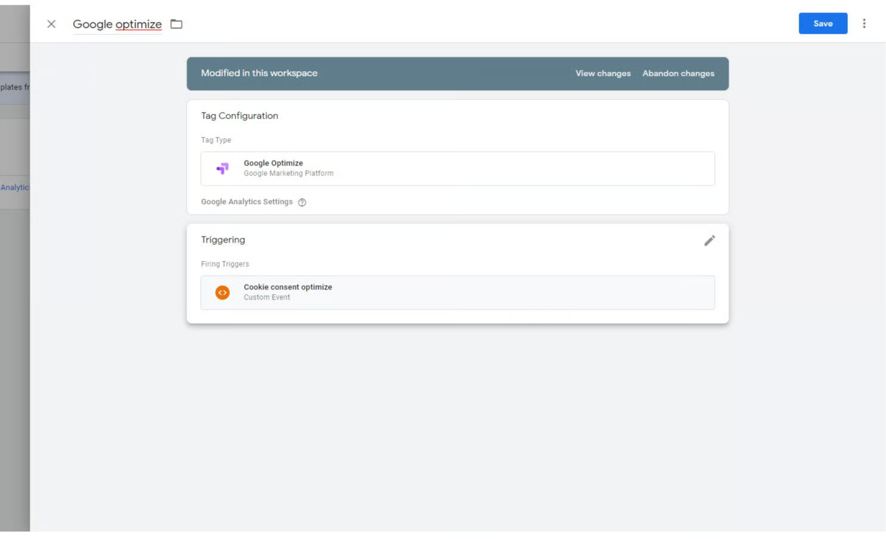
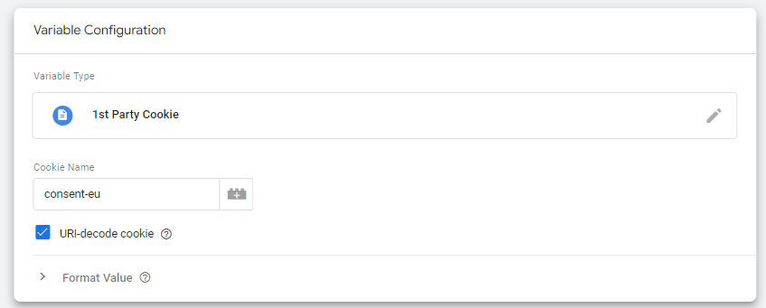
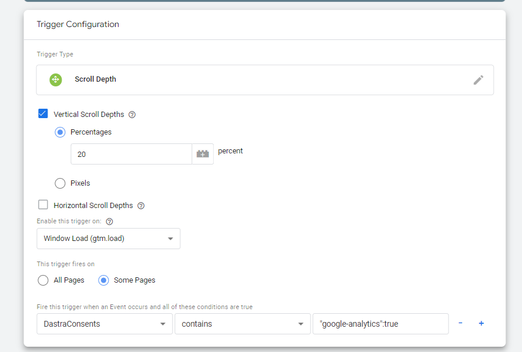
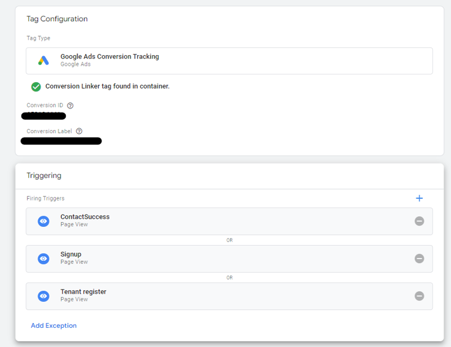
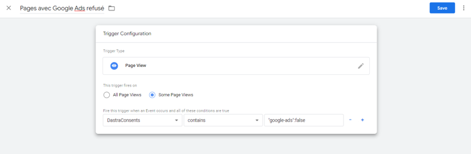
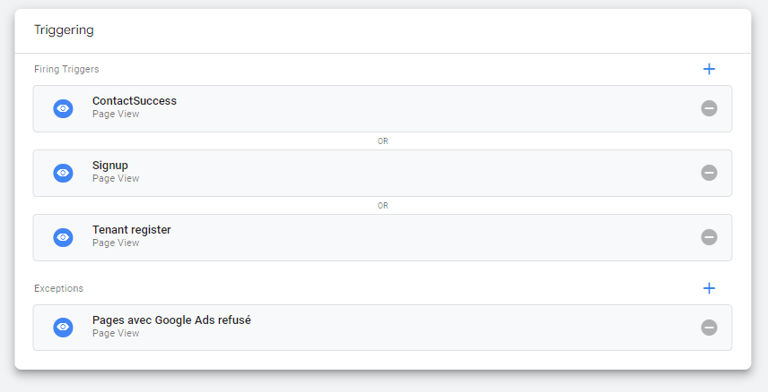

# Google Tag Manager

## Introduction

Google Tag Manager is a powerful tagging tool that centralizes all the code snippets you want to integrate into your website (Dastra can be one of them!).\
This tagging solution is very effective for implementing effective cookie consent because it does not require redeploying the entire website each time tags are modified.

## Google Consent Mode V2

Dastra natively supports **Google Consent Mode V2**. This integration sends a `consent_update` signal to GTM as soon as a user expresses their consent, allowing Google tags to respect that choice before triggering any tracking.

### Step 1 — Enable Consent Mode V2 on the service

In the configuration of the relevant service (e.g. Google Analytics, Google Ads), check the **"Google Consent Mode V2"** option. Once enabled, the Dastra banner will automatically send the `consent_update` signal to GTM each time a user interacts with the consent banner.

### Step 2 — Place the default consent code before GTM

For Google tags to wait for the consent signal before firing, insert the following snippet **before** the GTM initialisation code in your page:

```html
<script>
  window.dataLayer = window.dataLayer || [];
  function gtag() { dataLayer.push(arguments) }
  gtag('consent', 'default', {
    ad_storage: 'denied',
    analytics_storage: 'denied',
    ad_user_data: 'denied',
    ad_personalization: 'denied',
    wait_for_update: 500
  });
</script>
```

This snippet instructs Google tags to wait up to 500 ms for a `consent_update` signal before executing tracking. When the user accepts the relevant services, the Dastra banner automatically fires this signal and the tags can then execute.


This snippet must be placed **before** the GTM initialisation code. If it is loaded after GTM, Google tags may fire without waiting for consent.


### Installation: hard-coded or via GTM?

The Dastra CMP script can be integrated directly into the page source (hard-coded) or loaded via GTM. Both methods are valid. However, hard-coded installation is recommended because it guarantees that the default consent snippet (above) executes before GTM — which is a prerequisite for Consent Mode V2 to work correctly.

### Adding new services and resetting consent

Dastra does not automatically re-display the consent banner to visitors who have already made a choice when new services are added to the configuration. If you add a new tool (e.g. a new analytics service) and need to collect consent from existing visitors for that service, you must **reset consent** from the Dastra interface. A dedicated button in the widget configuration forces the banner to be shown again to all visitors on their next visit, including those who had already made a choice.

## Events sent to GTM in the DataLayer

The following events are automatically sent to Google's dataLayer:

| Name                              | Signification                                                                          |
| --------------------------------- | -------------------------------------------------------------------------------------- |
| Name                              | Signification                                                                          |
| dastra:consent:{your-vendor-name} | This event is sent when the user has accepted cookies from this provider.              |
| dastra:refused:{your-vendor-name} | This event is triggered when the user has not consented to cookies from this provider. |

You can therefore trigger the tags corresponding to the different providers configured in the widget using these two events.

## Example

In this example, we will trigger the Google Optimize tag when the user gives their consent.\
In your GTM container, create an event trigger on the dataLayer named “dastra:consent:google-optimize.”\
The Google Optimize tag will then only trigger on this event. Here is what it looks like in the GTM interface:

<figure><figcaption></figcaption></figure>

## Specific case of “blocking triggers”

In some cases, you need to disable certain tags if consent has not been given. Since the “dastra:consent:\<service name>” event only runs when a page is displayed, this may not be sufficient in some cases if you use different interaction triggers on the page, such as clicks on page elements, scroll heights, etc.

In this case, it is necessary to configure certain settings in order to directly **read the consent value stored in the consent cookie.**

### 1. Create a variable called “DastraConsents”

#### Define the variable

**Log in** to your Google Tag Manager account and go to “Variables,” then create a new “User-defined variable.”

#### &#x20;Select “1st party cookies”

Name your tag “DastraConsents,” for example. In the cookie name field, enter the name of the consent cookie (default: **consent-eu**).\
Remember to **select the “URI-decode cookie” option**.

<figure><figcaption></figcaption></figure>

#### Then configure your trigger as follows:

In this case, our tag fires if the scroll depth on the page is > 20%. We want this tag to fire only if the Google Analytics service has been authorized by the user. Here's how to configure the tag trigger.

<figure><figcaption></figcaption></figure>

In the “Some Pages” section, if you want to activate the tag only when consent has been given to use a service, enter the formula **DastraConsents contains “{serviceName}”:true** (example “crisp”:true) without spaces

If you want to trigger the tag in the event of a refusal, enter the formula:

**DastraConsents contains “{serviceName}”:false** (example “google-analytics”:false)

### Case of multiple triggers of the same type with an exception

If you have many different triggers for the same tag, it is also possible to create an exception in this way.\
Example of a tag with multiple triggers:

<figure><figcaption></figcaption></figure>

In this case, we want to add an exception: if the Google Ads tag (google-ads) is not accepted, we do not want the tag to trigger.

Click on “**Add Exception**”


Please note that exceptions only work properly when they are of the same type. If your triggers are of the “Page view” type, the exception must also be of the page view type.


Create a trigger of the same type with a name such as “Pages viewed with Google Ads service explicitly refused.”


If you also want to disable the default tag even if the user has not clicked on the consent modal (and therefore does not have cookies storing preferences), you can use a trigger with a negation such as:

**DastraConsents Does not contain “google-ads”:true**


<figure><figcaption></figcaption></figure>

Click “Save.” You should have this:

<figure><figcaption></figcaption></figure>

Save your changes and you should see that your tags are disabled on the relevant pages if consent is not given.

### Specific case: refreshing the page if the consent configuration changes

#### Rejection of cookies after acceptance:

In some cases, certain tags are not properly cleaned up after cookies are rejected. This occurs in particular when a user decides to accept cookies, then clicks on the widget again and decides to withdraw their consent. In most cases, this does not pose a problem because the markers are not executed multiple times on the page anyway, so it is no longer necessary to delete the script tags inserted into the page.

In some situations, it is possible that the tags are still active.

To prevent this type of problem, it is possible to force the page to refresh, which completely resets all markers or JavaScript SDKs loaded by the services.

Simply insert the following code (below the Dastra widget initialization tag if possible)

```markup
<script>
// If any service is refused explicitely in the modal
window.addEventListener('dastra:consents:any_refused', function(){
    // Refresh the current page
    location.reload();
})
</script>
```

#### Consent update:

To reload the page when any consent changes in any way, use the updated function with the following code:

```markup
<script>
window.addEventListener('dastra:consents:updated', function(){
    // Refresh the current page
    location.reload();
})
</script>
```

#### Full acceptance of trackers:

To reload the page when all trackers are accepted (“accept all” button):

```markup
<script>
window.addEventListener('dastra:consents:all_accepted', function(){
    // Refresh the current page
    location.reload();
})
</script>
```

#### Acceptance of a specific service:

To reload the page when accepting a specific service:

```markup
<script>
window.addEventListener('dastra:consent:<slug du service>', function(){
    // Refresh the current page
    location.reload();
})
</script>
```
