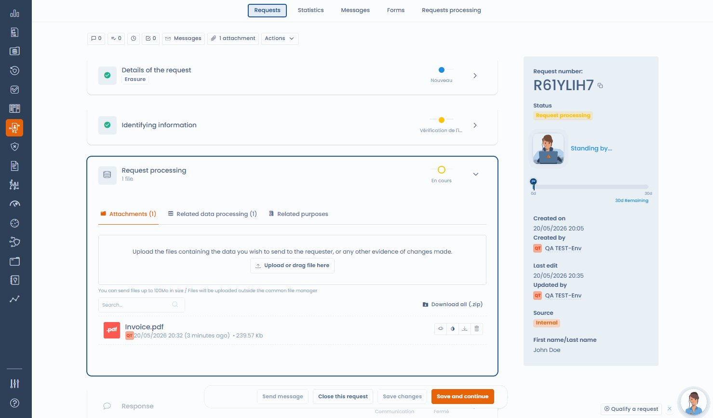

# Document redaction

When processing a data subject right request, it is common to share documents with the requester — identity copies, contracts, account histories, client files. These documents almost always contain confidential information that should not be passed on: data relating to third parties, internal contractual details, or personal references.

Dastra includes a redaction tool directly inside the request workflow, without requiring you to leave the platform.

***

## How to access redaction

The redaction tool is available from the **Communication / Transmission** step of a request in progress, when an attachment is present or added.

1. Open a data subject request in progress
2. Go to the **Communication / Transmission** step
3. Select or add the document to be shared
4. Click **Redact document**

<figure><figcaption>
Original attachment in the request processing step — ready to redact
</figcaption></figure>

***

## AI-assisted redaction

When you launch redaction, the AI assistant analyses the document and **automatically detects zones likely to contain third-party personal identifiers**: names, addresses, contact details, identification numbers.

These zones are pre-selected and displayed on the document. Your team then:

* **Removes false positives** with a click (incorrectly detected zones)
* **Manually adds** any zones the AI may have missed


The AI result is a starting proposal, not a final decision. Every redaction zone must be reviewed and validated by a qualified person before the document is sent.


***

## Manual redaction

For teams that prefer to keep full control without AI assistance, **fully manual redaction** is available in the same interface. Select the zones to mask directly on the document.

***

## Generating the redacted document

Once the review is complete, click **Generate redacted document**. The output document is:

<figure><figcaption>
The redacted document is automatically renamed and attached to the request (here: 6 zones masked)
</figcaption></figure>

* **Rasterised** — the underlying text is not simply hidden visually but made definitively inaccessible. It is not possible to extract redacted content from the final file.
* **Saved to the request** — the redacted document is attached to the request and available for sending.

The original can be kept or deleted based on your organisation's policy.


Rasterisation-based redaction is the method recommended by data protection authorities. A simple visual mask (an opaque rectangle on a non-flattened PDF) can be circumvented and does not constitute compliant redaction.


***

## Best practices

* Always review the redacted document before sending to verify that no confidential information is visible.
* Keep the original in Dastra for your compliance file, unless your internal policy requires deletion.
* For large or complex documents (multi-page contracts, account statements), combine AI detection with a manual page-by-page review.
