# Edit and process requests

Dastra lets you manage the entire lifecycle of a data subject right request (DSAR).\
From the interface, you can:

* **Qualify the request**: type of right concerned, organizational unit, deadline management.
* **Verify the identity** of the requester by completing or adjusting the information collected.
* **Process the associated data** by consulting the linked datasets, uploading evidence and notifying the owners.
* **Respond directly** to the requester thanks to the AI assistant, with full traceability of the exchanges.

Each step is documented and recorded in the history, ensuring legal compliance and a clear response to data subjects.

***

### Qualifying the request

When a request is registered, it appears in the record of requests.\
From the **qualification** screen, you can:

1. Define the **type of right** concerned (access, rectification, erasure, objection, etc.).
2. Assign the request to an **organizational unit**.
3. Manage the **processing deadlines**:
   * Legal deadline of 30 days.
   * Option to mark the request as complex (90 days).
   * Temporarily suspend the deadline if necessary.

<figure>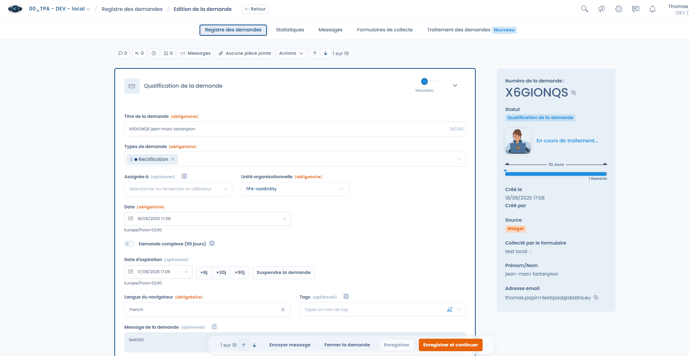<figcaption>
The request management interface
</figcaption></figure>

***

### Verifying the identity

Dastra makes it possible to verify the identity of the person who submitted the request.\
You can complete or modify the information collected via the initial form:

* Email address, first name, last name.
* Additional data: country, postal address, phone number, user identifier, etc.
* Data subject category (e.g. newsletter subscribers, customers, employees).

<figure>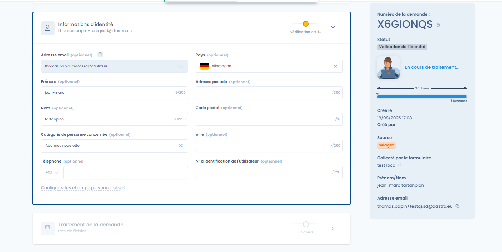<figcaption>
Section on the requester's identity
</figcaption></figure>

***

### Processing the request

The **Request processing** tab brings together all the actions related to execution.

#### Attachments

You can upload evidence files or exports containing the requester's data.\
These files can then be attached when responding.

<figure>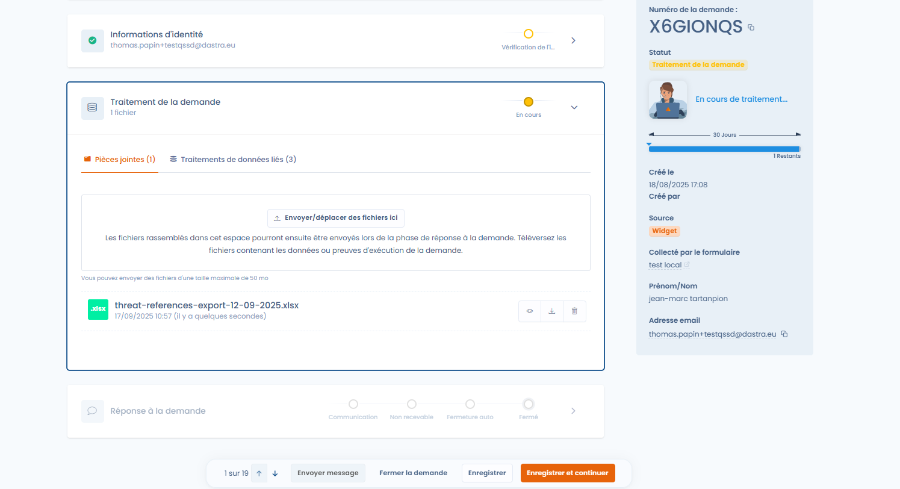<figcaption>
Adding files to the request
</figcaption></figure>

***

#### Related data processing

Dastra automatically identifies the datasets associated with the **data subject category**.\
Each dataset must be processed individually.

* Available statuses: **Pending** / **Processed**.
* Display of the overall progress (progress as a percentage).

The **Datasets** tab displays all the relevant datasets according to a **cumulative model**: those attached to the organizational unit assigned to the request, those of **all its parent units** (up to the root of the hierarchy) and those of **all its descendant units**. This view ensures that no inherited dataset is overlooked during processing.

<figure>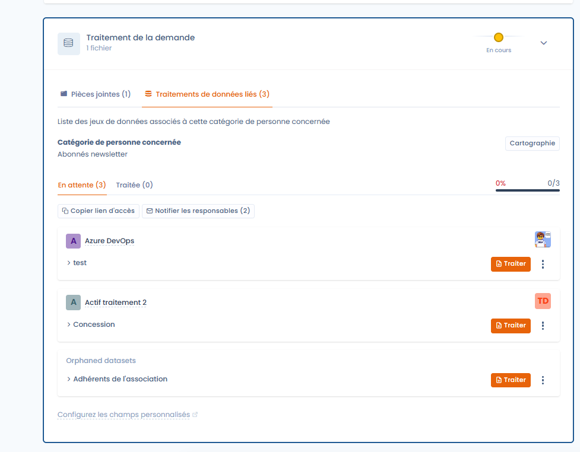<figcaption>
Advanced processing by dataset
</figcaption></figure>


A request cannot be declared 100% processed as long as inherited datasets have not been processed or explicitly marked as **Not applicable**.


If the operator in charge of the request does not have access rights to some of the datasets displayed, a **visual indication** invites them to contact the owners concerned.

<figure>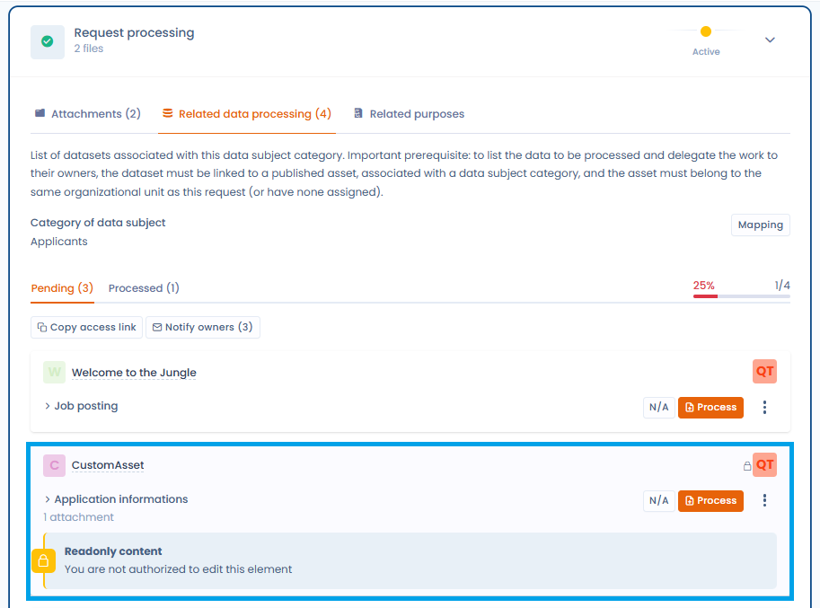<figcaption>
The datasets inherited from the parent and descendant units are displayed according to a cumulative model
</figcaption></figure>

***

**Details of a dataset**

You can directly view the links between the dataset and the assets by clicking on the **Mapping** button.

<figure>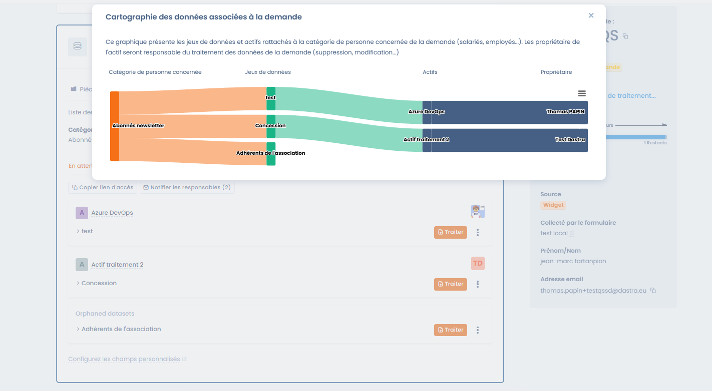<figcaption>
View the link between the data subject category and the owner to contact
</figcaption></figure>

By clicking on **Process**, you access the detailed information:

* Categories of data concerned (professional life, personal life, identity, etc.).
* Legal basis and retention period.
* Terms of erasure after the retention period.

<figure>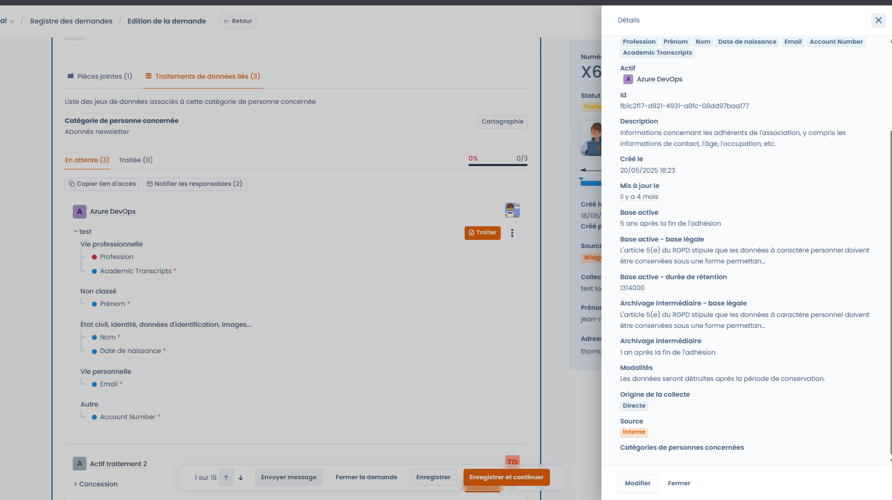<figcaption>
Quick access to the asset detail
</figcaption></figure>

***

**Marking a processing as processed**

For each dataset:

1. Review the information.
2. Justify the processing carried out (e.g. erasure, rectification).
3. Add evidence files if necessary.
4. Click on **Mark as processed**.

<figure>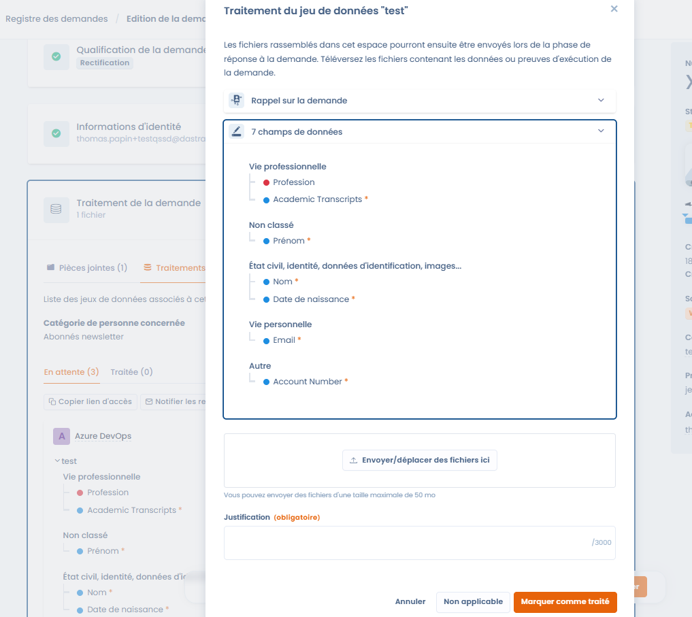<figcaption>
Request processing interface specific to the asset
</figcaption></figure>

Once marked as processed, the status is updated and a comment can be added.

<figure>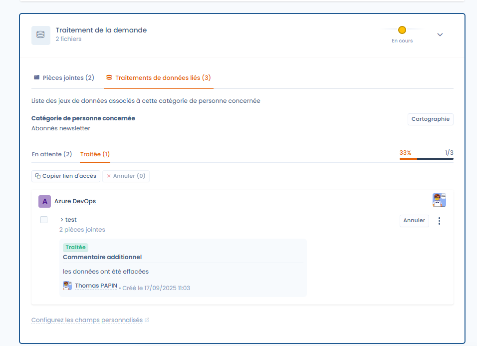<figcaption></figcaption></figure>

***

#### Collaboration and notifications

You can automatically notify the owners of the assets concerned.\
A window makes it possible to select the people to notify by email.

<figure>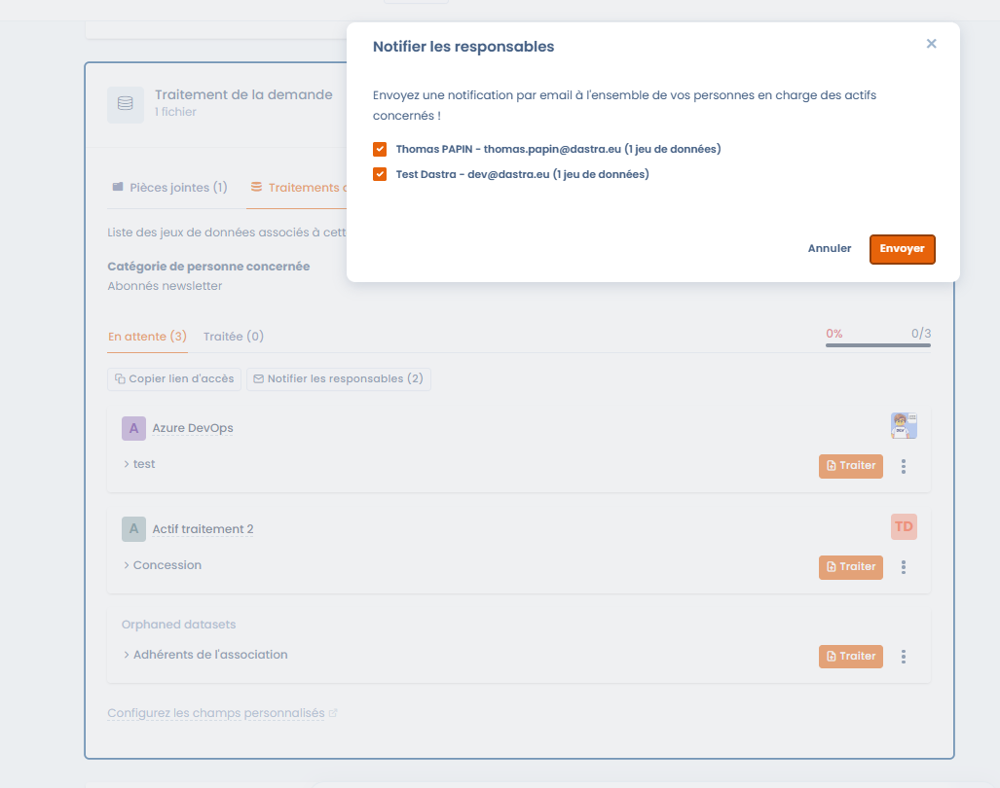<figcaption>
Quickly notify the owners of the assets
</figcaption></figure>

***

### Responding to the request

Once processing is complete, it is possible to respond directly to the requester.

* The **AI Assistant** suggests a compliant and customizable message.
* You can adjust the tone: more formal, shorter, longer, with emojis.
* The final message can be sent directly from Dastra.

<figure>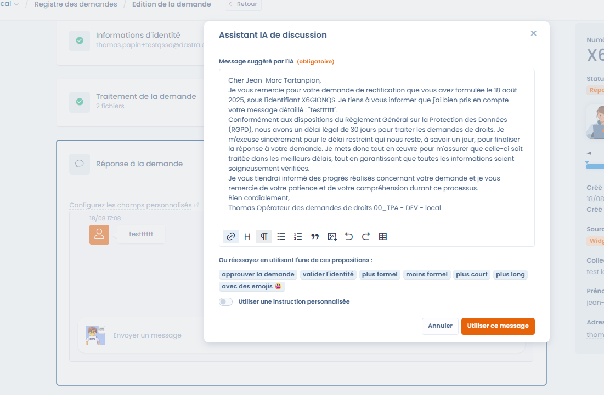<figcaption>
Exchange messages with the requester, using AI if you wish
</figcaption></figure>

***

### Additional actions on a request

In addition to the main steps (qualification, verification, processing and response), Dastra offers an **Actions** menu that makes it possible to carry out advanced operations on a request.

<figure>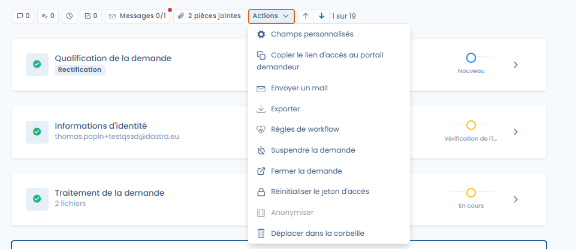<figcaption>
Quickly access the many additional actions available
</figcaption></figure>

The available actions notably include:

* **Custom fields**: add or modify specific fields to enrich the request.
* **Copy the requester portal access link**: share a direct link with the data subject.
* **Send an email**: send a message related to the request directly from the platform.
* **Export**: export the information of the request.
* **Workflow rules**: apply or trigger an automation rule.
* **Suspend the request**: pause the legal processing deadline (see below).
* **Close the request**: manually mark the request as completed.
* **Reset the access token**: recreate a secure link for the requester.
* **Anonymize**: erase the identifying data linked to the request.
* **Move to the trash**: archive or delete the request.

***

#### Suspending a request

In some cases, it is necessary to **temporarily suspend** a request (for example, while awaiting identity verification).\
The suspension interrupts the legal deadline, which only resumes once the suspension is lifted.

<figure>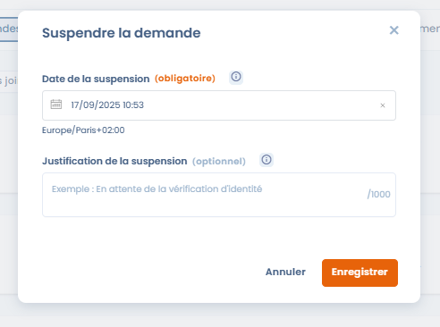<figcaption>
Suspend a request while awaiting a response from the requester, for example
</figcaption></figure>

* **Suspension date**: mandatory.
* **Justification**: free-text field to document the reason (e.g. awaiting supporting documents).

Once the request is suspended, the interface clearly displays the state and offers a button to lift the suspension.

<figure>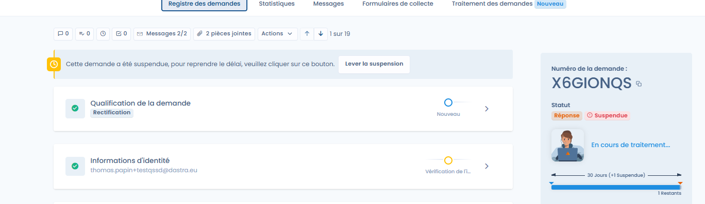<figcaption></figcaption></figure>

The counter of remaining days is automatically recalculated, taking the suspension period into account.

***

### Overall tracking

Each request keeps the complete history:

* Messages exchanged.
* Attachments added.
* Status and processing progress.

This makes it possible to ensure traceability and compliance in the event of an audit.
