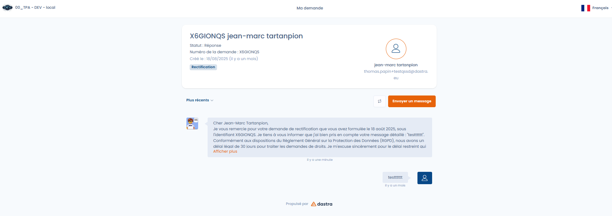

# Requester space

Each person who submits a request gets access to a **dedicated space**, secured by a unique code sent by email.

From this space, the requester can:

* Track the progress of their request.
* View the messages sent by the organization.
* Reply and exchange messages directly with the person in charge.
* Download or upload supporting documents.

<figure><figcaption>
The exchange space with the requester
</figcaption></figure>

This space ensures traceability, tracking, and transparency of exchanges, while avoiding unsecured exchanges by regular email.
