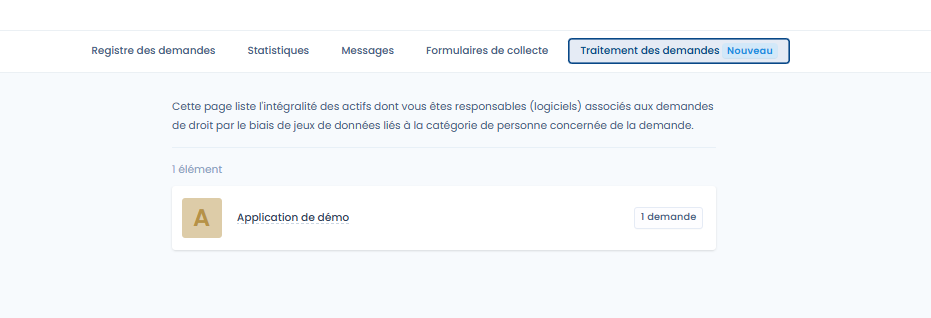
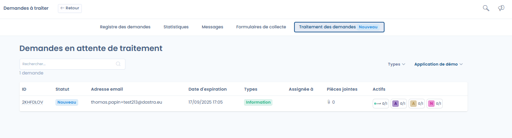
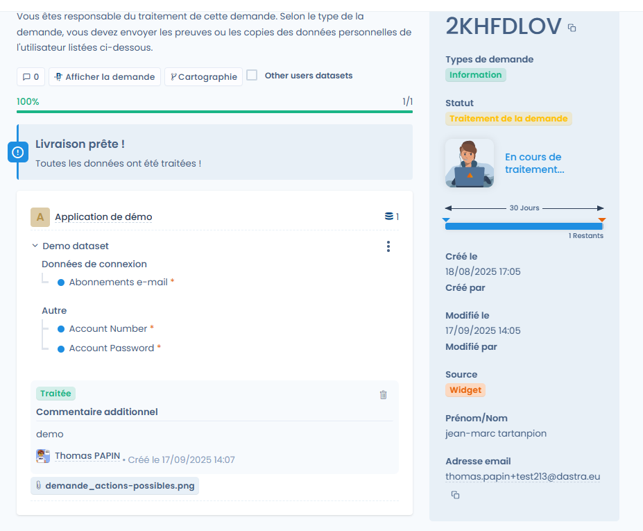

# Request processing interface (asset owners)

When a user is set as the **owner of an asset** linked to a dataset covered by a request, they get access to a dedicated interface to process these requests (they won't have access to the request list, but they **must have access rights to the repository**).

Available features:

* View the list of requests to process.
* Access the datasets covered by the request.
* Provide evidence, copy or delete the requested data.
* Mark the request as processed or inadmissible, with a comment.

<figure><figcaption>
List of requests to process
</figcaption></figure>

<figure><figcaption>
Requests awaiting processing
</figcaption></figure>

<figure><figcaption>
Example of a processed request
</figcaption></figure>
