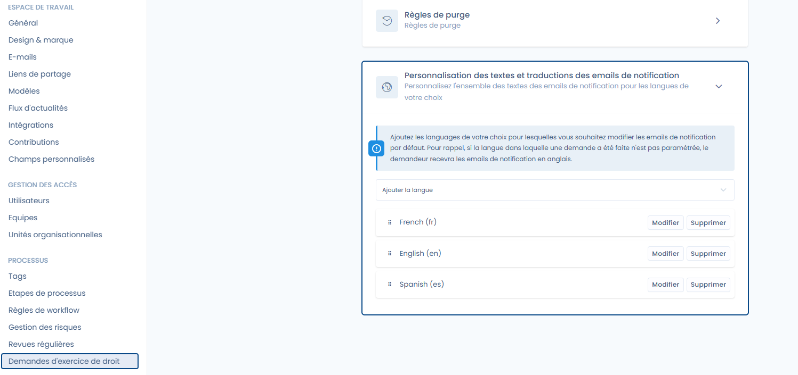
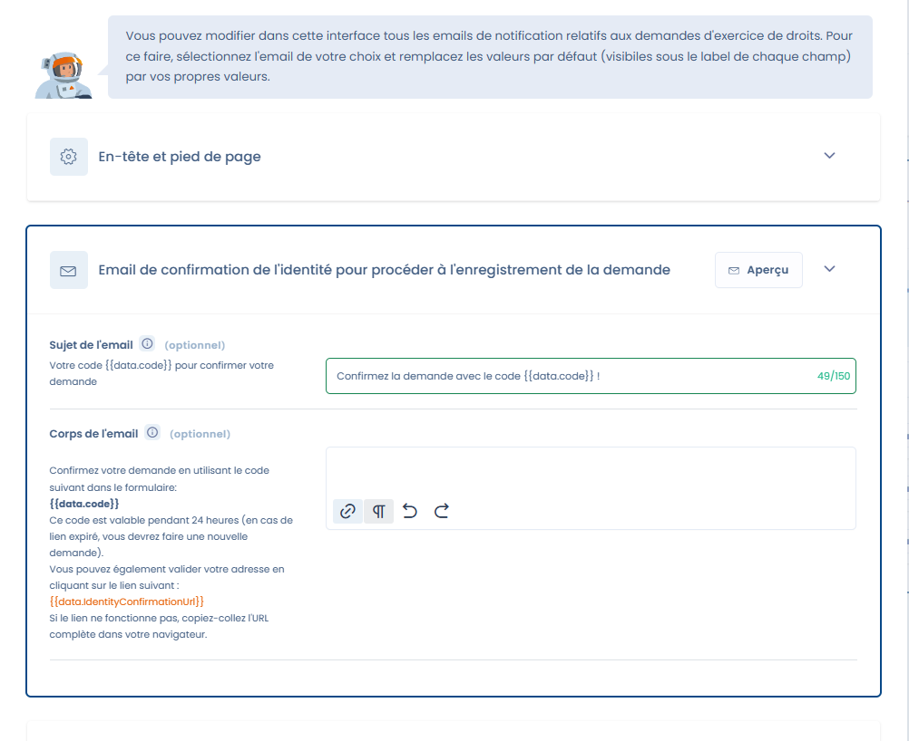

# Customizing emails sent to requesters

The interface lets you edit all the notification emails related to data subject rights requests, if you don't want to use our default wording.\
You can:

* Customize the **subject and body of the messages**.
* Manage **multilingual translations** to send emails in the language chosen by the requester.
* Add additional languages (by default, emails are sent in English if no translation is defined).

<figure><figcaption>
Language customization
</figcaption></figure>

<figure><figcaption>
Customizing a message
</figcaption></figure>


Please pay attention to any tags that may be present (here: `{{data.code}}`): this means that data will be inserted when the message is generated, and it is required for the feature to work correctly!&#x20;

You can of course add other information to the text (type `{{` to open the list of available variables)

