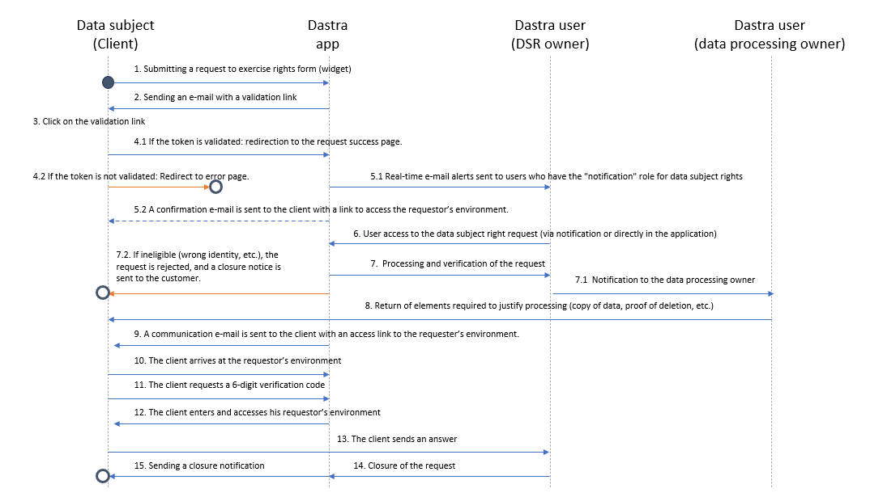
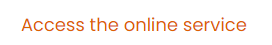
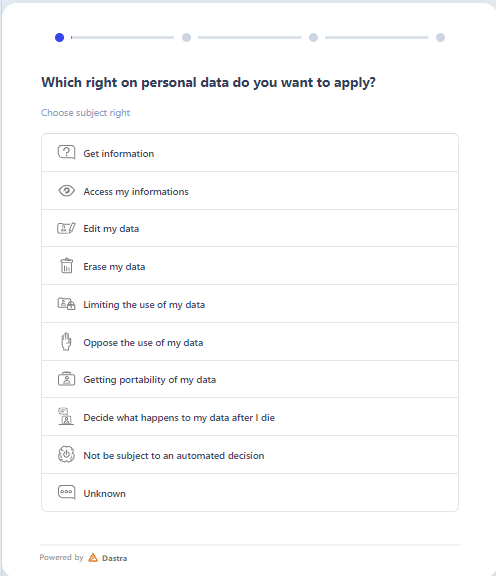

# Set up a data subject right request widget

## Process

The process of data subject right request via the widget is as shown in the diagram below:

<figure><figcaption></figcaption></figure>

## Setting up

DASTRA allows you to put a data subject right request widget directly on your website, that can be accessed by anyone via a simple button, as currently done on its [privacy policy](https://www.dastra.eu/en/legal/privacy-policy):

<figure><figcaption></figcaption></figure>

By clicking on the "Access the online service" button, a window will appear, allowing the Internet user who wishes to make their request:

<figure><figcaption></figcaption></figure>

To set up such a widget, simply configure your widget using our right exercice widget editor functionality.

For more information on how to implement a rights exercise widget on your website, [**contact us**](https://www.dastra.eu/en/contact?type=Other)**.**

### Conditional logic (skip logic)

It is now possible to define **conditional display rules** on the fields of your DSR widget template: a field appears only if the answer to a previous question meets a defined condition.

These rules are interpreted dynamically on the respondent side — the form adjusts in real time as answers are entered.

This allows you to  :

* Show or hide fields depending on the type of right exercised, the nature of the request, or any previous answer
* Manage multiple scenarios within a **single widget**, without creating and maintaining a separate form for each variant
* Reduce maintenance overhead when content evolves or compliance requirements change
