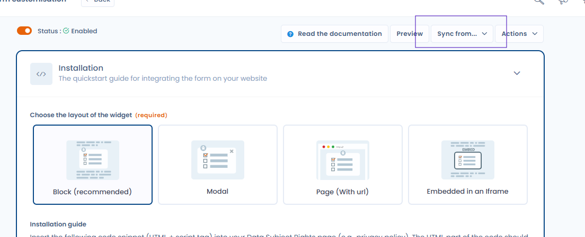
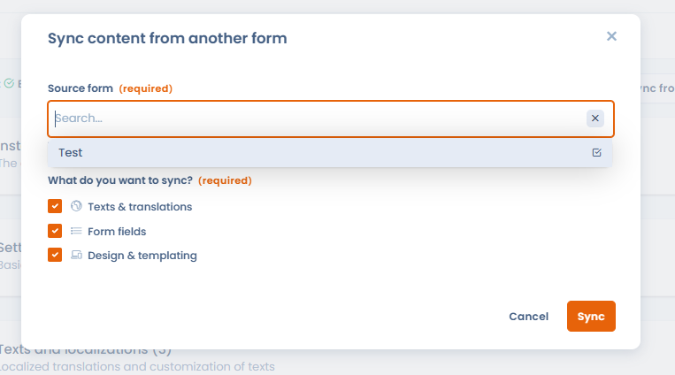

# Widget synchronisation

When multiple DSR widgets share a similar configuration (same fields, same texts), you can **synchronise** them. Designate one widget as the source, associate child widgets to it, then propagate any change in a single click to all linked widgets.

This is particularly useful for organisations that manage several variants of the same widget (for example, an account deletion widget deployed across different applications or geographic markets).

## Sync content from another widget

To import the configuration from an existing widget into the current one, use the **"Sync from..."** button on the widget customisation page.

<figure><figcaption>
The "Sync from..." button lets you synchronise configuration from a source widget
</figcaption></figure>

A dialog opens to select the source widget and choose which elements to import: texts and translations, form fields, design and templating.

<figure><figcaption>
Selecting the source widget and the elements to import
</figcaption></figure>

## Propagate changes to child widgets

Once you have made changes to the source widget, propagate them in one click to all linked widgets using **"Propagate to linked forms"**.

<figure><figcaption>
Pushing changes from the source widget to all its children (texts, fields, design)
</figcaption></figure>
