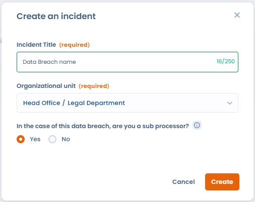
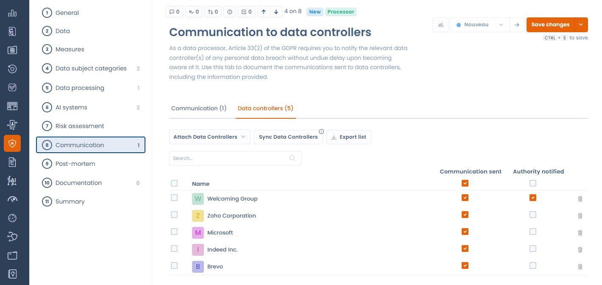

# Incidents as a Data Processor

Dastra's data breach module adapts to your **organisation's role** in the incident: Data Controller (DC) or Data Processor (DP). This role determines the applicable obligations and which steps are displayed in the form.

***

## Declaring your role at creation

When creating a new incident, a selector lets you choose between:

* **Data Controller** — standard flow: supervisory authority notification, communication to data subjects, risk analysis.
* **Data Processor** — adapted flow: the obligation to notify the supervisory authority directly does not apply; it is the Data Controller's responsibility to notify.

<figure><figcaption>
When creating an incident, indicate whether your organisation acts as a Data Processor
</figcaption></figure>


**Regulatory basis — GDPR Art. 33(2)**

The Data Processor is required to notify any personal data breach to the Data Controller **without undue delay** after becoming aware of it. There is no obligation for the Processor to notify the supervisory authority directly — that obligation rests with the Data Controller.


***

## Form differences in Data Processor mode

When the **Data Processor** role is selected:

| Element | DC mode | DP mode |
| ------- | ------- | ------- |
| Supervisory authority notification step | ✅ Shown | ❌ Hidden |
| Communication to data subjects section | Standard | Replaced by DP section (see below) |
| Communication to Data Controller clients section | ❌ Not present | ✅ Present |

***

## Communication to Data Controller clients

In Data Processor mode, a dedicated section replaces the standard communication section. It allows you to:

* **Associate the Data Controller clients** involved in the incident — the list can be automatically synchronised from the processing activities linked to the incident
* **Track the notification status** of each DC (notified / pending)
* **Export the list** of involved DCs for your compliance file

<figure><figcaption>
The Data Controllers tab lists the DCs to notify, with the Attach, Sync, and Export buttons
</figcaption></figure>

### Automatic synchronisation of DCs from linked processing activities

If processing activities are associated with the incident, Dastra can automatically identify the relevant Data Controller clients from those activities and add them to the notification list. Click **Sync Data Controllers** in the dedicated section to trigger this synchronisation.

***

## Best practices

* Notify your DC clients **without undue delay** as soon as you become aware of the incident — the GDPR does not set a fixed deadline for the Processor's notification to the Controller (unlike the 72-hour deadline imposed on Controllers towards the supervisory authority), but prompt action is essential.
* Document the date and time of each notification sent to DCs in the dedicated section.
* Keep a record of acknowledgements or responses from DCs in the incident attachments.
