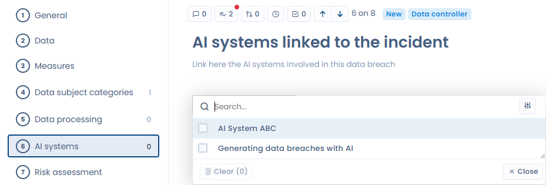

# Report a data breach

## Introduction

There are 2 possible ways to fill in a new data breach in DASTRA:

1. Fill in any new breach directly by hand
2. Import breaches from an Excel, csv or text file

### Manual documentation of a data breach

By clicking on the "Add a data breach" button, a window appears where you can detail the data breach. Follow the steps and click on "Save and exit". That's it, you've documented your first data breach manually!



### Import / export of the data breach register

The entire data breach register can be imported and exported. To import a breach, click on the arrow icon next to the "add a data breach" button.

A window appears with an "import" button. Click on it, download the register template, then follow the instructions to import the breaches into Dastra. Once imported, the breach will be directly available in the data breach register.

### How to carry out a risk analysis of the data breach?



***

### Linking an AI system to a data breach

When a data breach involves an AI system — whether as the cause, the vector, or because it processes the affected data — you can associate it directly with the breach record.

From the breach editing page, in the **Additional information** section, use the **Linked AI systems** field to search for and associate one or more AI systems declared in your workspace.

<figure><figcaption>
"AI systems" section of the breach form — search and select the systems involved
</figcaption></figure>

This association allows you to:

* Quickly identify the AI systems involved in incidents
* Link the breach to the AI Act compliance documentation of the relevant system
* Centralize incident tracking by AI system in your register
* Filter and display incidents by AI system thanks to the **Linked AI systems** column and its dedicated filter in the data breach register
* Automatically account for linked AI systems in the AI-generated post-mortem report

This association addresses the convergence of the obligations under the GDPR and the European regulation on artificial intelligence (AI Act).

#### "With an AI system" indicator in the incidents register

The data breach register displays a **With an AI system** indicator in the statistics bar at the top of the list. The data breach dashboard also shows an indicator of the number of incidents involving at least one AI system. These counters let you monitor at a glance the share of incidents involving an AI system in your organization.

<figure><figcaption>
The register's "Linked AI systems" column and the indicator of the number of incidents involving at least one AI system
</figcaption></figure>
